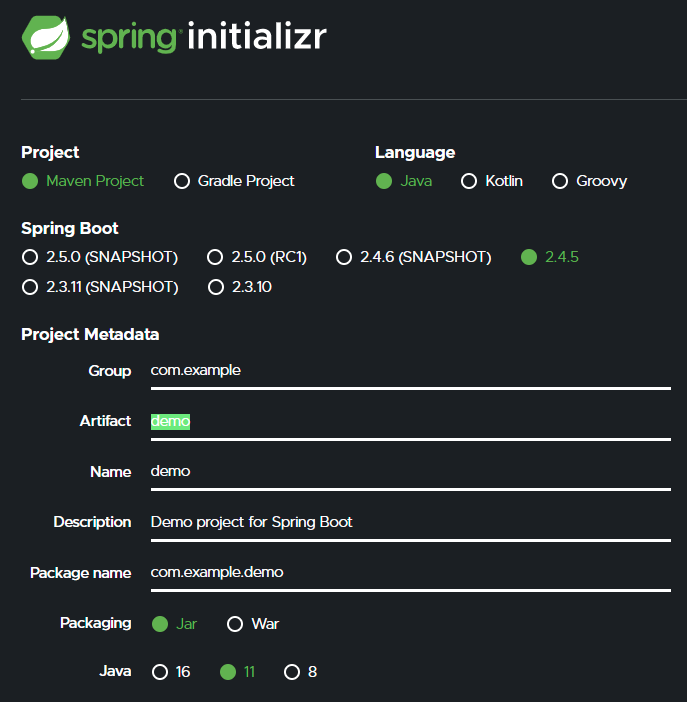
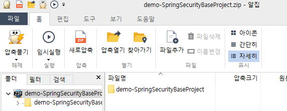
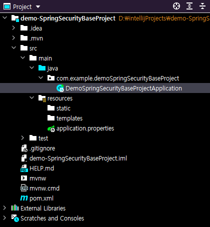
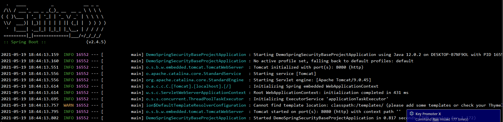
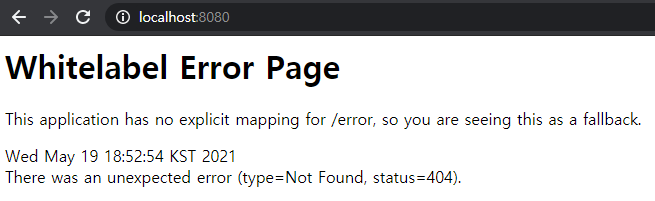

#### 스프링 시큐리티

```js
https://start.spring.io/ 
<br>
위 사이트 주소로 접속하면 아래와 같은 화면이 출력될거야 
<br>

<br>
여기서 자신에게 맞는 프로젝트 설정을 지정해주고 ctrl + b 단축키를 눌러서  Dependencies 에 우선적으로
Web 과 Thymeleaf 정도만 추가해서 프로젝트 생성을 해준 후 ctrl + enter 단축키를 누르면 
압축된 프로젝트 파일을 다운로드 받게될거야 
<br>

<br>
이 압축파일을 자신이 원하는 경로에 압축을 풀어줘보자 ! 
<br>
자신의 코딩툴에서 open -> 자신이 압축을 풀었던 경로에 폴더를 open 해주면
<br>

<br>
위와 같이 https://start.spring.io/ 에서 설정했던 SpringSecurity 를 확인할수있어!
<br>
그리고 정상 작동이되는지 확인해보자 아래와같이 확인된다면 정상이야!
<br>

<br>
이제 톰캣 서버가 정상 작동중인지 테스트 겸 사이트를 열어볼까 ?
<br>
localhost:8080 을 입력하고 아래와같은 화면이라면 톰캣 서버는 정상이야
<br>


```