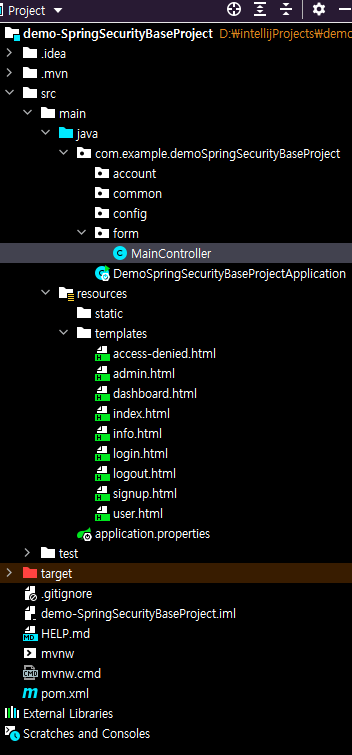

### 스프링 시큐리티

```js

오늘은 Controller 에서 view 에 보여줄 로직을 간단하게 만들어보자!
<br>
먼저 view 단을 만들어줄거야 , resources 에서 templates 폴더를 만들어주자
<br>
그리고 자신이 구상해 놓은 또는  사이트내에 필요한 페이지를 만들어주자
<br>

<br>
그 이후에 위 사진과 같이 자신이 필요한 패키지들을 만들어줘볼까?
<br>
구성해놨던 패키지들을 만들어주고 먼저 form 패키지에 controller 를 만들어줄거야
<br> 
자 ! 그리고 우리가 view 에서 출력해줄 간단한 메시지를 넣어줄거야,
<br>
먼저 index 에서 보여줄 메시지는 아래와 같이 하겠어
<br>
```html
<!DOCTYPE html>
<html lang="en" xmlns:th="http//www.thymeleaf.org">
<head>
    <meta charset="UTF-8">
    <title>index</title>
</head>
<body>
  <h1 th:text="${message}">Hello</h1>
</body>
</html>

```

그 후 controller 에서 view message 에 들어갈 내용을 입력해줘볼까?

```java
@Controller //@ 주로 view 를 반환하기 위해서 사용
public class MainController {

    @GetMapping("/")
    //principal 클래스: 모든 보안 주체에 공통되는 계정 데이터 및 작업을 캡슐화, 모든 보안 주체가 파생되는 추상 기본 클래스
    public String index (Model model, Principal principal){//principal에 담긴 사용자 정보 id출력
        //index 에 message key value 에 들어갈 내용
        //로그인했을 경우에는 로그인한 방문자의 이름을 따로 출력하게만들자
        if ( principal == null ){
            model.addAttribute("message","방문자님 안녕하세요. vitamin7777777 의 메인 화면입니다.");
        }else {
            model.addAttribute("message", principal.getName() + "님 안녕하세요 , vitamin7777777 의 메인 화면입니다.");
        }
        return "index";
    }
    @GetMapping("/info")
    public String info (Model model){
        //index 에 massage key value 에 들어갈
        model.addAttribute("message","안녕하세요. 사이트 정보 화면입니다.");
        return "info" ;
    }
    @GetMapping("/dashboard")
    public String dashboard (Model model, Principal principal){
        //index 에 massage key value 에 들어갈
        model.addAttribute("message","안녕하세요." + principal.getName() + " 님 게시물 화면입니다.");//principal에 담긴 사용자 정보 id출력
        //AccountContext.setAccount(accountRepository.findByUsername(principal.getName()));//사용자 정보를 가져와서 스레드로컬에 넣어주기
        return "dashboard" ;
    }
    @GetMapping("/admin")
    public String admin (Model model, Principal principal){
        //index 에 massage key value 에 들어갈
        model.addAttribute("message","안녕하세요." + principal.getName() + " 님 관리자 화면입니다.");
        return "admin" ;
    }
}
```  

index와 마찬가지로 나는 dashboard , admin , info 페이지까지 만들어주고  
실행을 해봤어 그럼 어떻게나오는지 한번 봐볼까 ??  

