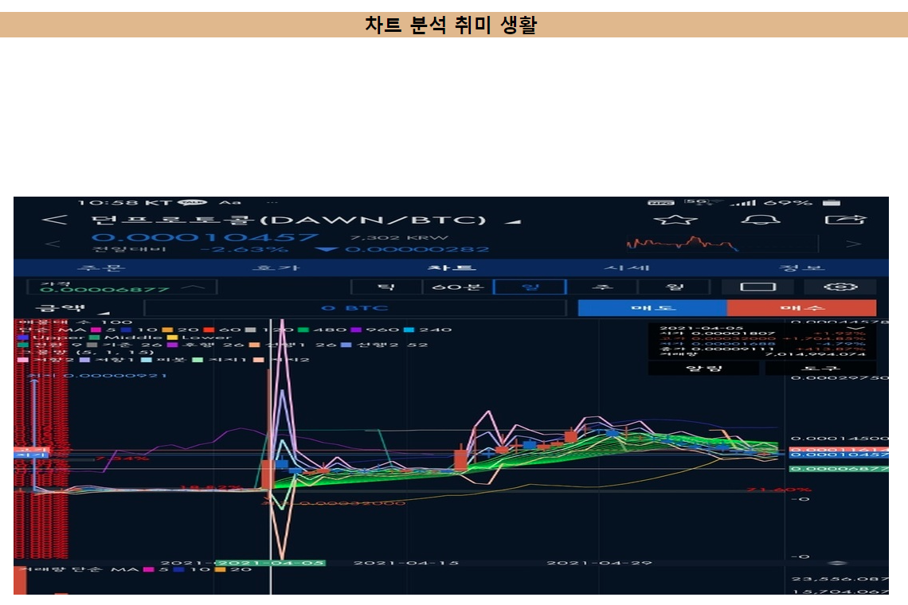

### 자바스크립트로 이미지 변환을 해보자!
<br>
자바스크립트라 하면 정적인 html 을 동적으로 활용할 수 있다. 자세한건 직접 실습해보고 확인해보자!
<br>
나는 일단 로직을 파악해 해석하는 방식을 좋아하기때문에 코드를 분석해볼까?
<br>


<br>
위 사이트를 보면 이미지가 애니메이션 효과로 다른 이미지로 변경될거야 그 코드를 살펴볼까?
<br> 
```java
<script>
        var imgArray = new Array();
        imgArray[0] = "coin1.jpg"
        imgArray[1] = "coin2.jpg"
        imgArray[2] = "coin3.jpg"
        imgArray[3] = "coin4.jpg"
        imgArray[4] = "coin5.jpg"

        function showImage() {
            var imgNum = Math.round(Math.random() * 1);
            var objImg = document.getElementById("introImg");
            objImg.src = imgArray[imgNum];
            setTimeout(showImage, 1500);
        }
    </script>
</head>

<body onload="showImage()">
<h2 class="homeFirstH2">차트 분석 취미 생활</h2>
<nav>
<div class="navGrid">
<li class="grid_item home">
<a href="index.html">Home</a></li>
<li class="grid_item video">
<a href="video.html">차트 동영상</a>
</li>
<li class="grid_item call">다이렉트 연락</li>
</div>
</nav>
<div id="intro">

```
<br>
살펴보면 배열 imgArray 에 이미지를 5개를 담아두었고,funciton showImage() 동작한대 showImage 메소드가!,
어떻게 동작하냐면 imgNum변수에 랜덤한 수에 1을 곱한 값에 반올림한 정수의 순서로,
<br>
변수 objImg에는 "introImg" id 를 호출하는데<br>
여기 들어갈 이미지는 반올림됐던 정수의 순서대로 시간 1.5초 간격으로 이미지를 보여준데, 그럼 언제?
<br>

```java
<body onload="showImage()">
```
사이트가 열리자마자 로드된데 showImage() 메소드!
<br>
<br>
자 다음은 다른 코드를 재해석 해볼까 ?


<br>
위와 같이 js를 활용하여 클릭 했을 시 내용이 변환되는 코드를 살펴볼꺼야!
<br>
```java
<script>
 function myintroduce() {
            document.getElementById("introduce").innerHTML = "안녕하세요. 김민우입니다!"

        }
</script>
<div style="text-align: center;">
<p id="introduce">
  제 이름은요 !
</p>
<button type="button" onclick="myintroduce()">이름이 궁금하시다면 클릭!</button>
<br>
```
위와 같이 button을 onclick했을 시 myintroduce메소드가 동작되며 동작되는 내용은 
<br>
문서에 id introduce를 가져와 innerHTML로 내용 "안녕하세요 김민우입니다."내용으로 넣어준다는 코드야!
<br>
마지막으로 보통 프로젝트에는 .js 파일등 따로 외부파일을 html 문서에 load해서 활용하는 경우를 많이봤을거야!
<br>
어떻게 진행되는지 한번볼까!?
<br>

위와 같이 .js메모장에 javascript 내용을 넣어주고 
```java
<head>
    <meta charset="UTF-8">
    <meta http-equiv="X-UA-Compatible" content="IE=edge">
    <meta name="viewport" content="width=device-width, initial-scale=1.0">
    <title>Home</title>

    <link rel="stylesheet" href="csscode.css" type="text/css">
<style>

</style>
<script src="jscode.js"></script>
</head>
```
위와 같이 head 부분에 script 경로 설정을 지정해 주면 끝!


