####출처 : 한양사이버대학교 민병석 교수님 자료
### 01. 접근제한자에 대해서 알아보자.

<strong>접근제한자 : </strong>멤버의 이용을 제한하거나 확장하기 위한 키워드

 

public, protected, private 키워드를 멤버(필드, 메소드) 앞에 붙이며 어떠한 키워드도 붙이지 않다면 default 라고 한다.

 

패키지 내or외부 에서의 클래스 및 오브젝트의 상속에 영향을 준다.

 

 

### 02. 랩퍼 클래스에 대해서 알아보자.

<strong>랩퍼 클래스 : </strong>변수를 감싸서 오브젝트로 취급하는 클래스

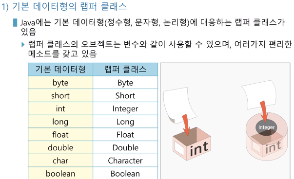
 

<strong>수치형 랩퍼 클래스 : </strong>Byte, Short, Integer, Long, Double 은 자료형을 변환할 수 있는 메소드를 갖고 있음

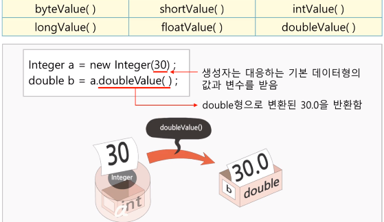

Integer 클래스의 객체 a를 생성해 30 정수를 넣은 후 a 의 value 을 double 형으로 변환하면 30.0 반환

 

### equals() 메소드 활용하기

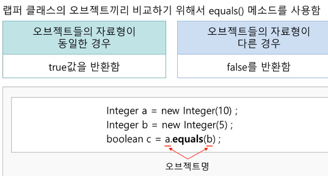

Integer 클래스 객체 a 와 b 생성 후 정수 10, 5 를 boolean 클래스 c 객체 생성하여 a.equals(b) 로 같다면 true, 다르다면 false 반환

### 문자열 반환 활용

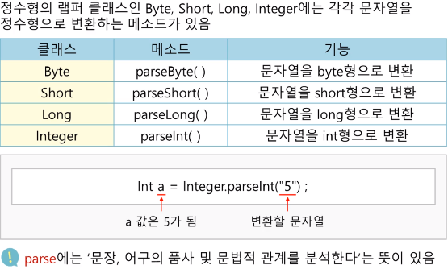

정수형 변수 a에 문자열5를 Integer 클래스에 parseInt 메소드로 형 변환하여 정수5를 a에 대입

### 문자열 처리 메소드를 알아보자

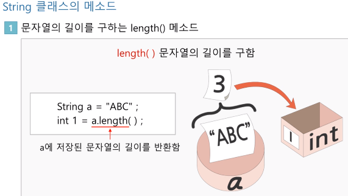

이미지에 int 1 은 i 로 대체(오타)! 문자형 a에 문자 "ABC" 대입 후 정수형 i 에 a.length() 랭스 메소드로 a에 문자열 길이를 알아보는 메소드를 활용하면 int i 에는 3 대입된다.

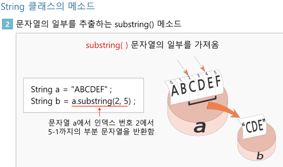

문자형 a에 ABCDEF 대입 후 문자형 B 변수에 변수 a에 substring 메소드로 2 번째부터  5 번째 전까지의 문자열을 b에 대입, CDE 가 대입된다.

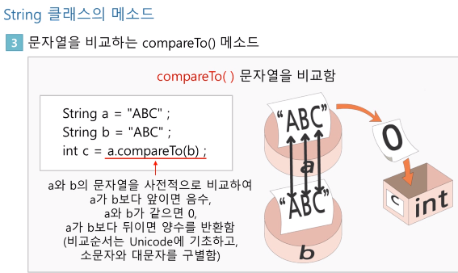

compareTo메소드와 equals메소드가 비교활용하는데 사용하는 method이지만 equals 는 같거나 다르거나 이분법으로 비교되지만 , compareTo메소드는 해당 문자열보다 앞에있거나 같거나 뒤에있는지 까지 비교해 음수 0 양수 로 반환해 알려준다.

 

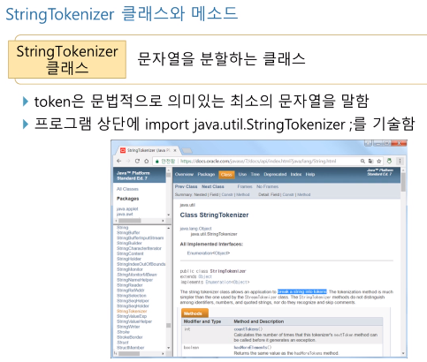
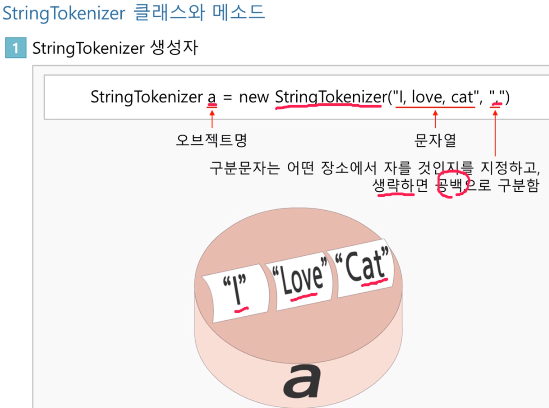
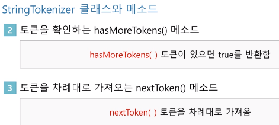
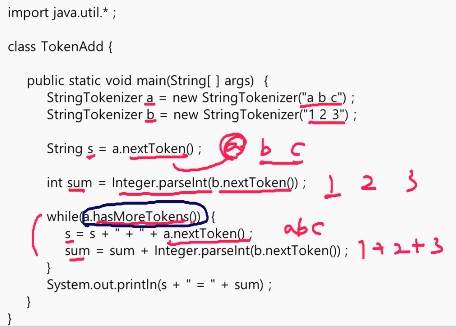

StringTokenizer 클래스의 a객체 생성 , 문자열 a공백b공백c 대입, 같은방식으로 문자열 1공백2공백3대입, 공백은 따로지정없이 생략하면 공백제거됨, 문자열 s에 a객체에 차례대로 토큰 대입 , while 문으로 토큰이있는지 있다면 문자열 s에 공백제거된 상태로 a "+" b"+" c 로 대입, 정수형 sum에는 문자열b에 대입된 123을 형변환하여 sum에 차례로 1+2+3=6 으로 대입과 동시에 더해짐 , syso는 a+b+c=6으로 출력

