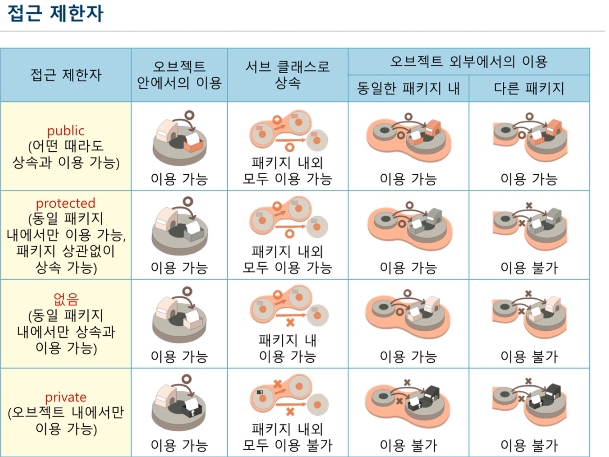

### 01. 접근제한자에 대해서 알아보자.

<strong>접근제한자 : </strong>멤버의 이용을 제한하거나 확장하기 위한 키워드

 

public, protected, private 키워드를 멤버(필드, 메소드) 앞에 붙이며 어떠한 키워드도 붙이지 않다면 default 라고 한다.

 

패키지 내or외부 에서의 클래스 및 오브젝트의 상속에 영향을 준다.

 

 

### 02. 랩퍼 클래스에 대해서 알아보자.

<strong>랩퍼 클래스 : </strong>변수를 감싸서 오브젝트로 취급하는 클래스

