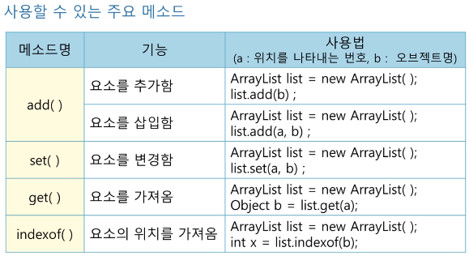
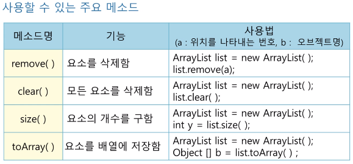
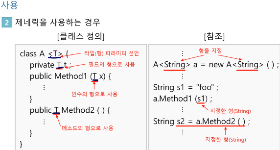
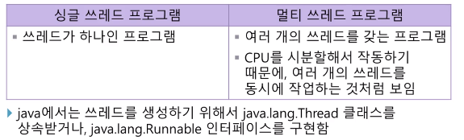
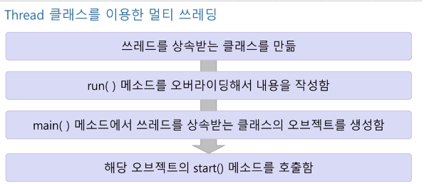
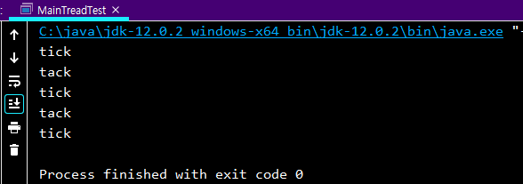
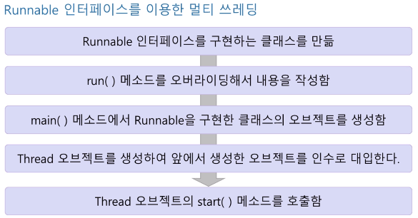
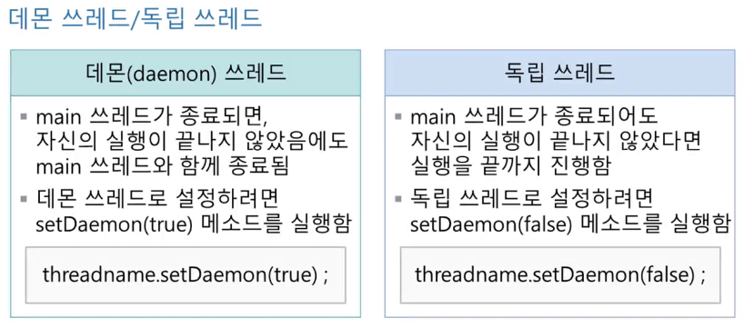
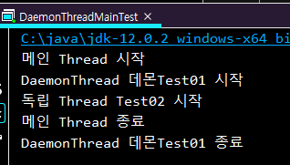

##1)ArrayList class, 2)제네릭, 3)멀티쓰레딩, 4)임계영역을 이용한 동기화, 5)쓰레드 사이의 통신을 이용한 동기화.
####출처 : 한양사이버대학교 민병석 교수님 자료
###1) ArrayList
<p><strong>Collections class : </strong>오브젝트 데이터의 관리를 지원하는 클래스,</p>
<p>ArrayList class 는 요소 들을 연결구조로 저장할 수 있으며, 배열과 달리 사용에 따라 크기가 자동적으로 조절됨</p>
<li>java.util.* or java.util.Arrays package import 로 사용</li>
<li>오브젝트 생성시 < >  꺽쇠 안에 저장한 데이터의 자료형을 지정, 버전6 이후에서는 자료형을 생략해도되나 습관적으로 명시해주는게 좋음</li>

```java
ArrayList <Integer> list = new ArrayList <Integer> ();
```




```java
import java.util.ArrayList;
import java.util.Collections;


/***
 * test
 */
public class ArrayListTest {
    public static void main(String[] args) {
        ArrayList <String> alist = new ArrayList <String> () ;//ArrayList class object new constructor create
        String a = "A" , b = "B" , c = "C" ; // String a in substitute capital letter the "A" and b="B" , c="C"

        String d = "X" ; //String d in substitute capital letter the "X"

        alist.add(a) ;//object alist in add String the a
        alist.add(b) ;//object alist in add String the b
        alist.add(c) ;//object alist in add String the c
        System.out.println(alist);//print object alist

        alist.add(2 , d) ;//객체 alist 에 add 메소드로 2번째 요소에 d를 추가
        System.out.println(alist);//출력, 객체 alist

        Collections.sort(alist);//컬렉션 클래스에 sort 메소드로 크기 순서대로 정렬
        System.out.println(alist);//출력, alist
    }
}
```

### 2)제네릭
<p>클래스의 정의 내에서 이용되는 자료형을 미리 정해놓지 않고 , 파라미터(인수)로 처리하는것</p>
<li>오브젝트를 생성하기 전에는 자료형을 추상적으로 표현하고, 오브젝트 생성 시 구체적인 자료형을 인수로 전달 받아 지정함</li>


<p>미리 자료형을 지정해 두면, 콜렉션 클래스의 요소를 참조할 때 캐스팅을 피할 수 있다.</p>

### 3)쓰레드
<li>시작점과 종료점을 갖는 하나의 작업흐름</li>
<li>프로그램을 실행하면 main()메소드가 호출되어 , 하나의 작업흐름이 시작된다.</li>


<p>cpu를 시분할 한다는 얘기는 예를들어 cpu가 3개의 각각 3초씩 걸리는 작업을 처리한다했을 때 , 첫번째 작업1초 시작 처리 중지 , 두번째 1초 시작 작업 중지, 세번째도 같으며 , 분할로 쪼개서 로테이션으로 진행되기때문에 동시에 작업하는 것 처럼 보인다는 것이다.</p>


<p>위 순서에 맞게 간략하게 코드를 만들어보자!</p>

```java
package com.company;

public class MultiThreadTest extends Thread{
    private String word ;
    private int time ;
    private int count ;

  /**
   * construct
   * */
    public MultiThreadTest(String w , int t , int c){
        word = w ;
        time = t ;
        count = c ;
    }
  /***
   * start method execute
   * */
    public void run(){
        for(int n = 0 ; n < count ; n++){
            System.out.println(word);

            try {
                //time 밀리초 만큼 현재 쓰레드 대기
                Thread.sleep(time);
            }
            catch (Exception e){

            }
        }
    }
}
```

<p>main class</p>

```java
/***
 * main multi thread
 **/
public class MainTreadTest {
    public static void main(String[] args) {
        //뉴 생성자 호출 후 문자열 (tick , tack) , 밀리초 ( 1000 ) , 반복 횟수 ( tick 3 , tack 2 ) 입력
        MultiThreadTest tick = new MultiThreadTest("tick",1000,3) ;
        MultiThreadTest tack = new MultiThreadTest("tack",1000,2);

        tick.start();//start method 실행 시 500 밀리초 만큼 쓰레드 대기 
        try {//예외 처리 
            Thread.sleep(500);
        }
        catch (Exception e){
            
        }
        tack.start();
        //tick 작업 후 tack 작업 진행 , tack 의 쓰레드 시간만큼 대기 후 
        // 다시 남은 반복 횟수가 tick에 남아있기에 tick 작업 실행 후 
        // 다시 tack 작업 진행.모든 작업의 반복 횟수 만큼 작업 완료 후 자동 종료  
    }
}
```


<p>위 이미지와 같이 tick 3번 반복 , tack 2번 반복된 후 자동 종료 결과를 확인 할 수 있다 . </p>

### 3-1)Runnable interface use the multiThreading


<p>구현 작업 코드</p>

```java
package com.company;

public class RunnableThreadTest implements Runnable {
    private String word ;
    private int time ;
    private int count ;

    public RunnableThreadTest(String w, int t, int c) {//생성자
        this.word = w;
        this.time = t;
        this.count = c;
    }
    public void run(){
        for (int n = 0 ; n < count ; n++){//int i 는 0 이며 , count 가 i 보다 낮을 때까지 i 는 1씩 늘어난다.
            System.out.println(word);//넘겨온 문자열을 count 만큼 출력

            try {
                Thread.sleep(time);// time (밀리초) 만큼 현재 쓰레드 대기
            }catch (Exception e){
                //예외 발생시 예외 출력
            }
        }
    }
}

```

<p>메인 구현 코드</p>

```java
package com.company;

public class RunnableThreadMainTest {
    public static void main(String[] args) {
        //RunnableThreadTest 클래스 tick객체 생성 및 인수 문자열 tick , 1000밀리초,3회 count 입력
        RunnableThreadTest tick = new RunnableThreadTest("tick",1000,3);
        RunnableThreadTest tack = new RunnableThreadTest("tack",1000,2);
        //Thread 클래스 tickThread 객체 생성 및 인수는 위에서 만든 객체 tick 넣어줌
        Thread tickThread = new Thread(tick);
        Thread tackThread = new Thread(tack);

        tickThread.start();
        try {
            Thread.sleep(500);// 500 밀리초 만큼 쓰레드 대기
        }catch (Exception e){
            //예외 발생시 예외 출력
        }
        tackThread.start();
    }
}

```


<p>**내 실수**</p>
<p>Thread 클래스 tickThread 객체 생성중 RunnableThreadTest 의 객체 tick을 인수로 넣어줘야했지만 "tick" 문자열로 넣어주었기에 실행되지 않았음</p>

### 4) 데몬 쓰레드와 독립 쓰레드


<p>구현 작업 코드 test01 데몬스레드</p>

```java
package com.company;

public class DaemonThreadTest01 extends Thread{
    public void run(){
        System.out.println("DaemonThread 데몬Test01 시작");
        try {
            Thread.sleep(10000);//10000 밀리초 현재 스레드 대기
        }catch (Exception e){

        }
        System.out.println("DaemonThread 데몬Test01 종료");
    }
}

```

<p>구현 작업 코드 test02 독립 스레드</p>

```java
package com.company;

public class DaemonThreadTest02 extends Thread{
    public void run() {
        System.out.println("독립 Thread Test02 시작");
        try {
            Thread.sleep(10000);
        }catch (Exception e){

        }
        System.out.println("독립 Thread Test02 종료");
    }
}

```

<p>메인 코드</p>

```java
package com.company;

public class DaemonThreadMainTest {
    public static void main(String[] args) {
        System.out.println("메인 Thread 시작");

        DaemonThreadTest01 Test01 = new DaemonThreadTest01() ;
        DaemonThreadTest02 Test02 = new DaemonThreadTest02() ;

        Test01.setDaemon(true);//데몬스레드 실행
        Test02.setDaemon(false);//실행하지 않음

        Test01.start();
        Test02.start();

        try {
            Thread.sleep(500);//메인스레드 500 밀리초 만큼 현재 쓰레드 대기
        }catch (Exception e){

        }
        System.out.println("메인 Thread 종료");
    }
}

```


<p>위와 같이 메인 시작과 종료 시 , 데몬test01 이 시작되었지만 종료 메세지가 출력되지않고 메인이 종료되었기에 데몬 Thread 가 작업도중에 종료 확인되었으며</p>
<p>독립 thread 는 메인이 종료되었어도 독립적으로 남은 작업을 마친 후 종료됨을 확인할 수 있습니다.</p>
