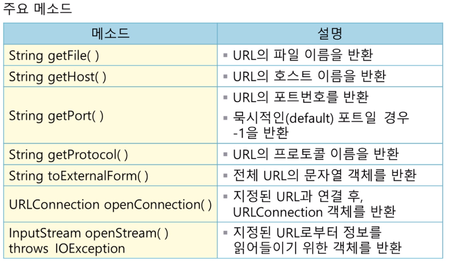

###java and networking!
 <li>네트워크로 연결된 컴퓨터의 정보, 웹문서 정보를 탐색할 수 있다.</li>
 <li>컴퓨터 간에 데이터 통신을 지원하는 java.net package 제공</li>

###1) TCP/IP 프로토콜

네트워크를 사용해 컴퓨터간에 통신을 위한 규약

<li>계층적으로 정의되며 TCP/IP 프로토콜은 4개의 계층으로 구성됨</li>

응용(HTTP,FTP,TELNET 등)계층 , 전달(TCP/UDP 등) 계층 , 인터넷(ip) 계층 , 네트워크(device,driver) 계층으로 구분됨

<li>자바에서 네트워크 관련 클래스를 이용해 프로그래밍을 작성하는것은 응용계층에서의 사용을 의미함</li>

###2) 전달 계층의 프로토콜 TCP / UDP
####2-1 TCP
<li>TCP 는 연결형으로 컴퓨터간에 가상의 경로를 설정하고 통신하는 방식</li>
<li>신뢰성이 높다</li>
<li>재전송 요구: 오류/패킷 손실 시 재전송 요구 있음</li>
<li>전송속도 : 상대적으로 낮음(하나의 가상의 경로로 전송되기에 낮음)</li>
<li>응용분야 : 신뢰성이 높은 분야 EX)FTP (파일 전송에 패킷 손실이 일어나면 안되기때문에)</li>

####2-2 UDP
<li>UDP 는 비연결형으로 가상의 경로를 설정하지 않으며 , 다중 경로로 데이터(패킷)를 보내는 방식</li>
<li>신뢰성이 낮다</li>
<li>재전송 요구: 재전송 요구 없음</li>
<li>전송속도 : 상대적으로 높음(다중 경로로 전송하기에 높음)</li>
<li>응용분야 : 실시간 전송 (동영상 스트리밍, 음원) 패킷 손실이 일어나더라도 지나칠 수 있는 상황</li>

###3) 소켓
<li>컴퓨터가 연결된 통신의 끝지점으로 전기선의 소켓과 유사</li>
<li>상호 연결된 응용 프로그램들 사이의 정보 교환을 제공하고있는 소프트웨어 매체</li>

자바 프로그램에서 통신할때 생성해야하는 소켓의 유형

<li>TCP = TCP 소켓을 생성해야함</li>
<li>UDP = UDP 소켓을 생성해야함</li>

###4) 포트
<li>통신선을 통해 수신되는 데이터가 컴퓨터 내의 여러 통신 프로그램 중에서 하나의 프로그램에 전달 되도록 하기 위한 포트 넘버</li>
<li>인터넷을 통하여 전달되는 정보들은 목적지 컴퓨터의 주소(32비트)와 16비트의 포트번호로 구성됨</li>
<li>데이터를 떠다니는 배(ship)라고 생각하고 포트를 port(항구)라고 생각하면 떠올리기 쉽다</li>

###5) URL 클래스

Web 에서 사용하는 URL 에 과한 정보를 처리

####5-1) throws IOException 
<li>throws IOException 표시가 있으면 예외 처리를 수행하라는 의미</li>
<li>throws 는 예외가 발생하면 해당 메소드 내에서 처리하지 않고, 자신을 호출하는 메소드에서 처리하도록 함</li>
<li>오브젝트 생성이나 메소드는 throws IOException 내에서 사용함</li>

