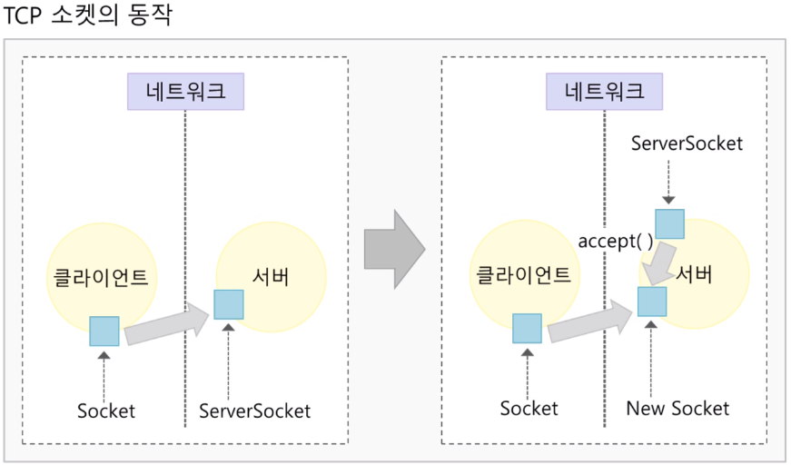
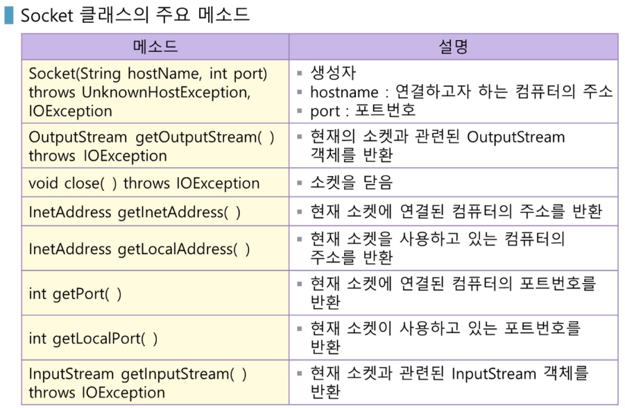
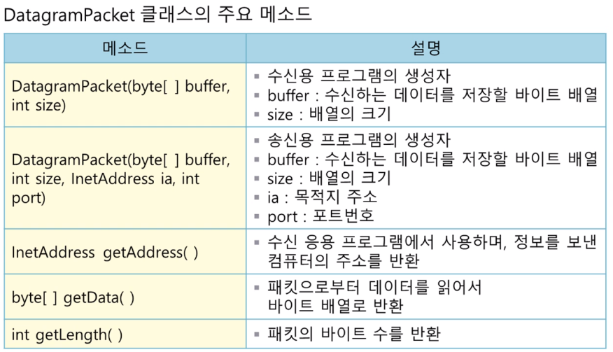
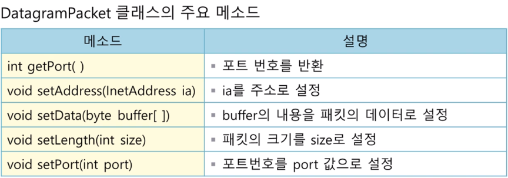
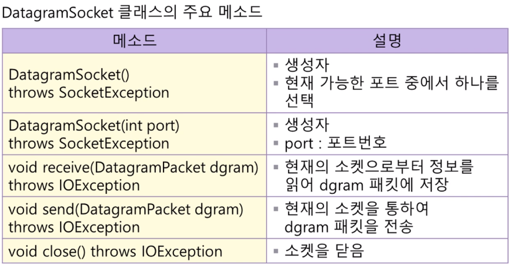

#### 출처 : 한양사이버대학교 민병석 교수님 자료

### 1)자바와 네트워킹

### 2)URL 클래스와 URLConnection 클래스

### 3)TCP 소켓을 이용한 서버/클라이언트 통신

### 4)UDP 소켓을 이용한 서버/클라이언트 통신

### 1-1) TCP 통신 방식

<li>자바는 서버/클라이언트 응용 프로그램을 위한 ServerSocket 클래스와 Socket 클래스를 제공</li>
<dl>
TCP 소켓의 특징
<li>연결성 통신 방법이므로, 전송 전에 연결이 성립되어야 한다.</li>
</dl>

<p>TCP 소켓의 동작</p>
<ol>
  <li>클라이언트는 소켓을 생성하여 서버에 연결 요청을 하며, 서버는 accept()메소드로 연결 요청을 수락</li>
  <li>클라이언트 연결 요청에 서버가 응답(수락)하지 못한다면 접속 거부 에러 발생</li>
  <li>서버가 먼저 실행되어 클라이언트의 접속 요청을 대기</li>
  <li>클라이언트의 접속 요청이 발생하면 서버는 요청을 처리, 데이터를 클라이언트에 전송</li>
</ol>



#### 1-2) ServerSocket class 주요 메소드

```java
ServerSocket(int port)//생성자,port == 포트번호
throws IOException
-----------------------------------------------
Socket accept()//클라이언트의 요청을 받아들인다음 Socket 클래스 객체 반환
throws IOExcetption 
---------------------------------------------------------------------
void close()//서버 소켓을 닫는다.
throws IOException 
```

#### 3-1) TCP Socket 을 이용한 서버/클라이언트 간 통신 순서

<p>서버</p>
<ol>
  <li>ServerSocket class 로 부터 서버 소켓 오브젝트를 생성 후 클라이언트의 접속 요청을 기다림</li>
  <li>클라이언트 접속 요청이 발생하면 요청을 수락하여 Socket object 생성</li>
  <li>Socket 오브젝트를 이용하여 입출력을 위한 스트림을 생성</li>
  <li>통신을 진행</li>
  <li>소켓 닫음</li>
</ol>
<p>클라이언트</p>
<ol>
  <li>연결하고자하는 서버의 주소와 포트번호로 Socket 을 생성</li>
  <li>Socket 오브젝트를 이용해 입출력을 위한 스트림 생성</li>
  <li>통신을 진행</li>
  <li>소켓 닫음</li>
</ol>
<p>프로그램 순서</p>
<ol>
  <li>서버에서 클라이언트로 데이터 전송</li>
  <li>클라이언트에서는 수신한 데이터를 출력</li>
  <li>명령창에서 서버 프로그램 실행</li>
  <li>다른 명령창에서 클라이언트 프로그램 실행</li>
  <li>서버는 무한 루프 수행중이므로 종료하려면 컨트롤 + c 입력</li>
</ol>
<p>Server</p>

```java
package com.company;

import java.io.DataOutputStream;
import java.io.IOException;
import java.io.OutputStream;
import java.net.ServerSocket;
import java.net.Socket;

class Server {
  public static void main(String args[]) throws IOException {
    int port = Integer.parseInt(args[0]) ;
    //서버 소켓 객체 생성
    ServerSocket serverSocket = new ServerSocket(port) ;

    System.out.println("서버 실행중 !");
    while (true){
      //연결수락 , 클라이언트 소켓 객체 생성
      Socket clientSocket = serverSocket.accept();
      //소켓 출력 스트림 생성
      OutputStream Ostream = clientSocket.getOutputStream();
      //스트림 변환
      DataOutputStream DOstream = new DataOutputStream(Ostream);

      for (int imsg = 1; imsg <= 5; imsg++)
        //데이터 전송
        DOstream.writeInt(imsg);
      //소켓 닫기
      clientSocket.close();
    }
  }
}
```

<p>Client</p>

```java
package com.company;

import java.io.DataInputStream;
import java.io.IOException;
import java.io.InputStream;
import java.net.Socket;

public class Client {
    public static void main(String[] args) throws IOException {
        String server = args[0];
        int port = Integer.parseInt(args[1]);
        //클라이언트 소켓 객체 생성 ( 서버에 연결 요청 )
        Socket clientSocket = new Socket(server, port);
        //소켓 입력 스트림 객체 생성
        InputStream Istream = clientSocket.getInputStream();
        //스트림 변환
        DataInputStream DIstream = new DataInputStream(Istream);

        for (int i = 1; i <= 5; i++){
            //데이터 수신
            int imsg = DIstream.readInt();
            System.out.println("서버로부터 받은 데이터 : " + imsg);
        }
        // 소켓 닫음
        clientSocket.close();
    }
}
```

### 2-1) UDP socket 의 특징

<ol>
<li>단순히 데이터 송신을 위한 소켓</li>
<p>- UDP는 통신을 위해 데이터그램 소켓을 사용하지만, 서버에 연결 요청을 하지 않음</p>
<li>UDP 에서는 패킷에 데이터를 받을 목적지 주소와 포트번호를 기록한 후, 소켓을 통해서 전송</li>
</ol>
<li>Java는 UDP 를 지원하는 DatagramPacket , DatagramSocket 클래스를 제공</li>
<p>- DatagramPacket 클래스는 응용 프로그램들이 주고받을 데이터와 관련이있다.</p>
<p>- 실제 데이터의 전송은 DatagramSocket 클래스에서 이루어짐</p>


#### DatagramPacket Important Method




#### DatagramSocket Important Method



#### 서버/클라이언트 간 통신 순서

#### Server

<ol>
<li>DatagramSocket class 로부터 socket object create</li>
<li>목적지 주소 오브젝트를 생성</li>
<li>DatagramPacket class 로 부터 packet object create(data,data size, inet addr, port num을 생성자의 인수로 전달)</li>
<li>send the packet</li>
<li>close the socket</li>
</ol>

#### Client

<ol>
<li>DatagramSocket class 로 부터 socket object create (port num 을 생성자의 인수로 전달) </li>
<li>DatagramPacket 클래스로부터 packet object create(data buffer , data buffer size 를 생성자의 인수로 전달</li>
<li>packet 을 수신해서 데이터 버퍼에 저장</li>
<li>close the socket</li>
</ol>

#### mini program 

<ol>
<li>서버에서 클라이언트로 데이터 전송</li>
<li>클라이언트에서는 수신한 데이터를 출력</li>
<li>명령창에서 클라이언트 프로그램을 실행</li>
<li>다른 명령창에서 서버 프로그램을 실행</li>
</ol>

```java
package com.company;

import java.io.BufferedReader;
import java.io.IOException;
import java.io.InputStreamReader;
import java.net.*;
import java.nio.charset.StandardCharsets;

public class ServerUDP_CommunicationTest {
    public static void main(String[] args) throws IOException {
        DatagramSocket ds = new DatagramSocket(); //소켓 생성
        InetAddress ia = InetAddress.getByName(args[0]); //주소 생성
        int port = Integer.parseInt(args[1]); //포트번호

        BufferedReader br = new BufferedReader(new InputStreamReader(System.in));
        System.out.println("전송할 메세지를 입력하세요.(끝내려면 finish 입력");

        String buf ;
        do {
            buf = br.readLine(); //키보드로 부터 한 줄 입력
            byte buffer[] = buf.getBytes(StandardCharsets.UTF_8); //바이트 배열로 변환
            //패킷화
            DatagramPacket dp = new DatagramPacket(buffer, buffer.length,ia,port);
            ds.send(dp);//패킷을 소캣으로 전송
        } while (!buf.equals("finish"));

        ds.close();
    }
}
```

```java
package com.company;

import java.io.IOException;
import java.net.DatagramPacket;
import java.net.DatagramSocket;

public class ClientUDP_CommunicationTest {
    public static void main(String[] args) throws IOException {
        int port = Integer.parseInt(args[0]);
        //client 1번 수행
        DatagramSocket ds = new DatagramSocket(port);
        String q ;
        do{
            byte buffer[] = new byte[60];
            //client 2번 수행
            DatagramPacket dp = new DatagramPacket(buffer, buffer.length);
            //client 3번 수행
            ds.receive(dp); //패킷 수신
            String msg = new String(dp.getData()) ;//바이트 배열을 문자열로 변환
            System.out.println("수신 메세지 : " + msg);

            q = msg.substring(0,3);
        }while (!q.equals("finish"));
        //client 4번 수행
        ds.close(); //소켓 닫음
    }
}
```