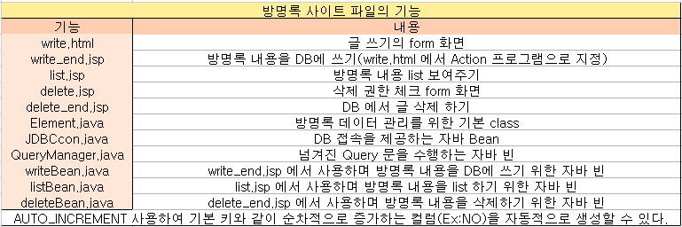

### DB활용 방명록을 만들어보자!.

#### 1-1 방명록을 위한 파일 및 빈 준비하기

#### 1-2 방명록에 사용할 테이블 만들어보자

#### 1-3 글 작성 form view 만들기

#### 1-4 JDBC_CONNECTION 코드

#### 1-5 QueryManager

#### 1-3 방명록 글 작성 후 DB 입력 확인

#### 1-4 방명록 내용 삭제

<br>



#### 1-1. 1) 필요한 파일 준비

<ol>
  <li>write.html 글 작성을 보여주는 파일</li>
  <li>write_end.jsp 글 작성 후 처리 파일</li>
  <li>list.jsp 글 목록을 보여주는 파일</li>
  <li>delete.jsp 글 삭제 파일</li>
  <li>delete_end.jsp 글 삭제 후 처리 파일</li>
  <li>이미지를 사용한다면 상위 폴더 하위에 image 폴더 생성</li>
</ol>


<br>

#### 1-1. 2) 빈 준비를 위한 자바 소스

<ol>
  <li>JDBCcon.java //자바와 데이터베이스 연결하여 데이터를 주고받을수있도록함</li>
  <li>QueryManager.java //데이터베이스 쿼리문 매니저 소스 생성</li>
  <li>Element.java //vo를 만들어줄 소스</li>
  <li>writeBean.java //글 작성 후 db에 값을 넘겨줄 소스 생성</li>
  <li>listBean.java //글 목록(db table values) 보여줄 소스 생성</li>
  <li>deleteBean.java //글 삭제 후 db에 값을 삭제해줄 소스 생성</li>
</ol>


<br>

#### 1-2 테이블 생성하기

  <p>mysql create visit_board table</p>


<br>

#### 1-3 글 작성 form view 만들기

<p>write.html 에 폼을 만들어주자</p>
<p>form 은 post 방식으로 값을 전송하게될 form이 될것이며 액션은 form data를 처리할 
프로그램의 uri 이며 액션으로 넘어가기전에 onsubmit 이벤트가 발생</p>

```html
<body>
  <form
    method="POST"
    action="write_end.jsp"
    name="write"
    onsubmit="return empty()"
  >
    <table align="center" width="800" border="0">
      <tr>
        <td align="right">이름</td>
        <td>
          <input type="text" name="visitor" size="20" />
        </td>
      </tr>
      <tr>
        <td align="right">E-mail</td>
        <td>
          <input type="text" name="email" size="30" />
        </td>
      </tr>
      <tr>
        <td align="right">HomePage</td>
        <td>
          <input type="text" name="homepage" size="40" value="http://" />
        </td>
      </tr>
      <tr>
        <td align="right">내용</td>
        <td>
          <textarea name="contents" rows="10" cols="40" wrap="hard"> </textarea>
        </td>
      </tr>
      <tr align="center">
        <table align="center" border="0">
          <tr>
            <td>
              <input type="submit" value="저장" />
            </td>
          </tr>
        </table>
      </tr>
    </table>
  </form>
</body>
```

#### html 실행 시 보이는 화면


<br>

<p>form 을 만들어줬으니 db와 연동될 수 있도록 JDBCcon.java 코드를 만들어보자</p>

```java
package jspbook.ch11;

import java.sql.Connection;
import java.sql.DriverManager;
import java.sql.SQLException;

public class JDBCcon {
	private String jdbc_driver = "com.mysql.cj.jdbc.Driver";
	private String dbUrl = "jdbc:mysql://localhost:3306/jsp_db?serverTimezone=UTC&useSSL=false";
	private String userName ="uname";
	private String userPW = "패스워드";

public Connection getConnection() {
	try {
		Class.forName(jdbc_driver);
        //여기서 class는 jvm에서 동작할 클래스들의 정보를 묘사하는 일종의 메타클래스
        //forname은 jdbc_driver의 드라이버 로드
	} catch (ClassNotFoundException CNFE) {
		CNFE.printStackTrace();
		return null;
	}
	try {
		Connection
		con=DriverManager.getConnection(dbUrl,userName,userPW);
		System.out.println("connected:"+con);
		return con;
	} catch (SQLException e) { //sql에서 예외가 발생된다면
		e.printStackTrace(); //에러 메세지의 발생 근원지를 찾아서 단계별로 에러 출력
		return null;
	}
}
}
```

<br>

#### QueryManager.java 를 만들어주자

```java
package jspbook.ch11;

import java.sql.Connection;
import java.sql.SQLException;
import java.sql.Statement;

public class QueryManager {
	private Connection con=null;

	public void setConnection(Connection c) {
		this.con=c;
	}

	public String update(String Query) {
		if (con==null) return "You must set Connection in advance";
        //con이 null이라면 문구 출력
		try {
			System.out.println("SQL:"+ Query);//정상실행된다면 SQL QUERY 내용 출력
			Statement stmt = con.createStatement();
			stmt.executeUpdate(Query);

			stmt.close();
			con.close();
			return "<li>Update Success!";
		} catch (SQLException E) {
			System.out.println("SQLException:"+E);
			return "<li>" + E.getMessage();
		}

	}
}

```

#### Element.java 에 java Bean 특정 형태의 클래스 만들기

(private 구성,getter&setter를 통해서만 접근,전달인자가없는 생성자를 가지는 형태의 클래스)

```java
package jspbook.ch11;

public class Element {
	private String no;
	private String query;
	private String visitor;
	private String email;
	private String homepage;
	private String contents;
	private String adminID;
	private String adminPass;

	public void setNo(String no) {
		this.no = no;
	}
	public void setQuery(String query) {
		this.query = query;
	}
	public void setVisitor(String visitor) {
		this.visitor = visitor;
	}
	public void setEmail(String email) {
		this.email = email;
	}
	public void setHomepage(String homepage) {
		this.homepage = homepage;
	}
	public void setContents(String contents) {
		this.contents = contents;
	}
	public void setAdminID(String adminID) {
		this.adminID = adminID;
	}
	public void setAdminPass(String adminPass) {
		this.adminPass = adminPass;
	}

	public String getNo() {
		return no;
	}
	public String getVisitor() {
		return visitor;
	}
	public String getEmail() {
		return email;
	}
	public String getHomepage() {
		return homepage;
	}
	public String getContents() {
		return contents;
	}
	public String getAdminID() {
		return adminID;
	}
	public String getAdminPass() {
		return adminPass;
	}
	@Override
	public String toString() {
		return "Element [no=" + no + ", query=" + query + ", visitor=" + visitor + ", email=" + email + ", homepage="
				+ homepage + ", contents=" + contents + ", adminID=" + adminID + ", adminPass=" + adminPass + "]";
	}
}

```

#### writeBean.java 실제 db에서 사용하는 역할을하는 빈 생성

```java
package jspbook.ch11;

public class writeBean extends Element { //element 상속받아 사용
    private String insertQuery;

    public String TO_DB(String str) {//변환 내용의 메소드 생성
        //str을 받아서 디비에 저장하기 적합한 형태로 코드(유니코드)를 바꿔서 리턴해주는 역할
        try {
            if (str==null) {
                return null;
            }
            return new String(str.getBytes("8859_1"),"utf-8");//유니코드 변환
        } catch (Exception e) {
            return "error";
        }
    }
    public String getInsert() {
        if(getHomepage().equals("http://")) {//homepage 내용을 따로 입력하지않아 http://로 남았을경우
            insertQuery = "INSERT INTO visit_boad(visitor,email,homepage,regist_date,contents)"+
                    "values('"+TO_DB(getVisitor())+"','"+getEmail()+"','"+""+"',sysdate(),'"+TO_DB(getContents())+"')";
            return insertQuery;
        } else {//homepage 내용을 입력한 경우 getHomepage 추가로 homepage 주소 db저장
            insertQuery = "INSERT INTO visit_boad(visitor,email,homepage,regist_date,contents)"
            		+ "values('" + TO_DB(getVisitor()) + "','" + getEmail() + "','" + getHomepage()
            		+ "',sysdate(),'" + TO_DB(getContents()) + "')";
                return insertQuery;
        }
    }
}
```

#### write_end.jsp 에 write.html 에 저장버튼을 눌렀을때 실행되는 jsp

```js
<%@ page language="java" contentType="text/html; charset=UTF-8"
pageEncoding="UTF-8"%>
  <jsp:useBean id="SQL_Manager" class="jspbook.ch11.QueryManager" scope="session" />
  <jsp:useBean id="DB_con" class="jspbook.ch11.JDBCcon" scope="application" />
  <jsp:useBean id="insert" class="jspbook.ch11.writeBean" scope="page" />
  <jsp:setProperty name="insert" property="*"/> /*필드에 이름을 매치시켜 메소드들이 가동이되서 데이터가 프로퍼티에 */
  <% SQL_Manager.setConnection(DB_con.getConnection()); %>/*커넥션 정보얻어오기*/

<%
System.out.println("----------------------------------------------------");
System.out.println(insert.toString());//insert 에 들어오는 내용을 string으로 출력
System.out.println("----------------------------------------------------");

SQL_Manager.update(insert.getInsert());
%>
<!DOCTYPE html>
<html>
<head>
<meta charset="UTF-8">
  <title>글쓰기 확인</title>
</head>
<script type="text/javascript">
  function go_list(){
  alert("작성된 글이 성공적으로 등록되었습니다.")/*메세지 창 출력*/
  location.href="list.jsp?pg_count=0";/*곧 생성할 list.jsp의 첫번째 페이지로 이동*/
}
</script>
<body onload="go_list();">--웹페이지가 로드될때 go_list 함수 이벤트발생--

</body>
</html>
```
