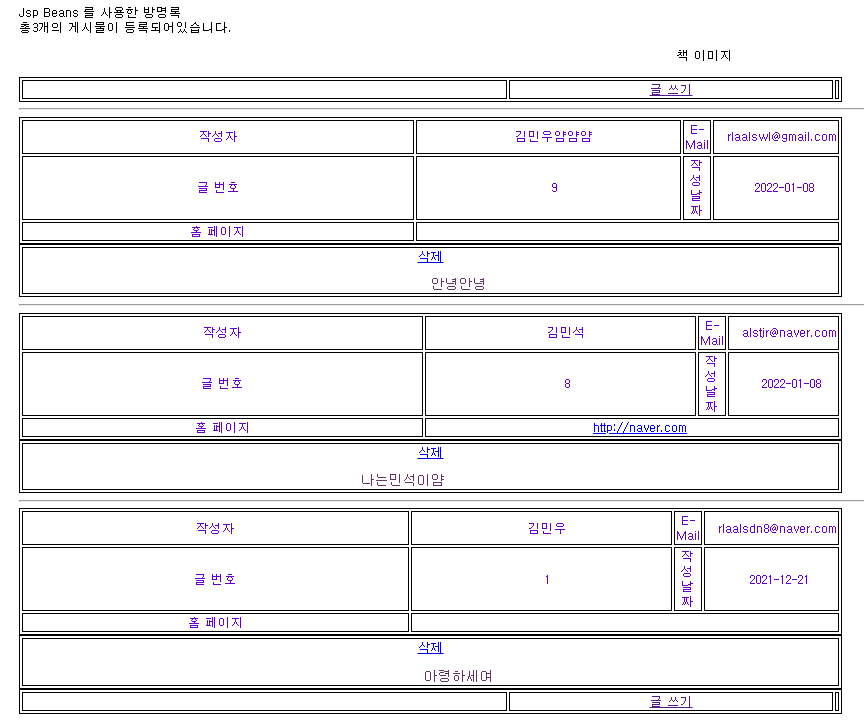

#### #목록을 보여줄 list.jsp, listBean.java 와 글 삭제에 관련된 delete.jsp , delete_end.jsp

먼저 첫 번째 문제
게시물 등록 건수가 0개로나왔다 찾아본 결과... 끔찍한 실수를 저질렀다<br>
테이블의 이름이 visit_board 라 생각했는데 boad 였다... 변경해주니 값이 잘들어오고<br>
쿼리문에서도 visit_board 라 적어야했지만 visit board 라고 적어놨었다;<br>
공부하면서 html5 에서는 더이상 table 에 boder 와 cellpadding 이 적용되지않는다해서
따로 css로 작업을했다.
항상 오타와의 전쟁인것같다...
```js
<%@ page language="java" contentType="text/html; charset=UTF-8"
    pageEncoding="UTF-8"%>
<%@ page language="java" import="java.util.Vector" %>
<jsp:useBean id="DB_con" class="jspbook.ch11.JDBCcon" scope="application"/>
<jsp:useBean id="list" class="jspbook.ch11.listBean" scope="session"></jsp:useBean>
<jsp:setProperty name="list" property="*"/>
<% list.setConnection(DB_con.getConnection());%><%--connection정보가 list에 들어옴--%>
<% list.list(list.listQuery());%>
<jsp:setProperty name="list" property="current_pg" param="pg_count"/>
Jsp Beans 를 사용한 방명록
<!DOCTYPE html>
<html>
<head>
<meta charset="UTF-8">
<title>방명록 리스트</title>
    <style type="text/css">
        body{
            font-family: 돋움, Verdana; font-size: 10pt
        }
        td{
            font-family: 돋움, Verdana; font-size: 10pt; text-decoration: none; color: #6600CC;
        }
    </style>
</head>
<body>
<%list.scopeList();%><!--보여줄 리스트의 범위-->
<br>
<!--총 몇건의 게시물이 등록되어있는지 계산-->
<jsp:getProperty name="list" property="itotal"/>개의 게시물이 등록되어있습니다.
    <p align="center"></p>
    <font size="1pt">
<form method="POST" ACTION="write.html">
    <table align="center" width="550" border="0">
        <tr>
            <td align="right" width="183">
                <%if (list.getIremain()==0 && list.getCurrent()<1){ %><!--페이지를채운나머지 글이0개이고 보여주는페이지의번호가 0이라면 공백-->
                    &nbsp;&nbsp;&nbsp;&nbsp;
                <%}else if (list.getCurrent()!=0){ %><!--현재페이지의번호가 0번이아니라면 이전목록 보여주기-->
                <a href="list.jsp?pg_count=<%=list.getCurrent()-1%>">
                     </a>
                <%}else{ %>
                &nbsp;&nbsp;&nbsp;&nbsp;
                <%}%>
            </td>
            <td align="center" width="184">
                <a href="write.html" onmouseover="status='post a new article'; return true;" onmouseout="status=''">
                    
                </a>
            </td>
            <td align="left" width="183">
                <% if (list.getCurrent()==list.getIvalue()-1&&list.getIremain()==0){ %>
                    &nbsp;&nbsp;&nbsp;&nbsp;
                <%} else if (list.getCurrent() != list.getIvalue()) { %>
                    <a href="list.jsp?pg_count=<%=list.getCurrent()+1%>"><!--다음페이지로가기위해서 +1-->
                        
                    </a>
                <%}%>
            </td>
        </tr>
    </table>
    <!--한 페이지에 해당되는 부분 보여주기-->
    <%for (int i = list.getIstart(); i < list.getIend(); i++){ %>
        <table align="center" border="1" width="550">
            <hr>
            <tr>
                <td align="center" width="60"> 작성자 </td>
                <td>&nbsp;&nbsp;<%=list.getVisitor().elementAt(i)%></td>
                <td align="center" width="60">E-Mail</td>
                <td colspan="3">&nbsp;&nbsp;<%=
                    list.getEmail().elementAt(i)%></td>
            </tr>
            <tr>
                <td align="center" width="60"> 글 번호</td>
                <td>&nbsp;&nbsp;<%=list.getNo().elementAt(i)%></td>
                <td align="center" width="60"> 작성 날짜</td>
                <td colspan="3">&nbsp;&nbsp;
                    <%=list.getRegist_date().elementAt(i)%></td>
            </tr>
            <tr>
                <td align="center" width="60"> 홈 페이지 </td>
                <td colspan="5">&nbsp;&nbsp;
                <a href="<%=list.getHomepage().elementAt(i)%>">
                    <%=list.getHomepage().elementAt(i)%></a></td>
            </tr>
        </table>
        <table align="center" cellpadding="10" border="1" width="550">
            <tr>
                <!--no 이용해서  no 으로만 삭제-->
                <td><a href="delete.jsp?delno=
                    <%=list.getNo().elementAt(i)%>">삭제</a><font color="#663366">
                    <pre><%=list.getContents().elementAt(i)%></pre></font> </td>
            </tr>
        </table>
    <%}%>
    <table align="center" width="550" border="0">
        <tr>
            <td align="right" width="183">
                <%if (list.getIremain()==0&&list.getCurrent()<1){ %>
                    &nbsp&nbsp&nbsp&nbsp
                <%}else if (list.getCurrent()!=0){ %>
                <a href="list.jsp"pg_count="<%=list.getCurrent()-1%>">
                    
                </a>
                <%}else { %>
                &nbsp;&nbsp;&nbsp;&nbsp;
                <%}%>
            </td>
            <td align="center" width="184">
                <a href="write.html" onmouseover="status='post a new article';return true;" onmouseout="status=''">
                    
                </a>
            </td>
            <td align="left" width="183">
                <%if (list.getCurrent()==list.getIvalue()-1&&list.getIremain()==0){ %>
                    &nbsp&nbsp&nbsp&nbsp
                <%}else if (list.getCurrent()!=list.getIvalue()){ %>
                <a href="list.jsp?pg_count=<%=list.getCurrent()+1%>">
                    
                </a>
                <%}%>
            </td>
        </tr>
    </table>
    </font>
</form>
</body>
</html>
```

```java
package jspbook.ch11;

import java.sql.Connection;
import java.sql.ResultSet;
import java.sql.SQLException;
import java.sql.Statement;
import java.util.Vector;

public class listBean {
    private static Connection con = null ;
    private Statement stmt = null ;
    private ResultSet rset = null ;
    //Vector는 ArrayList와 동일한 배열 구조를 의미하며,내부에 값이 추가되면 자동으로 크기가 조절되며 다음 객체들은 한자리씩 뒤로 이동
    // (!)한가지 다른점이있다면, 동기화된 메소드로 구성되어있기에 멀티스레드가 동시에 메소드들을 실행할수는 없으며,
    // 하나의 스레드가 실행을 완료해야만 다른 스레드가 실행을 할 수 있다.
    // 그렇기에 멀티 스레드 환경에서는 안전하게 객체를 추가하고 삭제할수있다. Vector<String>는 타입설정을 String 으로 .
    private Vector<String> v_no;
    private Vector<String> v_visitor;
    private Vector<String> v_email;
    private Vector<String> v_homepage;
    private Vector<String> v_regist_date;
    private Vector<String> v_contents;
    private String listQuery;
    private int istart; // 현재 페이지에 보여줄 첫 번째 인덱스
    private int iend ; // 현재 페이지에 보여줄 마지막 번째 인덱스
    private int current ; // 현재 보여주고있는 페이지 번호
    private String current_pg ; //파라미터로 넘길때 String 형태로 넘어가기때문에 만들어둠
    private int itotal ; // 전체 게시글 수
    private int iremain ; // iviewing 으로 나누고 남은 게시글 수
    private int iviewing=10 ; // 한번에 보여주고싶은 글의 개수
    private int ivalue ; // 전체 페이지 수 -1

    public listBean(){//Vector 객체 생성
        v_no = new Vector<String>();
        v_visitor= new Vector<String>();
        v_email= new Vector<String>();
        v_homepage= new Vector<String>();
        v_regist_date= new Vector<String>();
        v_contents= new Vector<String>();
    }
    /*==========리스트 쿼리 : 6개 필드============*/
    public String listQuery(){
        listQuery=" select no,visitor,email,homepage,"+" regist_date,contents "+"from visit_board order by no desc";
        return listQuery;
    }
    /*==========DB에 커넥션 후 가져온 값을 할당=============*/
    public void setConnection(Connection c){
        this.con = c ;
    }
    public String list(String Query){
        System.out.println(Query);
        if (con==null){
            return "<li>DB와 연결이 되어있지 않습니다.</li>";
        }
        if (!v_no.isEmpty()){//no 가 비어있지않다면 모두 초기화
            v_no.clear();
            v_visitor.clear();
            v_email.clear();
            v_homepage.clear();
            v_regist_date.clear();
            v_contents.clear();
        }
        try {
            stmt = con.createStatement();
            rset = stmt.executeQuery(Query);
            while (rset.next()) {
                v_no.addElement(rset.getString(1));//컬럼 첫번째 인덱스
                v_visitor.addElement(rset.getString(2));//컬럼 두번째 인덱스
                v_email.addElement(rset.getString(3));//컬럼 세번째 인덱스
                v_homepage.addElement(rset.getString(4));//컬럼 네번째 인덱스
                v_regist_date.addElement(rset.getString(5));//컬럼 다섯번째 인덱스
                v_contents.addElement(rset.getString(6));//컬럼 여섯번째 인덱스
            }
            rset.close();
            stmt.close();
            con.close();
            return "<li>Query_List success!!";
        } catch (SQLException e){
            return "<li>SQLException : " + e.getMessage();
        }
    }
    /*==========보여줄 리스트의 범위=============*/
    public void scopeList(){
        if (current_pg!=null){
            current=Integer.parseInt(current_pg);//문자열형태로들어온current_pg가 null이 아니라면 Integer로 형변환해서 페이지번호대입
        }else {
            current=0;//페이지번호가null이라면 페이지0번
        }
        itotal=v_no.size();//검색된 글의 크기를 가져와서 총 글 수로 지정
        ivalue=itotal/iviewing;//총 글 수 / 보여줄 페이지 = ivalue
        iremain=itotal%iviewing;//총 글 수 / iviewing = 나머지(iremain)
        //current 페이지에 보여줄 메시지의 시작과 끝 구하기
        if (itotal==0){//총 게시글의 수가 0일때
            istart=0;
            iend=0;
        }else if(iremain==0){//한 페이지가 가득할때
            istart=(current)*iviewing;//페이지넘버*한번에보여줄페이지글수
            iend=istart+iviewing;//현재페이지첫번째인덱스+한번에보여줄페이지글수
        }else if(itotal<iviewing){//전체게시글수보다 현재페이지에서보여주는 글 수가많을때
            istart=0;
            iend=iremain;
        }else if (itotal>=iviewing&&current<ivalue){//한페이지 이상이지만 마지막페이지가 아닐경우
            istart=current*iviewing;
            iend=istart+iviewing;
        }else if (current==ivalue){//마지막페이지
            istart=ivalue*iviewing;
            iend=istart+iremain;
        }
    }
    public Vector<String> getNo() {
        return v_no;
    }
    public void setNo(Vector<String> v) {
        this.v_no = v;
    }
    public Vector<String> getVisitor() {
        return v_visitor;
    }
    public void setVisitor(Vector<String> v) {
        this.v_visitor = v;
    }
    public Vector<String> getEmail() {
        return v_email;
    }
    public void setEmail(Vector<String> v) {
        this.v_email = v;
    }
    public Vector<String> getHomepage() {
        return v_homepage;
    }
    public void setHomepage(Vector<String> v) {
        this.v_homepage = v;
    }
    public Vector<String> getRegist_date() {
        return v_regist_date;
    }
    public void setRegist_date(Vector<String> v) {
        this.v_regist_date = v;
    }
    public Vector<String> getContents() {
        return v_contents;
    }
    public void setContents(Vector<String> v) {
        this.v_contents = v;
    }
    public String getListQuery() {
        return listQuery;
    }
    public void setListQuery(String listQuery) {
        this.listQuery = listQuery;
    }
    public int getIstart() {
        return istart;
    }
    public void setIstart(int istart) {
        this.istart = istart;
    }
    public int getIend() {
        return iend;
    }
    public void setIend(int iend) {
        this.iend = iend;
    }
    public int getCurrent() {
        return current;
    }
    public void setCurrent(int current) {
        this.current = current;
    }
    public String getCurrent_pg() {
        return current_pg;
    }
    public void setCurrent_pg(String current_pg) {
        this.current_pg = current_pg;
    }
    public int getItotal() {
        return itotal;
    }
    public void setItotal(int itotal) {
        this.itotal = itotal;
    }
    public int getIremain() {
        return iremain;
    }
    public void setIremain(int iremain) {
        this.iremain = iremain;
    }
    public int getIviewing() {
        return iviewing;
    }
    public void setIviewing(int iviewing) {
        this.iviewing = iviewing;
    }
    public int getIvalue() {
        return ivalue;
    }
    public void setIvalue(int ivalue) {
        this.ivalue = ivalue;
    }
}
```


