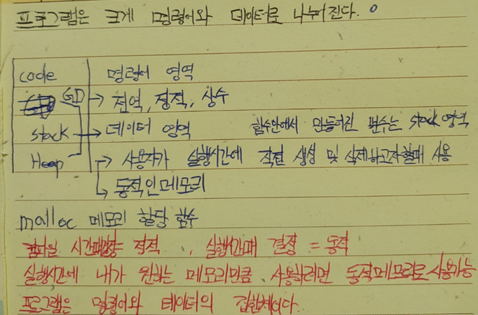
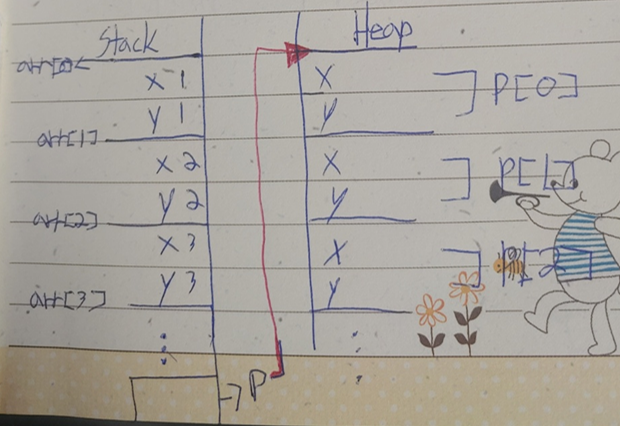
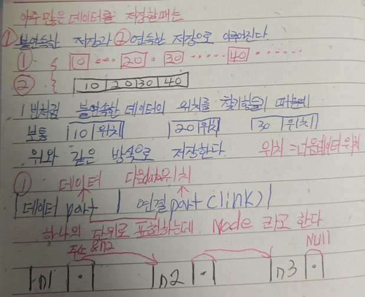

#### 자료구조 공부하기, part 01

<pre>
<strong>Chapter1</strong>
자료를 표현하는 방식에는 크게 2가지가있다.
1 = 연속하게 표현하는 방식
2 = 비 연속하게 표현하는 방식

1-1 = Array
2-1 = 연결리스트
2-2 = 트리 등등등

1-1 ) 메모리 첫번째 위치(주소)를 알게된다면 찾고자 하는 다른 위치도 알 수 있다.
2 ) 비연속성 메모리는 첫번째 위치를 안다해서 두번째 위치를 알려고 한다면 여러 매커니즘이 필요하다.

데이터 메모리 표현에는 두가지가있다.
첫번째 값 보관
두번째 위치(참조) 보관

첫번째인 값 보관에는 각 값(ex:10mega,10mega,10mega)을 용량 그대로의 값을 보관하지만,
두번째 위치보관에는 각 위치가 참조(4byte,4byte,4byte)로서 보관하게된다.

값 보관은 복사본이 필요한 경우 값 보관형태로 보관
위치보관은 복사본이 필요하지 않은 경우 위치 보관 형태로 보관

위치(참조)보관하는 방법(문법)에는 포인터가 사용된다.

</pre>



<pre>
<strong>Chapter2</strong>
</pre>




```java
#include <stdio.h>
#include <stdlib.h>
//자기 참조형 구조체 node
struct Node
{
    //데이터
    int data;
    //위치(주소)
    Node* link;
};
int main() {
    //변수 n1,n2,n3 에 데이터 값을 대입시키고 위치는 NULL
    Node n1 = { 10,NULL };
    Node n2 = { 20,NULL };
    Node n3 = { 30,NULL };
    //변수 n1에 n2주소 저장,n2에 n3주소 저장
    n1.link = &n2;
    n2.link = &n3;
    //데이터 출력
    printf("%d\n", n1.data);
    printf("%d\n", n2.data);
    printf("%d\n", n3.data);
    //주소를 참조한 데이터 출력
    printf("%d\n", n1.data);
    printf("%d\n", n1.link->data);
    printf("%d\n", n1.link->link->data);
    return 0;
}

//#include <stdio.h>
//#include <stdlib.h>
////자기 참조형 구조체 node
//struct Node
//{
//    //데이터
//    int data;
//    //위치(주소)
//    Node* link;
//};
//int main() {
//
//    return 0;
//}

//#include <stdio.h>
//#include <stdlib.h>
////포인트 구조체 사용자 정의
////이 구조체의 타입은 point 로 정의하겠다.
//typedef struct Point
//{
//    int x;
//    int y;
//}Point;
//int main() {
//    //stack에 저장하기
//    Point arr[5] = { {1,1}, {2,2}, {3,3}, {4,4}, {5,5} };
//    //heap에 저장하기
//    Point* p = (Point*)malloc(sizeof(Point) * 5);
//    p[0].x = 1;
//    p[0].y = 1;
//    p[1].x = 2;
//    p[1].y = 2;
//    p[2].x = 3;
//    p[2].y = 3;
//    p[3].x = 4;
//    p[3].y = 4;
//    p[4].x = 5;
//    p[4].y = 5;
//    for (int i = 0; i < 5; i++)
//    {
//        //stack 에 있는 내용물 출력
//        printf("(%d,%d)\n", arr[i].x, arr[i].y);
//    }
//    for (int i = 0; i < 5; i++)
//    {
//        //heap 에 있는 내용물 출력
//        printf("(%d,%d)\n", p[i].x, p[i].y);
//    }
//    free(p);
//    return 0;
//}

//#include <stdio.h>
//#include <stdlib.h>
////포인트 구조체 사용자 정의
////이 구조체의 타입은 point 로 정의하겠다.
//typedef struct Point
//{
//    int x;
//    int y;
//}Point;
//int main() {
//    //stack에 저장하기
//    Point arr[5] = { {1,1}, {2,2}, {3,3}, {4,4}, {5,5} };
//    //heap에 저장하기
//    Point* p = (Point*)malloc(sizeof(Point)*5);
//    p[0].x = 1;
//    p[0].y = 1;
//    p[1].x = 2;
//    p[1].y = 2;
//    p[2].x = 3;
//    p[2].y = 3;
//    p[3].x = 4;
//    p[3].y = 4;
//    p[4].x = 5;
//    p[4].y = 5;
//    for (int i = 0; i < 5; i++)
//    {
//        //stack 에 있는 내용물 출력
//        printf("(%d,%d)\n", arr[i].x,arr[i].y);
//    }
//    for (int i = 0; i < 5; i++)
//    {
//        //heap 에 있는 내용물 출력
//        printf("(%d,%d)\n", p[i].x, p[i].y);
//    }
//    free(p);
//    return 0;
//}
```

```java
#include <stdio.h>
int main() {
	int a = 10, b = 20, c = 30, d = 40;
	int arr[4] = { 10,20,30,40 };
	//a의 위치를 p에 대입, arr의 첫번째 위치를 pa에 대입
	int* p = &a;
	int* pa = arr;
	//포인터 변수 출력 방법
	printf("%d %d\n", *p, *pa);//출력 결과 10 , 10
        //포인터 변수의 위치(주소) 출력
        printf("%d %d\n", p, pa);
  //포인터 배열 위치에 참조되어있는 값 출력
  printf("%d %d %d %d\n", pa[0], pa[1], pa[2], pa[3]);
}
```

```java
#include <stdio.h>
  int main() {
  //hello! 문자열의 주소를 s에 담는다.
  const char* s = "hello!";
  printf("%s\n", s);
  printf("%s\n", "HELLO!");
  }
```

```java
#include <stdio.h>
#include <stdlib.h>
//포인트 구조체 사용자 정의
//이 구조체의 타입은 point 로 정의하겠다.
typedef struct Point
{
    int x;
    int y;
}Point;
int main() {
    Point pt = { 1,2 };
    //&pt 주소 를 포인트 pp로 담기
    Point* pp = &pt;
    printf("(%d,%d)", pt.x, pt.y);
    printf("(%d,%d)", (*pp).x, (*pp).y);
    printf("(%d,%d)", pp->x, pp->y);
    printf("(%d,%d)", (&pt)->x, (&pt)->y);

    return 0;
}

//#include <stdio.h>
//#include <stdlib.h>
////포인트 구조체 사용자 정의
////이 구조체의 타입은 point 로 정의하겠다.
//typedef struct Point
//{
//    int x;
//    int y;
//}Point;
//int main() {
//    Point pt = { 1,2 };
//
//    printf("(%d,%d)", pt.x, pt.y);
//
//
//    return 0;
//}

//#include <stdio.h>
//#include <stdlib.h>
////포인트 구조체 사용자 정의
//struct Point
//{
//    int x;
//    int y;
//};
//int main() {
//    Point p1; //int 형 x,y 4바이트씩 2개=8바이트 메모리사용
//    Point p2;//int 형 x,y 4바이트씩 2개=8바이트 메모리사용
//
//    int n; //int 형 4바이트 메모리 사용
//
//    n = 10;
//    //멤버 참조 연산자
//    p1.x = 1;
//    p1.y = 2;
//    //멤버 참조 연산자
//    p2.x = 2;
//    p2.y = 4;
//
//    printf("(%d,%d)", p1.x, p1.y);
//    printf("(%d,%d)", p2.x, p2.y);
//
//    return 0;
//}

//#include <stdio.h>
//#include <stdlib.h>
//int main() {
//    int x = 1, y = 2;
//    int x2 = 2, y2 = 4;
//    printf("(%d,%d)\n", x, y);
//    printf("(%d,%d)\n", x2, y2);
//
//    return 0;
//}

//#include <stdio.h>
//#include <stdlib.h>
//int main() {
//    int arr[5];
//    int* pa = (int*)malloc(sizeof(int) * 5);
//    for (int i = 0; i < 5; i++)
//    {
//        arr[i] = 10 * i;
//        pa[i] = 10 * i;
//    }
//    for (int i = 0; i < 5; i++)
//    {
//        printf("%d %d\n", arr[i], pa[i]);
//    }
//    return 0;
//}

//#include <stdio.h>
//#include <stdlib.h>
//int main() {
//    int arr[10];
//    arr[0] = 10;
//    arr[1] = 20;
//    arr[2] = 30;
//    arr[3] = 40;
//    arr[4] = 50;
//    arr[5] = 60;
//    arr[6] = 70;
//    arr[7] = 80;
//    arr[8] = 90;
//    arr[9] = 100;
//    for (int i = 0; i < 10; i++)
//    {
//        printf("%d\n", arr[i]);
//    }
//    //heap 메모리 할당하기
//    int* p;
//
//    p = (int*)malloc(sizeof(int)*10);//4byte 10개 할당
//    p[0] = 10;
//    p[1] = 20;
//    p[2] = 30;
//    p[3] = 40;
//    p[4] = 50;
//    p[5] = 60;
//    p[6] = 70;
//    p[7] = 80;
//    p[8] = 90;
//    p[9] = 100;
//    for (int i = 0; i < 10; i++)
//    {
//        printf("%d\n", p[i]);
//    }
//    free(p);//free 함수는 메모리 삭제함수
//    return 0;
//}

```
