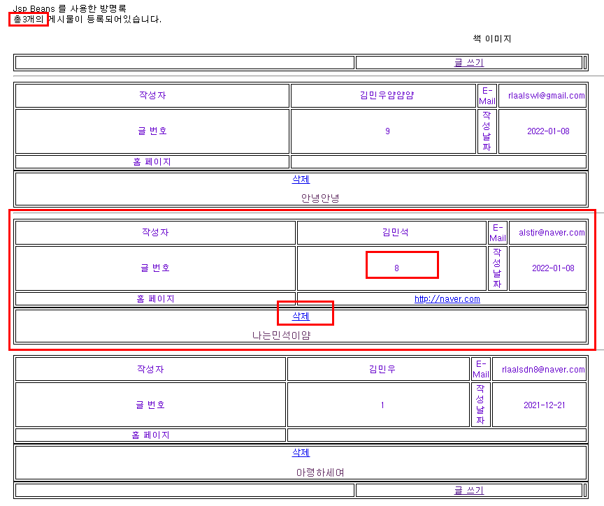
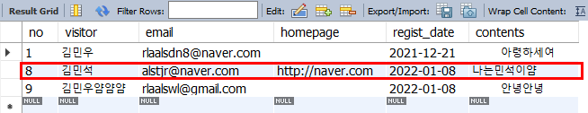
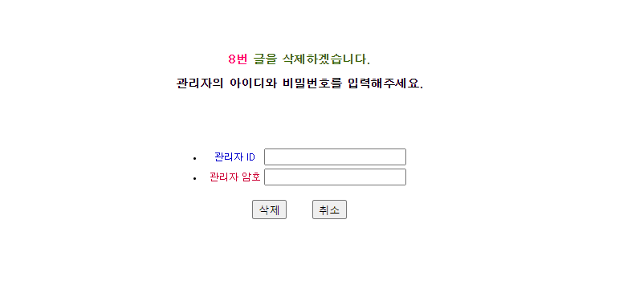
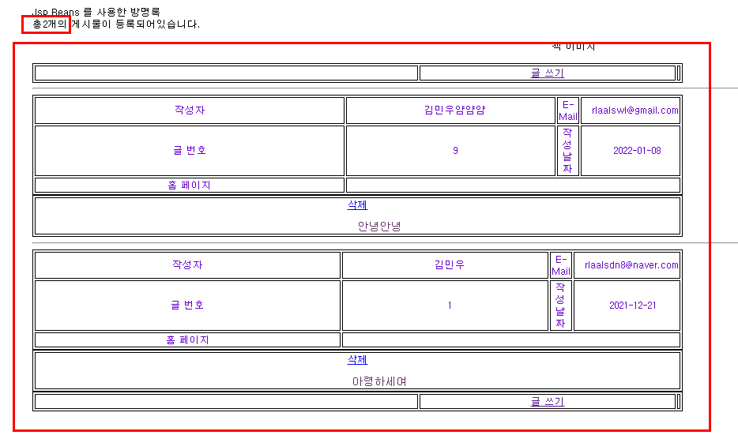
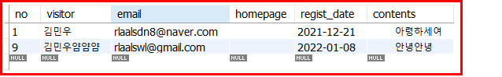

#### deleteBean.java , delete.jsp , delete_end.jsp 글 삭제 및 db 삭제




<p>이 글을 삭제했을 때 화면과 db에서 삭제되는지 확인해보자!</p>
<p>삭제를 누르면 아래와 같은 화면으로 넘어간다. 관리자 id와 password 입력창</p>



<p>관리자 아이디와 비밀번호 입력 후 글 삭제 시 alert 으로 글 삭제 성공이라 팝업되며 글 목록으로 이동된다.</p>



<p>총 게시물 등록건수 개수 줄어듬과 동시에 8번 게시물의 글이 삭제된것을 확인할수있다.</p>



<p>mysql db에서 table 조회 결과 8번 게시글이 삭제된것을 확인할수있었다.</p>

```java
package jspbook.ch11;

public class deleteBean extends Element{
	private String deleteQuery;
	public void setDeleteQuery(String deleteQuery) {
		this.deleteQuery=deleteQuery;
	}
	public String getDeleteQuery() {
		return deleteQuery;
	}
	public String getDelete() {//db 삭제 쿼리문
		deleteQuery = "delete from visit_board where no="+getNo();
		return deleteQuery;
	}
	public boolean comparePass() {//id 와 password 일치한지 확인
		if (getAdminID().equals("id")&&getAdminPass().equals("pass")) {
			return true ;
		} else {
			return false;
		}
	}
}

```

```js
<%@ page language="java" contentType="text/html; charset=UTF-8"
    pageEncoding="UTF-8"%>
<!DOCTYPE html>
<html>
<head>
<meta charset="UTF-8">
<title>방명록 글 삭제</title>
    <style type="text/css">
        body {font-family: 돋움, Verdana; font-size: 9pt}
        td {font-family: 돋움, Verdana; font-size: 9pt; text-decoration: none; color: #000000;}
    </style>
    <script language="JavaScript">
        function unsubmit() {
            if (document.submit_user.adminID.value==""){
                alert("ID가 입력되어있지 않습니다.");
                return false;
            }
            if (document.submit_user.adminPass.value==""){
                alert("Password 가 입력되어있지 않습니다.");
                return false;
            }
            return true;
        }
    </script>
</head>
<body>
<br><br><br><br>
<h3 align="center">
    <font color="#FF0066">
        <strong>
            <%=request.getParameter("delno")%>번
        </strong>
    </font>
    <font color="#336600">
        글을 삭제하겠습니다.
    </font>
</h3>
<h3 align="center">
    관리자의 아이디와 비밀번호를 입력해주세요.
</h3>
<form name="submit_user" method="post" action="delete_end.jsp?delno=<%=request.getParameter("delno")%>"onsubmit="return unsubmit()">
    <table align="center">
        <br>
        <br>&nbsp;&nbsp;adminID : <font color="red">'id'</font><br>
        &nbsp;&nbsp;adminPass : <font color="red">'pass'</font><br>
        <tr>
            <td><li></li></td>
            <td align="center"><font color="#0000CC">관리자 ID</font> </td>
            <td><input type="text" name="adminID"></td>
        </tr>
        <tr>
            <td><li></li></td>
            <td align="center"><font color="#CC0033">관리자 암호</font> </td>
            <td><input type="password" name="adminPass"></td>
            <!--hidden 눈으로는 보이지않지만 게시물 no 이름으로 삭제할 게시물의 번호를 가지고있음-->
            <input type="hidden" name="no" value="<%=request.getParameter("delno")%>">
        </tr>
    </table>
    <p>
    <table align="center">
        <tr>
            <td>
                <!--삭제를 누르면 action 에 delete_end.jsp?delno 실행-->
                <input type="submit" value="삭제">&nbsp;&nbsp;
                </form>
            </td>
            <td>
                <form name="new_User" method="post" action="list.jsp">&nbsp;&nbsp;
                <input type="submit" value="취소">
                </form>
            </td>
        </tr>
    </table>
</body>
</html>
```

```js
<%@ page language="java" contentType="text/html; charset=UTF-8"
    pageEncoding="UTF-8"%>
<%@ page language="java" import="java.util.Vector" %>
<jsp:useBean id="SQL_Manager" class="jspbook.ch11.QueryManager" scope="session"></jsp:useBean>
<jsp:useBean id="DB_con" class="jspbook.ch11.JDBCcon" scope="application"></jsp:useBean>
<jsp:useBean id="delete" class="jspbook.ch11.deleteBean" scope="page"></jsp:useBean>
<jsp:setProperty name="delete" property="adminID" param="adminID"/>
<jsp:setProperty name="delete" property="adminPass" param="adminPass"/>
<jsp:setProperty name="delete" property="no" param="delno"/>
<!DOCTYPE html>
<html>
<head>
<meta charset="UTF-8">
<title>글삭제 확인</title>
<script type="text/javascript">
	function go_list() {
		alert("글을 성공적으로 삭제하였습니다.");
		location.href="list.jsp";
	}
	function go_back() {
		alert("아이디 또는 비밀번호가 틀립니다.");
		history.go(-1);
	}
</script>
</head>
<% if(delete.comparePass()){
	SQL_Manager.setConnection(DB_con.getConnection());
	SQL_Manager.update(delete.getDelete());
%>
<body onload="go_list()"><!--password true = go_list-->
<%
}else{
%>
<body onload="go_back();"><!--password false = go_back-->
<%
}
%>
</body>
</html>
```
