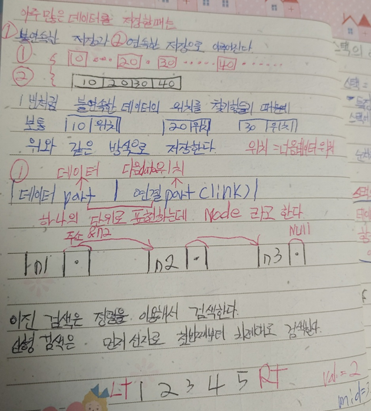
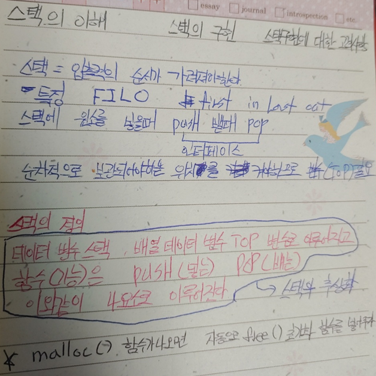
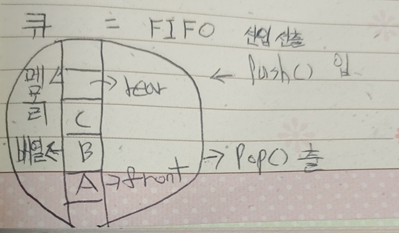
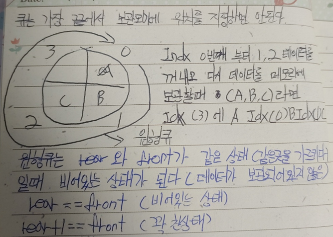

<pre>
  자료 검색에는 선형검색과 이진검색이있다.
  선형검색은 첫번째부터 순차적으로 검색하는 알고리즘을 만들고, 이진검색은 정렬을 이용해서 검색한다.
  특히 이진검색은 1부터 10까지있다면 5의 중간값을 기준으로 1또는 10까지 검색방식
  못 찾았다면 2부터 9 또 못찾으면 3부터 8까지의 계속해서 좁히며 검색 만약 
  중간값 기준으로 1또는 10사이의 값을 찾았다면 다시 줄인다. 5부터 10사이라면 7이 중간값
  1부터 5사이라면 3이 중간값 기준이된다.
  추상화 정의에대해 다시한번 공부하는 계기가되었다.
</pre>






queue.h header (구조체 정의 및 인터페이스 추상화)

```java
#pragma once
typedef struct q_
{
	int* queue;
	int front, rear;
	int capacity;//메모리 변수를 보관하기위한 변수
}Queue;
//서버(Queue)
void Push(Queue* q, int data);
int Pop(Queue* q);
void InitQueue(Queue* q, int cap);
void UninitQueue(Queue* q);
```

queue.cpp (함수 정의)

```java
#include <stdlib.h>
#include "Queue.h"
//함수의 구현정보or정의정보
void Push(Queue* q, int data) {
	//큐에 0번째에 데이터를 보관하고 rear 1 증가,rear 는 5를 넘기지않는다.
	if ((q->rear + 1) % 5 == q->front)
	{
		return;
	}
	q->rear = (q->rear + 1) % q->capacity;
	q->queue[q->rear] = data;//큐공간에 rear가 가르키는 곳에 data 보관
}
int Pop(Queue* q) {
	if (q->front == q->rear)
	{
		return	0xffffff;
	}
	q->front = (q->front + 1) % q->capacity;
	return q->queue[q->front];
}
void InitQueue(Queue* q, int cap) {
	q->queue = (int*)malloc(sizeof(int) * cap);
	q->capacity = cap;
	q->front = q->rear = 0;
}
void UninitQueue(Queue* q) {
	free(q->queue);
	q->front = q->rear = 0;
}
```

client.cpp

```java
#include <stdio.h>
#include "Queue.h"
int main() {
	Queue q;

	InitQueue(&q,100);
	Push(&q, 10);
	Push(&q, 20);
	Push(&q, 30);
	Push(&q, 40);
	Push(&q, 50);

	printf("queue : %d\n", Pop(&q));
	printf("queue : %d\n", Pop(&q));
	printf("queue : %d\n", Pop(&q));
	printf("queue : %d\n", Pop(&q));
	printf("queue : %d\n", Pop(&q));
	UninitQueue(&q);
}
```

```java
#include <stdio.h>
#include <stdlib.h>
//서버
struct Stack
{
	//동적 메모사용하기에 포인트 변수로바꿔주자
	int* stack;
	int top;
};
void Push(Stack* st, int data)
{
	st->stack[st->top] = data;
	++st->top;
}
int Pop(Stack* st)
{
	--st->top; //*top = *top - 1;
	return st->stack[st->top];
}
void InitStack(Stack* st,int cap) {
	st->stack = (int*)malloc(sizeof(int) * cap);
	st->top = 0;//top 위치 초기화
}
void UninitStack(Stack* st) {
	free(st->stack);//동적메모리공간초기화
	st->top = 0;
}
////////////////////////
//클라이언트
int main()
{
	Stack st;
	Stack st2;

	//스택 초기화 함수
	//스택 heap메모리공간 500
	InitStack(&st,500);

	Push(&st, 10);
	Push(&st, 20);
	Push(&st, 30);

	printf("%d\n", Pop(&st));
	printf("%d\n", Pop(&st));
	printf("%d\n", Pop(&st));

	//스택 마무리 초기화 함수
	UninitStack(&st);

	InitStack(&st2,10);//스택 heap메모리 공간 10

	Push(&st2, 100);
	Push(&st2, 200);

	printf("%d\n", Pop(&st2));
	printf("%d\n", Pop(&st2));

	UninitStack(&st2);
	return 0;
}

```

```java
#include <stdio.h>
#include <stdlib.h>
void PrintList(int list[], int size)
{
	for (int i = 0; i < size; ++i)
		printf("%5d", list[i]);
	printf("\n");
}
int BSearch(int data,int list[], int size, int (*cmp)(int,int))
{
	int left = 0;
	int right = size - 1;
	while (left <= right)
	{
		int middle = (left + right) / 2;
		switch (cmp(data,list[middle]))
		{
		case 1:
			right = middle - 1;
			break;
		case -1:
			left = middle + 1;
			break;
		case 0:
			return middle;
		}
	}

	return -1;
}
/////////////////////
int cmp(int data1, int data2)
{
	if (data2 < data1)
		return -1;
	else if (data2 > data1)
		return 1;
	else
		return 0;
}

int main()
{
	int list[10] = { 20, 23, 25, 35, 42, 51, 56, 65, 70, 89 };

	PrintList(list, 10);
	int idx = BSearch(56,list, 10, cmp);
	if (idx != -1)
		printf("list[%d]:%d\n", idx, list[idx]);
}
//#include <stdio.h>
//#include <stdlib.h>
//void PrintList(int list[], int size)
//{
//	for (int i = 0; i < size; ++i)
//		printf("%5d", list[i]);
//	printf("\n");
//}
//int BSearch(int list[], int size, int (*cmp)(int))
//{
//	int left = 0;
//	int right = size - 1;
//	while (left <= right)
//	{
//		int middle = (left + right) / 2;
//		switch (cmp(list[middle]))
//		{
//		case 1:
//			right = middle - 1;
//			break;
//		case -1:
//			left = middle + 1;
//			break;
//		case 0:
//			return middle;
//		}
//	}
//
//	return -1;
//}
///////////////////////
//int cmp(int data)
//{
//	if (data < 51)
//		return -1;
//	else if (data > 51)
//		return 1;
//	else
//		return 0;
//}
//
//int main()
//{
//	int list[10] = { 20, 23, 25, 35, 42, 51, 56, 65, 70, 89 };
//
//	PrintList(list, 10);
//	int idx = BSearch(list, 10, cmp);
//	if (idx != -1)
//		printf("list[%d]:%d\n", idx, list[idx]);
//}
//#include <stdio.h>
//#include <stdlib.h>
//void PrintList(int list[], int size) {
//    for (int i = 0; i < size; i++)
//    {
//        printf("%5d", list[i]);
//    }
//    printf("\n\n");
//}
//int Bsearch(int list[], int size, int data) {
//    int left = 0;
//    int right = size - 1;
//
//    while (1)
//    {
//        int middle = (left + right) / 2;
//        if (data < list[middle])
//        {
//            right = middle - 1;
//        }
//        else if (data > list[middle])
//        {
//            left = middle + 1;
//        }
//        else {
//            return middle;
//        }
//    }
//    return 2;
//}
//int main() {
//    int list[10] = { 10,20,30,40,50,60,70,80,90,100 };
//    PrintList(list, 10);
//    int idx = Bsearch(list, 10, 20);
//    if (idx != -1)
//    {
//        printf("list[%d]:%d\n", idx, list[idx]);
//    }
//    return 0;
//}

//#include <stdio.h>
//#include <stdlib.h>
//void PrintList(int list[], int size) {
//    for (int i = 0; i < size; i++)
//    {
//        printf("%5d", list[i]);
//    }
//    printf("\n\n");
//}
//int Bsearch(int list[], int size, int data) {
//    int left = 0;
//    int right = size - 1;
//    int middle = (left + right) / 2;
//    if (data < list[middle])
//    {
//        return -1;
//    }
//    else if (data > list[middle])
//    {
//        return -1;
//    }
//    else {
//        return middle;
//    }
//    return 2;
//}
//int main() {
//    int list[10] = { 10,20,30,40,50,60,70,80,90,100 };
//    PrintList(list, 10);
//    int idx = Bsearch(list, 10, 50);
//    if (idx != -1)
//    {
//        printf("list[%d]:%d\n", idx, list[idx]);
//    }
//    return 0;
//}

//#include <stdio.h>
//#include <stdlib.h>
//void PrintList(int list[], int size) {
//    for (int i = 0; i < size; i++)
//    {
//        printf("%5d", list[i]);
//    }
//    printf("\n\n");
//}
//int Bsearch(int list[], int size, int data) {
//    return 2;
//}
//int main() {
//    int list[10] = { 10,20,30,40,50,60,70,80,90,100 };
//    PrintList(list, 10);
//    int idx = Bsearch(list,10,30);
//    if (idx!=-1)
//    {
//        printf("list[%d]:%d\n", idx, list[idx]);
//    }
//    return 0;
//}

//#include <stdio.h>
//#include <stdlib.h>
//void PrintList(int list[], int total) {
//    for (int i = 0; i < total; i++)
//    {
//        printf("%5d", list[i]);
//    }
//}
//int Search(int list[], int total, int (*cmp)(int)) {
//    for (int  i = 0; i < total; i++)
//    {
//        if (cmp(list[i]))
//        {
//        return i;
//        }
//    }
//        return -1;
//}
//int cmp(int data) {
//    return data ==100;
//}
//int main() {
//    int list[10] = { 10,20,30,40,50,60,70,80,90,100 };
//    PrintList(list,10);
//    int idx = Search(list,10,cmp);
//    if (idx != -1)
//    {
//        printf("list[%d]:%d\n", idx, list[idx]);
//    }
//
//    return 0;
//}

//#include <stdio.h>
//#include <stdlib.h>
////////////서버
//void printlist(int list[], int size) {
//    for (int i = 0; i < size; i++)
//    {
//        printf("%5d", list[i]);
//        printf("\n");
//    }
//};
//int search(int list[], int size, int (*cmp)(int)) {
//    for (int i = 0; i < size; i++)
//    {
//        if (cmp(list[i]))//콜백(서비스코드가 클라이언트 코드 호출)
//        {
//            return i;
//        }
//    }
//    return -1;
//};
///////////////클라이언트
//int cmp(int data) {//콜백함수(클라이언트 코드가 서비스코드인 서버 호출)
//    return data > 50 && data % 2 == 0;
//};
//int main() {
//    int list[10] = { 20,23,56,70,35,42,65,51,89,25 };
//    printlist(list, 10);
//    int idx = search(list, 10, cmp);
//    if (idx != -1)
//    {
//        printf("list[%d]:%d\n", idx, list[idx]);
//    }
//    return 0;
//}

//#include <stdio.h>
//#include <stdlib.h>
//int Add(int a, int b) {
//    return a + b;
//};
//void Print(int n) {
//
//};
//int main() {
//    int (*pf)(int, int);//리턴타입 int 정수 두개를 매개변수로 받는 함수의 주소를 저장하는 포인터 변수
//        pf = Add;//pf 포인트 변수에 Add함수 주소 담기
//        void (*pf2)(int n);
//        pf2 = Print;//Print의 함수 주소를 pf2 포인트변수에 담기
//    int result = pf(10, 20);
//    printf("result : %d\n", result);
//    printf("result : %d\n", pf(30,40));//pf==Add
//    printf("result : %d\n", Add(50,60));//Add==pf
//
//    printf("%p\n", Add);
//    printf("%p\n", main);
//    return 0;
//}

//#include <stdio.h>
//#include <stdlib.h>
//int Add(int a, int b) {
//    return a + b;
//};
//int main() {
//    int result = Add(10, 20);
//    printf("result : %d\n", result);
//    printf("%p\n", Add);
//    printf("%p\n", main);
//    return 0;
//}
//#include <stdio.h>
//#include <stdlib.h>
////////////서버
//void PrintList(int list[], int size) {
//    for (int i = 0; i < size; i++)
//    {
//        printf("%5d", list[i]);
//        printf("\n");
//    }
//};
//int Search(int list[], int size, int (*cmp)(int)) {
//    for (int i = 0; i < size; i++)
//    {
//        if (cmp(list[i]))
//        {
//            return i;
//        }
//    }
//    return -1;
//};
//int cmp(int data) {
//    return data == 42;
//};
///////////////클라이언트
//int main() {
//    int list[10] = { 20,23,56,70,35,42,65,51,89,25 };
//    PrintList(list, 10);
//    int idx = Search(list, 10, cmp);
//    if (idx != -1)
//    {
//        printf("list[%d]:%d\n", idx, list[idx]);
//    }
//    return 0;
//}

//#include <stdio.h>
//#include <stdlib.h>
//void PrintList(int list[],int size){
//    for (int i = 0; i < size; i++)
//    {
//        printf("%5d", list[i]);
//        printf("\n");
//    }
//};
//int Search(int list[], int size, int data) {
//    return 1;
//};
//int main() {
//    int list[10] = { 20,23,56,70,35,42,65,51,89,25 };
//    PrintList(list, 10);
//    int idx = Search(list, 10, 42);
//    if (idx != -1)
//    {
//        printf("list[%d]:%d\n", idx, list[idx]);
//    }
//    return 0;
//}

//#include <stdio.h>
//#include <stdlib.h>
////자기 참조형 구조체 node
//struct Node
//{
//    //데이터
//    int data;
//    //위치(주소)
//    Node* link;
//};
//int main() {
//    //변수 n1,n2,n3 에 데이터 값을 대입시키고 위치는 NULL
//    Node n1 = { 10,NULL };
//    Node n2 = { 20,NULL };
//    Node n3 = { 30,NULL };
//    //변수 n1에 n2주소 저장,n2에 n3주소 저장
//    n1.link = &n2;
//    n2.link = &n3;
//    //데이터 출력
//    printf("%d\n", n1.data);
//    printf("%d\n", n2.data);
//    printf("%d\n", n3.data);
//    //주소를 참조한 데이터 출력
//    printf("%d\n", n1.data);
//    printf("%d\n", n1.link->data);
//    printf("%d\n", n1.link->link->data);
//    return 0;
//}

```
