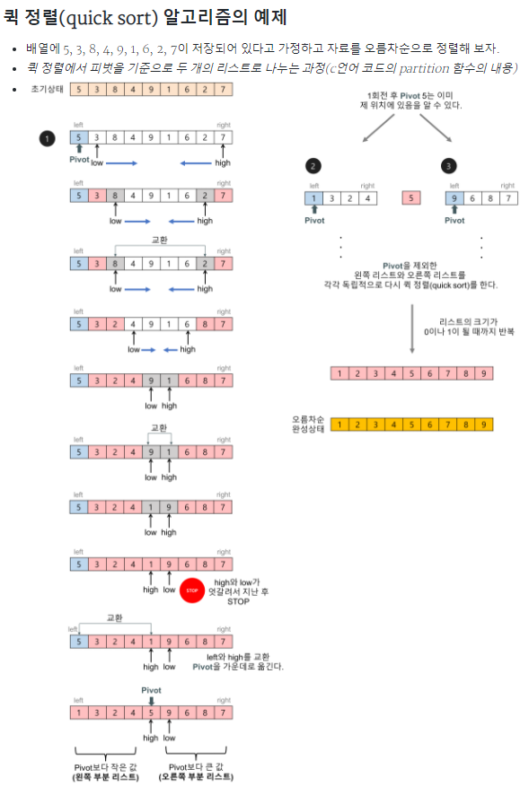
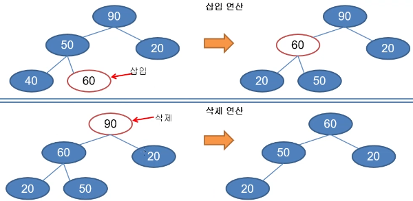

## 자료구조 정렬

<ul>
<li>선택정렬</li>
<li>삽입정렬</li>
<li>버블정렬</li>
<li>퀵 정렬</li>
<li>힙 정렬</li>
</ul>

선택정렬


```js
//list index 중 가장 작은 순서대로 나열하기 -선택 정렬-
#include <stdio.h>
int Min(int list[], int sIndex, int eIndex) {
	int min = sIndex; //리스트의 0번째 index
	for (int i = sIndex + 1; i <= eIndex; i++)
	{
		if (list[min] > list[i])//리스트의 최소값보다 리스트의 i 번째가 작다면 true
		{
			min = i;//1번째 인덱스가 20이기에 최소값에는 20이 대입됨
			printf("min : %d\n", min);//index min 위치 출력
		}
	}
	return min;
}
void Swap(int* pa, int* pb) {
	int temp = *pa;
	*pa = *pb;
	*pb = temp;
}
void PrintList(int list[], int size) {
	for (int i = 0; i < size; i++)
	{
		printf("%5d", list[i]);
	};
	printf("\n");
}
int main() {
	int list[10] = { 80,20,70,50,60,90,40,30 };
	int size = 8;

	PrintList(list, size);
	{
		for (int i = 0; i < size - 1; i++)
		{
			int min = Min(list, i, size - 1);
			Swap(&list[i], &list[min]);
		}
	}
	PrintList(list, size);
	return 0;
};
```

삽입정렬


```js
//list index 중 가장 작은 순서대로 나열하기 -삽입 정렬-
////정렬되어있는곳에 값을 넣어 교체하며 앞의 인덱스와 비교하는것이아닌 인덱스를 뒤로 밀면서 비교
#include <stdio.h>
int Min(int list[], int sIndex, int eIndex) {
	int min = sIndex; //리스트의 0번째 index
	for (int i = sIndex + 1; i <= eIndex; i++)
	{
		if (list[min] > list[i])//리스트의 최소값보다 리스트의 i 번째가 작다면 true
		{
			min = i;//1번째 인덱스가 20이기에 최소값에는 20이 대입됨
			printf("min : %d\n", min);//index min 위치 출력
		}
	}
	return min;
}
void Swap(int* pa, int* pb) {
	int temp = *pa;
	*pa = *pb;
	*pb = temp;
}
void InsertionSort(int list[], int size) {

	int cur = 4;
	int value = list[cur];
	int j;
	for ( j = cur-1; 1 ; --j)
	{
		if (list[j]>value)
		{
			list[j + 1] = list[j];
		}
		else
		{
			break;
		}
	}
	list[j + 1] = value;
}
void PrintList(int list[], int size) {
	for (int i = 0; i < size; i++)
	{
		printf("%5d", list[i]);
	};
	printf("\n");
}
int main() {
	//int list[10] = { 80,20,70,50,60,90,40,30 };
	int list[10] = { 20,50,70,80,60,90,40,30 };
	int size = 8;

	PrintList(list, size);

	InsertionSort(list, size);

	PrintList(list, size);
	return 0;
};
```

버블정렬


```js
//list index 중 가장 작은 순서대로 나열하기 -버블 정렬-
#include <stdio.h>
int Min(int list[], int sIndex, int eIndex) {
	int min = sIndex; //리스트의 0번째 index
	for (int i = sIndex + 1; i <= eIndex; i++)
	{
		if (list[min] > list[i])//리스트의 최소값보다 리스트의 i 번째가 작다면 true
		{
			min = i;//1번째 인덱스가 20이기에 최소값에는 20이 대입됨
			printf("min : %d\n", min);//index min 위치 출력
		}
	}
	return min;
}
void Swap(int* pa, int* pb) {
	int temp = *pa;
	*pa = *pb;
	*pb = temp;
}
	int j;
	int value;
	void BubbleSort(int list[], int size) {

		for (int i = 0; i < size-1; i++)//제일 마지막 부터 다시 앞으로 줄이며
		{

		for (int j = 0; j < (size-1)-i; ++j)//제일 큰 수를 제일 마지막에 위치
		{
			if (list[j] > list[j + 1])
			{
				Swap(&list[j], &list[j + 1]);
			}
		}
		}
	};
void PrintList(int list[], int size) {
	for (int i = 0; i < size; i++)
	{
		printf("%5d", list[i]);
	};
	printf("\n");
}
int main() {
	//int list[10] = { 80,20,70,50,60,90,40,30 };
	int list[10] = { 20,50,70,80,10,90,40,30 };
	int size = 8;

	PrintList(list, size);

	BubbleSort(list, size);

	PrintList(list, size);
	return 0;
};
```

퀵 정렬



```js
 순서대로 나열하기 -퀵 정렬-
//하나의 리스트를 피벗(pivot)을 기준으로 두 개의 비균등한 크기로 분할하고 분할된 부분 리스트를 정렬한 다음,
//두 개의 정렬된 부분 리스트를 합하여 전체가 정렬된 리스트가 되게 하는 방법이다.
#include <stdio.h>
#include <algorithm>
using namespace std;
void Swap(int* pa, int* pb) {
	int temp = *pa;
	*pa = *pb;
	*pb = temp;
}
void PrintList(int list[], int size) {
	for (int i = 0; i < size; i++)
	{
		printf("%5d", list[i]);
	};
	printf("\n");
}
void _Sort(int list[], int left, int right)
{
	if (left <= right)
	{
		int pivot = left;
		int i = left + 1;
		int j = right;

		do
		{
			while (list[pivot] > list[i])
				++i;
			while (list[pivot] < list[j])
				--j;
			if (i <= j)
			{
				Swap(&list[i], &list[j]);
				++i;
				--j;
			}
		} while (i <= j);
		Swap(&list[pivot], &list[j]);
		_Sort(list, left, j - 1);
		_Sort(list, j + 1, right);
	}
}
void Sort(int list[], int size) {
	_Sort(list, 0, size - 1);
}
int main() {
	//int list[10] = { 80,20,70,50,60,90,40,30 };
	int list[10] = { 50,20,70,80,60,90,40,30,45,75 };
	int size = 10;

	PrintList(list, size);
	make_heap(list, list + size);//원소의 시작과 끝(heap 구조 정렬)
	PrintList(list, size);
	pop_heap(list, list + size);//루트 노드 값이 변경됨 확인
	--size;
	pop_heap(list, list + size);
	--size;
	PrintList(list, 10);

	return 0;
};
```

힙 정렬





```js
//순서대로 나열하기 -힙 정렬-
//하나의 리스트를 피벗(pivot)을 기준으로 두 개의 비균등한 크기로 분할하고 분할된 부분 리스트를 정렬한 다음,
//두 개의 정렬된 부분 리스트를 합하여 전체가 정렬된 리스트가 되게 하는 방법이다.
#include <stdio.h>
#include <algorithm>
using namespace std;
void Swap(int* pa, int* pb) {
	int temp = *pa;
	*pa = *pb;
	*pb = temp;
}
void PrintList(int list[]) {

	printf("size : %d ", list[0]);
	printf(" [");
	for (int i = 1; i <= list[0]; i++)
	{
		printf("%d ", list[i]);
	};
	printf("]");
	for (int i = list[0] + 1; i <= 8; i++)
	{
		printf("%d ", list[i]);
	}
	printf("\n");
}
void _Sort(int list[], int left, int right)
{
	if (left <= right)
	{
		int pivot = left;
		int i = left + 1;
		int j = right;

		do
		{
			while (list[pivot] > list[i])
				++i;
			while (list[pivot] < list[j])
				--j;
			if (i <= j)
			{
				Swap(&list[i], &list[j]);
				++i;
				--j;
			}
		} while (i <= j);
		Swap(&list[pivot], &list[j]);
		_Sort(list, left, j - 1);
		_Sort(list, j + 1, right);
	}
}
void Sort(int list[], int size) {
	_Sort(list, 0, size - 1);
}
void Push_heap(int list[]) {
	++list[0];
	int size = list[0];
	int child = size;
	int parent = child / 2;

	while (parent > 0)
	{
		if (list[parent] < list[child])
		{
			Swap(&list[parent], &list[child]);
			child = parent;
			parent = child / 2;
		}
		else {
			break;
		}
	}
}
void Make_heap(int list[], int size) {
	for (int i = 0; i < size; i++)
	{
		Push_heap(list);
	}
}
void Pop_heap(int list[]) {
	int size = --list[0];
	Swap(&list[1], &list[size + 1]);
	int parent = 1;
	int child = parent * 2;

	while (child <= size)
	{

		if (child < size && list[child] < list[child + 1])
		{
			child = child + 1;
		}
		if (list[child] > list[parent])
		{
			Swap(&list[parent], &list[child]);
		}
		parent = child;
		child = parent * 2;
	}
}
void Sort_heap(int list[]) {
	int size = list[0];
	for (int i = 0; i < size; i++)
	{
		Pop_heap(list);
	}
}
int main() {

	int list[10] = { 0,70,45,35,15,20,85,75,55 };
	PrintList(list);
	Make_heap(list, 8);

	Sort_heap(list);
	PrintList(list);
	return 0;
};
```
