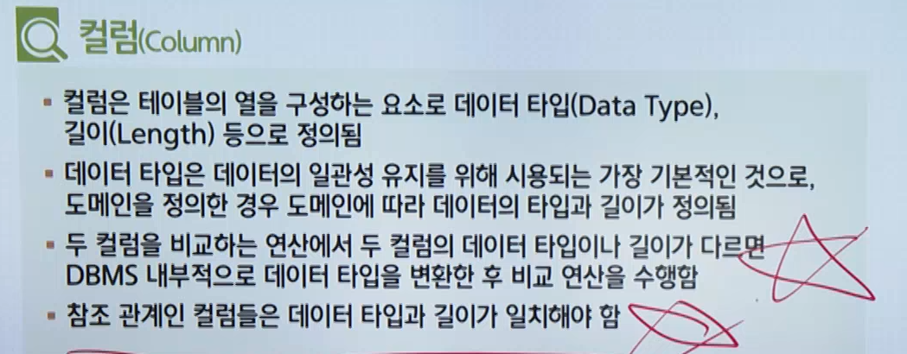
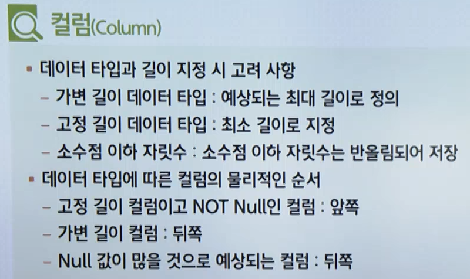
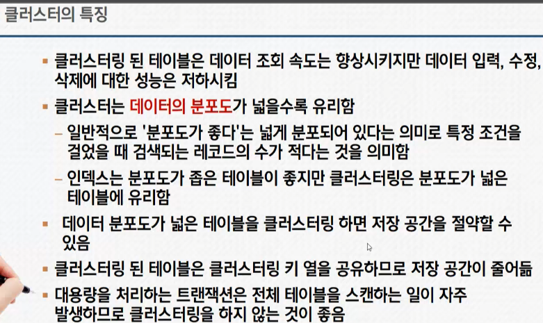
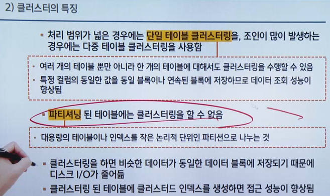
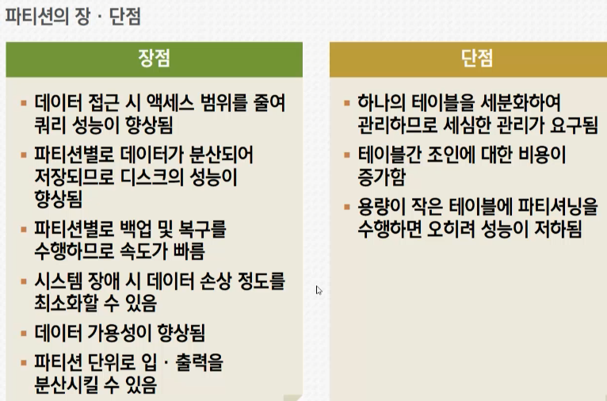
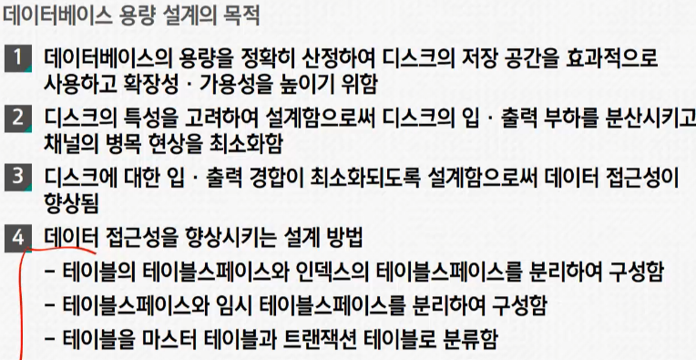

## 대학 DB THEORY 정리

```js
DBMS ( Data Base Management System)
- 사용자와 DB 사이에서 사용자의 요구에 따라 정보를 생성해주고, DB 를 관리 해주는 소프트웨어
- 기존의 파일 시스템이 갖는 데이터의 종속성과 중복성의 문제를 해결하기 위해 제안된 시스템

-- 모든 응용 프로그램들이 DB 를 공용할 수 있도록 관리해줌
-- 데이터베이스의 구성, 접근방법, 유지관리에 대한 모든 책임을 짐

---등장배경 - 종속성으로 인한 문제점과 중복성으로 인한 문제점을 해결하기 위해 등장 (데이터의 정확성을 유지해주기 위해)

----------------------------------------------------------------------------------------------------
DBMS 필수 기능
- 정의(DDL) , 조작(DML) , 제어(DCL)
정의(CREATE,ALTER,DROP)
= 데이터 형과 구조, 데이터가 DB에 저장될때의 제약조건등을 명시하는 기능
조작(SELECT,INSERT,DELETE,UPDATE)
= 데이터 검색, 갱신, 삽입 , 삭제등을 처리하기위해 사용자와 데이터베이스 수단을 제공하는 기능
제어(COMMIT,ROLLBACK,GRANT,REVOKE)
= 각 작업이 진행될때 데이터의 무결성이 유지되도록 제어해야함
= 보안을 유지하고 권한을 검사할수있도록해야함
= 여러 사용자가 디비를 동시에 접근해 데이터를 처리할 경우 처리결과가 항상 정확성을 유지하도록 병행 제어를 할수있어야함

----------------------------------------------------------------------------------------------------
트랜잭션(안전하게 수행되야하는걸 보장하기 위한 성질)
- 데이터베이스의 상태를 변경시키기 위해 수행하는 작업 단위
(변경시킨다는 의미 = SELECT, UPDATE, INSERT, DELETE 같은 행동을 뜻함)
(하나의 트랜잭션은 Commit 되거나 Rollback 될 수 있음)

--트랜잭션 특징 SQL(ACID)
A - Atomicity(원자성) = 회복
(트랜잭션의 연산은 디비에 모두 반영되던지 아니면 전혀 반영되지 않아야 함)
(트랜잭션 내의 모든 명령은 반드시 완벽하게 수행되어야하며, 모두가 완벽히 수행되지않고 어느하나라도 오류발생된다면 트랜잭션 전부가 취소되어야함)
C - Consistency(일관성) = 동시성제어 , 무결성 제약조건
(트랜잭션이 그 실행을 성공적으로 완료한다면 언제나 일관성있는 디비 상태로 변환함)
I - Isolation(격리성,고립성) = 동시성 제어
(둘 이상의 트랜잭션이 동시에 병행 실행되는 경우 어느 하나의 트랜잭션 실행 중에 다른 트랜잭션의 연산이 끼어들 수 없음)
D - Durability(영속성,지속성) = 회복
(성공적으로 완료된 트랜잭션의 결과는 시스템이 고장나더라도 영구적으로 반영되어야 함)

NoSQL(BASE) 특징
B,A - Basically(원래) Available = 기본적으로 Available(사용가능)하고
S - Soft-state = 사용자가 관리하지 않으면 Data 가 expire(유실?내쉬다?) 될 수 있으며
E - Eventually(결국) consistency(일관성) = 지금 당장은 아니지만 언젠가는 Data 가 일관성을 가진다.

NoSQL
- 데이터를 저장하는 방법에는 여러가지가있으며 sql 만 사용하여 저장하지 않는다는 의미를 담음
- 일반적으로 api 를 호출하여 저장을 함
- 최적화된 공간 = 단순 검색 및 추가 작업을 위한 최적화된 키 값 저장공간
- 분산 저장 = 트래픽 증가에 따른 비용에 효율적인 Scale-out  지원
- Schemaless = RDBMS 와 같은 스키가 구조를 가지고있지 않기에 개발 진척에 따른 스키마 변화에 FLEXIBLE(유연함) 함
----------------------------------------------------------------------------------------------------
논리 데이터 베이스 설계 / 데이터베이스 설계
-DBMS 독립적-   요구 조건 분석  [용도파악&데이터의종류&용도&처리형태&흐름&제약조건등 수집]
-DBMS 독립적-   요구 조건 명세
-DBMS 독립적-   개념적 설계   -- E-R 모델이나옴 [추상적 개념으로 표현하는 과정]
-DBMS 독립적-   개념적 스키마 [E-R도형]
-              논리적 설계 -- DBMS의 특성을 고려함 , 관계 DBMS 에서 E-R 도형을 릴레이션들로 사상(mapping) [테이블을 설계하는단계]
-DBMS 의존적-   논리적 스키마(관계 데이터베이스 스키마)
-DBMS 의존적-   정규화
-DBMS 의존적-   정규화된 릴레이션들
-DBMS 의존적-   물리적 설계  [DMBS에 맞는 물리적 구조,데이터 구조화]
-DBMS 의존적-   물리적 스키마
-DBMS 의존적-   데이터베이스 구현 [DDL 로 데이터베이스 생성]

요구사항을 분석해서 실제 데이터베이스를 구현하는 과정을 전체 설계 과정이라고 하는데 그 중간에 개, 논, 물. 우리가 개념적 설계 단계, 논리적 설계 단계, 물리적 설계 단계가 있다
----------------------------------------------------------------------------------------------------
<h3>스키마 정의</h3>
<dl>
  <dt>스키마</dt>
  <dd>데이터베이스의 구조와 제약조건에 관한 전반적인 명세를 기술한 것</dd>
  <dd>db를 구성하는 데이터 개체, 속성, 관계 및 데이터 조작 시 데이터 값들이 갖는 제약조건 등을 전반적으로 정의</dd>
</dl>
<dl>
  <dt>개체 ( Entity )</dt>
  <dd>파일 처리 방식의 파일에서 레코드</dd>
</dl>
<dl>
  <dt>속성 Attribute</dt>
  <dd>파일 처리 방식의 파일에서 필드에 해당되는 것으로 개체의 성질을 나타냄</dd>
</dl>
<dl>
  <dt>관계 Relationship</dt>
  <dd>개체와 개체 또는 개체와 속성간의 관계</dd>
</dl>
<h3>스키마 특징</h3>
<p>데이터 사전에 저장함</p>
<p>다른 이름으로 메타데이터라고함</p>
<dl>
  <dt>데이터사전</dt>
  <dd>db에 저장되있는 모든 data 개체들에대한 정보를 유지 관리하는 시스템 ( 시스템 카탈로그라고도함 )</dd>
</dl>
<dl>
  <dt>스키마의 3계층</dt>
  <dd>개념스키마</dd>
  <dd>외부스키마</dd>
  <dd>내부스키마</dd>
</dl>
<dl>
  <dt>개념 스키마</dt>
  <dd>전체적인 뷰(데이터베이스의 논리적 구조)</dd>
</dl>
<dl>
  <dt>외부 스키마</dt>
  <dd>서브 스키마 = 사용자 뷰 ( 사용자나 응용 프로그래머가 각 개인의 입장에서 필요로하는 db베이스의 논리적 구조를 정의)</dd>
</dl>
<dl>
  <dt>내부 스키마</dt>
  <dd>db 의 물리적 저장 구조를 정의 (data저장방법기술)(시스템 설계자가 보는 관점의 스키마)</dd>
</dl>
<dl>
  <dt>논리적 데이터 모델</dt>
  <dd>개념적 모델링 과정에서 얻은 개념적 구조를 컴퓨터가 이해하고 처리할수있는 컴퓨터 세계의 환경에 맞도록 변환하는 과정</dd>
</dl>
<dl>
  <dt>논리적 데이터 모델의 품질 검증</dt>
  <dd>완성된 논리 데이터 모델이 기업에 적합한지를 확인하기 위해 품질을 검증하는 것( 5가지 방법이있음 ) </dd>
</dl>
구조(Structure)
  - 논리적으로 표현된 개체 타입들 간의 관계로서 데이터 구조 및 정적 성질을 표현
연산(Operation)
  - dv 에 저장된 실제 데이터를 처리하는 작업에 대한 명세로서 db를 조작하는 기본도구
제약 조건 (Constraint)
  - db 에 저장 될 수 있는 실제 데이터의 논리적인 제약 조건
db 언어
  - db 구축, 이용하기 위한 db 시스템과의 통신 수단
  - DBMS 를 통해 사용 가능
  - 기능과 사용 목적에 따라 데이터 정의 언어ㅡ 데이터 조작언어, 데이터 제어 언어로 구분
DDL(정의어)
  - DB 생성 , 제거
DML(조작어)
  - DB 검색, 사용
DCL(제어어)
  - DB 관리, 제어
속성의 특성에 따른 분류
  - 기본속성
  - 설계속성
  - 파생속성
================================================================
1)개념적 설계(정보 모델링,개념화 단계)(필요필드등 정보취합)
2)논리적 설계(데이터 모델링)(테이블설계)
3)물리적 설계(데이터 구조화)(물리적 저장장치)
4)데이터베이스 구현(file 로 생성 단계)
5)데이터 모델의 구성요소
- 구조 = 논리적으로 표현한 개체들 간의 관계를 표시
- 연산 = 데이터베이스에 저장된 실제 데이터를 처리하는 방법을 표시
- 제약조건 = 데이터베이스에 저장될수있는 실제 데이터의 논리적인 제약조건을 표시

E-R model = entity(독립체,실제 대상체) relationship(관계) model

부모 자식 관계
-부모 = 정보가 먼저 생성되는 쪽
-자식 = 부모의 정보를 가져다 쓰는 쪽

피터첸 = er 다이어그램 만든사람?

관계형 데이터 모델
- 가장 널리 사용되는 모델, 계층 모델과 망 모델의 복잡한 구조를 단순화시킨 모델

DB 설계
사용자의 요구사항을 분석, 컴퓨터에 저장할수있는 DB 의 구조에맞게 변형한 후 특정 DBMS 로 DB를 구현하여 
일반 사용자들이 사용하게 하는 것

개념적 설계 단계에서는 E-R 모델이 나온다 . 

논리적 설계 - 관계 DBMS 에서 E-R 도형을 릴레이션들로 사상(Mapping)
- 논리적 설계 이후 부터는 DBMS 의존적

물리적 설계 - 
논리적 구조로 표현된 데이터를 디스크 등의 물리적 저장장치에 저장할 수 있는 물리적 구조의 데이터로 변환하는 과정

물리적 설계 시 고려사항-
1. 인덱스의 구조 2.레코드 크기 3.파일에 존재하는 레코드 개수 4. 파일에 대한 트랜잭션의 갱신과 참조성향
5. 성능 향상을 위한 개념 스키마의 변경 여부 검토
6. 빈번한 질의와 트랜잭션들의 수행속도를 높이기 위한 고려
7. 시스템 운용 시 파일 크기의 변화 가능성

엔티티 ( Entity )(개체) -
업무의 관심 대상이되는 정보를 갖고있거나 그에 대한 정보를 알아야하는 유 무형의 사물이나 객체
- 시스템 구축 대상이되는 업무에서 필요하고 관리하고자하는 정보여야한다
- 일반적으로 2개 이상의 인스턴스가 존재해야 의미가 있다
- 반드시 하나 이상의 속성을 가져야한다.

튜플 (Tuple) (행)-
릴레이션을 구성하는 각각의 행
- 튜플의 수를 카디널리티 또는 기수라고함

속성 ( Attribute )(열) - 
DB 를 구성하는 가장 작은 논리적 단위
- 속성의 수 : Degree 또는 차수 
- 속성은 개체의 특성을 기술 
- 파일 구조상의 데이터 항목 또는 데이터 필드에 해당

도메인 (Domain) -
하나의 속성이 취할수있는 같은 타입의 원자값들의 집합
- 실제 속성 값이 나타날때 그 값의 합법 여부를 시스템이 검사하는데에도 이용됨

릴레이션 (Relation) (테이블)-
특징
한 릴레이션에 포함한 튜플들은 모두 상이함
한 릴레이션에 포함된 튜플 사이에는 순서가 없음
튜플들의 삽입, 삭제 등의 작업으로 인해 릴레이션은 시간에 따라 변함
릴레이션 스키마를 구성하는 속성들 간의 순서는 중요하지 않음
속성의 유일한 식별을 위해 속성의 명칭은 유일해야 하지만, 속성을 구성하는 값은 동일한 값이 있을 수 있음
릴레이션을 구성하는 튜플을 유일하게 식별하기 위해 속성들의 부분집합을 Key 로 설정함
속성의 값은 논리적으로 더이상 쪼갤수없는 원자 값만을 저장함

제약조건 - 
DB 에 저장되는 데이터의 정확성을 보장하기 위해 키를 이용하여 입력되는 데이터에 제한을 주는것
- 개체 무결성 제약, 참조 무결성 제약 등이 해당함

Key 키 -
DB 에서 조건에 만족하는 튜플을 찾ㄱ거나 순서대로 정렬할때 튜플들을 서로 구분할수있는 기준이되는 속성

후보키 ( Candidate Key)-
릴레이션을 구성하는 속성들 중에서 튜플을 유일하게 식별하기 위해 사용하는
속성들의 부분집합으로 기본키로 사용할수있는 속성들
- 릴레이션에 있는 모든 튜플을 만족시키기 위한 특징
유일성 최소성을 만족해야한다 

기본키 ( Primary Key)-
후보키 중에서 선택한 Main Key 
- 한 릴레이션에서 특정 튜플을 유일하게 구별할수있는 속성
- Null 값을 가질수없음
- 기본키로 정의된 속성에는 동일한 값이 중복되어 저장될수없음

대체키 (Alternate Key)-
- 후보키가 둘 이상일때 기본키를 제외한 나머지 후보키들을 말함
- 보조키라고도 함

슈퍼키 (Super Key) - 
- 유일성만 있고 최소성이없는 속성 집합
- 한 릴레이션 내에 있는 속성들의 집합으로 구성된 키 

외래키 (Foreign Key)
- 관계 맺고있는 R1, R2 에서 릴레이션 R1 이 참조하고있는 릴레이션 R2 의 기본키와 같은 R1 릴레이션의 속성
- 사원과 부서에 서로 어트리부트 릴레이션이 없는 상황에서도 참조할수있다.
- 관계형 데이터 모델에서 참조되는 릴레이션의 기본키와 대응되어 릴레이션 간에 참조 관계를 표현하는데 중요한 도구
- 외래키로 지정되면 참조 릴레이션의 기본키에 없는 값은 입력할수없음
================================================================
요구조건 분석
개념적 설계
논리적 설계
물리적 설계

정규화:
  함수적 종속성 등의 종속성 이론을 이용해 잘못 설계된 관계형 스키마를 더 작은 속성의 세트로 쪼개서
  바람직한 스키마로 만들어가는 과정
목적:
  데이터 구조의 안정화를 최대화
  어떠한 릴레이션이라도 db 내에서 표현이 가능하게 만듦
  효과적인 검색 알고리즘을 생성
  중복을 배제해 삽입 삭제 갱신 이상의 발생을 방지
  데이터 삽입 시 릴레이션을 재구성할 필요성을 줄임
이상의 개념:
  정규화를 거치지 않으면 db 내에 데이터들이 불필요하게 중복되어 릴레이션 조작 시 예기치 못한 곤란한 현상이 발생
이상의 종류:
  삽입 이상 : 릴레이션에 데이터를 삽입할때 의도와는 상관없이 원하지 않는 값들도 함께 삽입되는 현상
  삭제 이상 : 릴레이션에서 한 튜플을 삭제할때 의도와는 상관없는 값들도 함께 삭제되는 연쇄 삭제
              현상이 일어나는 현상
  갱신 이상 : 릴레이션에서 한 튜플에있는 속성값을 갱신할때 일부 튜플의 정보만 갱신되어
              정보에 모순이 되는 현상
함수적 종속: 시간에 관계없이 항상 애트리뷰트 y 의 값이 오직 하나만 연관되어있을때 y 는 x 에 함수적 종속
완전 함수적 종속:
  여러 개의 속성이 모여 하나의 기본키를 이룰경우 기본키 전체가있어야하지만, 
  어떤 속성이 결정될때 완전 함수적 종속이라 할 수 잇음 
부분 함수적 종속:
  완전하게 함수적으로 종속하지 않으면 부분 함수적 종속성을 갖는데, 여러개의 속성이 모여서 하나의 기본키를 이룰경우
  기본키를 구성하는 부분 속성만으로도 결정되어지면 부분 함수 종속
이행 함수적 종속: 
  x-y , y-z 일때 x-z
정규화 과정 흐름도:
  비정규 relation
    제1정규형             (도메인이 원자값)
      제2정규형           (부분 함수적 종속 제거)
        제3정규형         (이행 함수적 종속 제거)
          BCNF 정규형 (Boyce-Codd Normal Form)      (결정자이면서 후보키가 아닌것 제거)
            제4정규형                   (다치 종속 제거)
              제5정규형                 (조인 종속성을 이용)
정규화의 필요성:
  정규화되지 못한 릴레이션을 조작할때 발생하는 Anomaly 현상의 근본 원인은
  여러 종류의 사실들이 하나의 릴레이션에 모두 표현되어있기 때문
================================================================
관계대수
  관계형 db 에서 원하는 정보와 그 정보를 어떻게 유도하는가를 기술하는 절차적인 방법
관계연산자
  Select
    릴레이션에서 주어진 조건을 만족하는 튜플(행)들을 선택하는 연산
  Project
    릴레이션에서 주어진 조건을 만족하는 속성들을 검색하는 연산
  Join
    공통 속성을 중심으로 두개의 릴레이션을 하나로 합쳐서 새로운 릴레이션을 만드는 연산
      Equi Join ( 동일 조인 )
      : 공통 속성 값 중복
      Natural Join ( 자연 조인 )
      : 공통 속성값 제거
  Division
    나누어지는 릴레이션인 A는 릴레이션 b의 모든 튜플에 연관되어있는 a의 튜플을 선택
  Union
    합병 가능한 두 릴레이션 A 또는 B 에 속하는 튜플들로 구성된 릴레이션
  Difference
    두 릴레이션에 존재하는 튜플의 차집합을 구하는 연산
  Cartesian Product
    A 에 속한 각 튜플 a 에 대해 b 에 속한 튜플 b 를 모두 접속시킨 튜플들(A,B)로 구성된 릴레이션
  
관계해석
  특징
    관계 데이터의 연산을 표현하는 방법으로 원하는 정보를 정의할때는 계산 수식을 사용
    관계해석은 원하는 정보가 무엇이라는 것만 정의하여 비절차적 특성을 가짐
    튜플 관계해석과 도메인 관계해석이있음
    질의어로 표현함

관계해석과 관계대수의 관계
  관계 DB 를 처리하는 기능과 능력면에서 동등
  관계대수로 표현한 식은 관계해석으로 표현할 수 있음

반정규화
  시스템의 성능 향상, 개발 및 운영의 편의성 등을 위해 정규화된 데이터 모델을
    통합, 중복, 분리하는 과정으로 의도적으로 정규화 원칙을 위배하는 행위
테이블 분할
  수평분할, 수직분할
중복테이블 추가
트리거
  :테이블의 이벤트에 반응해 자동으로 실행되는 작업을 의미
  :BEGIN 과 END 의 사이의 로직을 수행하라

시스템 카탈로그
  데이터베이스 시스템에서 데이터가 실제로 읽혀지거나 수정되기 전에 먼저 참조되는 파일
인덱스
  데이터 튜플에 빠르게 접근하기 위해 키값, 포인터 쌍으로 구성되어있는 데이터 구조
메타데이터
  데이터의 관리를 위한 데이터
쿼리 최적화
  DBMS 가 쿼리를 수행하는 여러 가지 방법들 중에서 가장 비용이 적게드는 방법을 찾는 과정

data directory
  데이터 사전에 수록된 데이터를 실제로 접근하는데 필요한 정보를 관리 유지하는 시스템
================================================================
물리적 데이터베이스 설계
  논리적 구조로 표현된 논리적 데이터베이스를 디스크 등의 물리적 저장장치에
    저장할수있는 물리적 구조의 데이터로 변환하는 과정

물리적 설계 옵션
  :특정 dbms 에서 제공되는 것으로, 데이터베이스 파일에 대한 저장 구조와 
    접근 경로에 대한 다양한 옵션을 말함

데이터 명명 규칙 파악
  :물리 데이터 모델에 적용해야하는 규칙으로 조직마다 다를 수 있으므로 , 
    물리 데이터 모델의 설계 전에 파악해야함

옵티마이저
  : sql 문을 수행할 가장 효율적이고 빠른 방법을 선택해주는 dbms 의 핵심 엔진

파티셔닝 테이블
  :대용량의 테이블은 작은 논리적 단위인 파티션으로 나눈 테이블

외부테이블
  :데이터베이스에서 일반 테이블처럼 이용할수있는 외부파일로,
    데이터베이스 내에 객체로 존재함

임시 테이블
  : 트랜잭션이나 세션별로 데이터를 저장하고 처리할수있는 테이블
```





```js

테이블 스페이스
  :테이블이 저장되는 논리적인 영역으로, 하나의 테이블 스페이스에 하나 또는 
    그 이상의 테이블에 저장될수있음

crud 매트릭스
  :2차원 형태의 표로 행에는 프로세스를 열에는 테이블을 행과 열이 만나는
   위치에는 프로세스가 테이블에 발생시키는 변화를 표시하는 
    업무 프로세스와 데이터간 상관 분석표 

인덱스
  :데이터 레코드를 빠르게 접근하기 위해 키,값,포인터 쌍으로 구성되는 데이터구조

트리기반 인덱스
  :인덱스를 저장하는 블록들이 트리 구조를 이루고있는 것으로 , 
  상용 dbms 에서는 트리구조 기반의 b 트리 인덱스를 주로 활용함

비트맵 인덱스
  :인덱스 컬럼의 데이터를 비트 값인 0 또는 1 로 변환하여 인덱스 키로 사용하는 방법
    비트맵 인덱스의 목적은 키 값을 포함하는 로우의 주소를 제공하는것
      비트맵 인덱스는 분포도가 좋은 컬럼에 적합하며 성능 향상 효과를 얻을 수 있음

함수 기반 인덱스
  :컬럼의 값 대신 컬럼에 특정 함수나 수식을 적용하여 산출된 값을 사용하는것

비트맵 조인 인덱스
  :다수의 조인된 객체로 구성된 인덱스로 단일 객체로 
    구성된 일반적인 인덱스와 엑세스 방법이 다름

도메인 인덱스
  :개발자가 필요한 인덱스를 직접 만들어 사용하는것ㄱ으로 확장형 인덱스라고도함

새로 추가되는 인덱스는 기존 액세스 경로에 영향을 미칠수있음
  인덱스를 지나치게 많이 만들면 오버헤드가 발생함
    넓은 범위를 인덱스로 처리하면 많은 오버헤드 발생 
      인덱스를 만들면 추가적인 저장공간이 필요함
        인덱스와 테이블 데이터의 저장 공간이 분리되도록 설계함 

뷰
  사용자에게 접근이 허용된 자료만을 제한적으로 보여주기 위해 하나 이상의
    기본 테이블로부터 유도된 이름을 가지는 가상 테이블
단점 : 독립적인 인덱스를 가질수없음
        alter view 문을 사용 할수 없음
        뷰로 구성된 내용에대한 갱신 연산에 제약이 따름 
================================================================
클러스터 설계
  데이터 저장시 데이터 액세스 효율을 향상시키기 위해 동일한 성격의 데이터를 
    동일한 데이터 블록에 저장하는 물리적 저장방법

클러스터링 키 
  지정된 컬럼 값의 순서대로 저장되고 여러개의 테이블이 하나의 클러스터에 저장됨

```





```js

클러스터 대상 테이블
1 분포도가 넓은 테이블
2 대량의 범위를 자주 조회하는 테이블
3 입력 수정 삭제가 자주 발생하지 않는 테이블
4 자주 조인되어 사용되는 테이블
5 정렬 그룹지정 통합지정이 빈번한 테이블

파티션
  db 에서 파티션은 대용량의 인덱스를 작은 논리적 단위인 파티션으로 나누는것
    성능저하를 방지 및 데이터 관리도 쉬워짐
  테이블이나 인덱스를 파티셔닝하면 파티션키 또는 인덱스키에따라 물리적으로 
   별도의 공간에 데이터가 저장됨

```



```js
파티션의 종류
  범위 분할
  해시 분할
  조합 분할
파티션키 선정시 고려사항
  파티션키는 테이블 접근 유형에 따라 파티셔닝이 이뤄지도록 선정함
  데이터 관리의 용이성을 위해 이력성 데이터는 파티션 생성주기와 소멸주기 일치
  매일 생성되는 날짜 컬럼 백업의 기준이되는 날짜 컬럼 파티션간 이동이 없는 컬럼
    데이터 분포가 양호한 컬럼 등을 파티션키로 선정
인덱스 파티션
  파티션된 테이블의 데이터를 관리하기 위해 인덱스를 나눈것

데이터베이스 용량 설계
  데이터가 저장될 공간을 정의

```



```js
5 db 에 생성되는 오브젝트의 익스텐트 발생을 최소화하여 성능 향상
  (익스텐트(기본적인 용량이 가득찼을때 할당하는 공간?))
6 데이터베이스 용량을 정확히 분석하여 테이블과 인덱스에 적합한 저장 옵션을 지정

분산 데이터베이스
  논리적으로는 하나의 시스템에 속하지만 물리적으로는 네트워크를 통해 연결된
    여러개의 컴퓨터 사이트에 분산되어있는 데이터베이스
분산처리기
  자체적으로 처리능력을 가지며 지리적으로 분산되어있는 컴퓨터 시스템
분산 db
  지리적으로 분산되어있는 데이터베이스
  해당 지역의 특성에 맞게 db 가 구성
통신 네트워크

분산 db 설계 시 고려사항
  1 작업 부하의 노드별 분산 정책
  2 지역의 자치성 보장 정책
  3 데이터의 일관성 정책
  4 사이트나 회선의 고장으로부터 회복 기능
  5 통신 네트워크를 통한 원격 

  분산 db 목표
  1 위치 투명성
  2 중복 투명성
  3 병행 투명성
  4 장애 투명성
  장점
  지역 자치성 높음
  자료의 공유성이 향상
  분산제어 가능
  시스템 성능 향상
  중앙 컴퓨터의 장애가 전체 시스템에 영향을 끼치지 않음
  효용성과 융통성이 높음
  신뢰성 및 가용성이 높음
  점진적 시스템 용량 확장이 용이
  단점
  dbms 가 수행할 기능 복잡
  db 설계 어려움
  소프트웨어 개발 비용 증가
  처리비용 증가
  잠재적 오류 증가

  테이블 위치 분산
    db 의 테이블을 각기 다른 서버에 분산시켜 배치하는 방법
    
  분할
  테이블의 데이터를 분할하여 분산시킴

  할당
    동일한 분할을 여러개의 서버에 생성하는 분산방법

db 이중화
  시스템 오류로 인한 db 서비스 중단이나 물리적 손상 발생시 이를 
    복구하기 위해 동일한 db 를 복제하여 관리하는것
  동일한 db 를 복제하여 관리하되 데이터를 읽고 쓸수있는 마스터 db 와 읽기만 가능한
    슬레이브 db 로 구분하여 사용함
  슬레이브 db 는 마스터 db 의 로그를 이용해 변경된 데이터를 동기화 함

  Eager 기법
  Lazy 기법
  활동 대기 방법
  활동 활동 방법

  클러스터링
    두 대 이상의 서버를 하나의 서버처럼 운영하는 기술
    공유 스토리지, 고가용성 클러스터링, 병렬 처리 클러스터링
==========================================================
무결성(integrity)
  db 에 저장된 data value 와 그것이 표현하는 현실 세계의 실제 값이 일치하는 정확성
  중앙 통제에 의한 데이터 갱신

  데이터 무결성
    데이터의 정확성 또는 유효성

  제한
    위배를 야기한 연산을 단순히 거절

  연쇄
    참조되는 릴레이션에서 튜플을 삭제하고, 참조되는 릴레이션에서 
      이 튜플을 참조하는 튜플들도 함께 삭제됨
  
  NULL 값
    참조되는 릴레이션에서 튜플을 삭제하고 참조되는 릴레이션에서 
      이 튜플을 참조하는 튜플들의 외래키에 null 값을 삽입함

  기본 값
    null 값을 넣는 대신에 default 값을 넣는다는 것을 제외하고는 null 값과 동일

  무결성의 종류
    null 무결성, 고유 무결성
  
  참조 무결성
    외래키 값은 null 이거나 참조 릴레이션의 기본키 값과 동일해야한다는 규정
    릴레이션은 참조할수 없는 외래키 값을 가질수 없다는 규정

  도메인 무결성
    특정 속성의 값이 그 속성이 정의된 도메인에 속한 값이어야 한다는 규정

  키 무결성
    하나의 테이블에는 적어도 하나의 키가 존재해야한다는 규정

  관계 무결성
    릴레이션에 어느 한 튜플의 삽입 가능 여부
    한 릴레이션과 다른 릴레이션의 튜플들 사이의 관계에 적절성 여부를 지정한 규정

  개체 무결성
    기본 테이블의 기본키를 구성하는 어떤 속성도 null 값이나 중복 값을 가질수 
      없다는 규정
      
db 보안
  db 의 일부분 또는 전체에 대해 권한이 없는 사용자가 접근하는 것을 금지하기 위해 
    사용되는 기술
  
  암호화 기법
    개인키 암호형식 = 비밀키 암호 방식
      (공인 인증서 등) 송 수신간에 공유된 비밀키
      des : 64 비트 블록화 ,56 비트 키 길이
      동일한 키로 데이터를 암호화하고 복호화 하는 방식
      데이터 생성자는 평문의 정보 m  을 암호화 알고리즘 e 와 개인키 k 를 이용해
        암호문 c 로 바꾸어 저장시켜 놓음
      사용자가 그 데이터에 접근하려면 복호화 알고리즘 d 와 개인키 k 를 이용해
        평문의 정보로 바꾸어 이용하는 방법

      장점
        암 복호화 속도가 빠름, 알고리즘이 단순하고 파일 크기가 작음
      단점
        사용자의 증가에따라 관리해야 할 키의 수가 상대적으로 많아짐
    공개키 암호 방식
      서로 다른 키로 데이터를 암 복호화 하는 방식
      데이터를 암호화 할때 사용하는 키는 db 사용자에게 공개하고 
        복호화할때 키는 관리자가 비밀리에 관리하는 키 
    rsa 알고리즘
      장점
        키의 분배가 용이
        관리해야할 키의 개수가 적음
      단점
        암,복호화 속도가 느림
        알고리즘이 복잡하고 파일 크기가 큼
  권한 부여 기법
    일반적으로 사용자들이 서로 다른 객체에 대해 서로 다른 접근 권한을 갖게 설정
    권한 부여기법에서 보안을 위한 데이터 단위는 테이블 전체나 특정한 행 열에 
      있는 데이터 값이 될 수 있음
  
    grant/revoke 기법
      dba 가 grant/revoke 명령으로 권한을 부여하고 취소시키는 방법
    사용자 등급 지정 및 해제
      종류
        dba 
          db 관리 책임자
        resource 
          db 및 테이블 생성 가능자
        connect 
          단순 사용자
  DDOS
    불특정 다수의 지점으로부터 네트웍이나 서버 자원의 사용을 방해하는 막대한
      요청을 전송하는 방식으로 정상적인 사용을 방해하고 궁극적으로는 서비스의 
        사용성을 훼손하기 위한 목적

    물량 기반 디도스 공격
      정상적으로 처리할수있는 수준을 상회하는 트래픽을 전송해 네트웍 기능 마비
    
    상태 소진형 디도스 공격
      프로토콜 특성을 악용해 방화벽,IPS, 로드 밸런서같은 시스템을 무력화
    
    어플리케이션 레이어 기반 디도스 공격
      정상 요청으로 가장하지만, 방어수단을 우회하고 어플리케이션 리소스를 소진하기 
        위한 악의적인 요청을 통한 공격

클라우드
  인터넷 기반 컴퓨팅의 일종으로 공유 컴퓨터 처리 자원과 데이터를 컴퓨터와 다른 
    장치들에 요청시 제공해줌
  구성 가능한 컴퓨팅 자원에대해 어디서나 접근이 가능한 주문형 접근을 가능케하는 
    모델이며 최소한의 관리 노력으로 빠르게 예비 및 릴리스를 가능케 함

  클라우드의 DB
    RDS, Redshift, DynamoDB, ElastiCache
  
db 백업
  전산 장비의 장애에 대비해 db 에 저장된 데이터를 보호하고 복구하기 위한 작업
  치명적인 데이터 손실을 막기위해 db 를 정기적으로 백업해야함

  장애유형
    1 사용자 실수
    2 미디어 장애
    3 구분 장애
    4 사용자 프로세스 장애
    5 인스턴스 장애
  
  로그파일
    db 처리 내용이나 이용 상황 등 상태변화를 시간의 흐름에 따라 모두 기록한 파일
    db 의 복구를 위해 필요한 가장 기본적인 자료
  
  동기적 비동기적 갱신 방법으로 분류

  백업 종류
    물리 백업
    논리 백업

스토리지
  단일 디스크로 처리할 수 없는 대용량의 데이터를 저장하기 위해 서버와 저장장치를 
    연결하는 기술

  DAS
    서버와 저장장치를 전용 케이블로 직접 연결하는 방식으로 일반 가정에서 컴퓨터의 
      외장하드를 연결하는것
  NAS
    서버와 저장장치를 네트워크를 통해 동작하는 방식
  SAN
    DAS 의 빠른처리와 NAS 의 파일 공유 장점을 혼합한 방식으로 서버와 저장 장치를 
      연결하는 전용 네트워크를 별도로 구성하는 방식
================================================================
논리 데이터 모델의 물리 데이터 모델 변환
  개체 타입과 이들간의 관계타입을 이용해 현실세계를 개념적으로 표현
  관계형 db 를 구성하는 개체나 관계를 모두 릴레이션이라는 표로 표현
엔티티
  업무의 관심 대상이 되는 정보를 갖고있거나 그에대한 정보를 알아야하는      
    유형,무형의 사물이나 객체
엔티티 특징
  시스템 구축 대상이되는 업무에서 필요하고 관리하고자하는 정보
  일반적으로 2개 이상의 인스턴스가 존재해야 의미가있음
  반드시 하나 이상의 속성을 가져야 함
튜플
  릴레이션을 구성하는 각각의 행
속성
  db 를 구성하는 가장 작은 논리적 단위
속성의 표현방법
  현실세계의 정보항목중 업무에서 관심이있는 항목만을 속성으로 취함
키
  db 에서 조건에 만족하는 튜플을 찾거나 순서대로 정렬할때 또는 튜플들을
    서로 구분할수있는 기준이되는 어트리뷰트
개체 무결성
  릴레이션에서 기본키를 구성하는 속성은 널값이나 중복의 값을 가질수없음
참조 무결성
  외래키 값은 널이거나 참조 릴레이션의 기본키 값과 동일해야한다
  릴레이션은 참조할수없는 외래키 값을 가질수없다
  외래키와 참조하려는 테이블의 기본키는 도메인과 속성 개수가 같아야한다

슈퍼타입,서브타입은 논리 데이터 모델에서 이용되는 형태이므로
물리 데이터 모델을 설계할때는 슈퍼,서브타입 테이블로 변환해야함

슈퍼타입
  장점
    데이터의 엑세스가 상대적으로 용이
    뷰를 이용해 각각의 서브타입만을 엑세스하거나 수정할수있음
    서브타입 구분이 없는 임의 집합에 대한 처리 용이
    여러 테이블을 조인하지 않아도 되므로 수행 속도 빨라짐
    sql 문장 구성이 단순해짐
  단점
    테이블의 컬럼증가로 디스크 저장공간 증가
    처리마다 서브타입에대한 구분 필요한 경우 많이 발생
서브타입
  장점
    각 서브타입 속성들의 선택 사양이 명확한 경우에 유리
    처리할때마다 서브타입 유형을 구분할 필요없음
    여러개의 테이블로 통합하므로 테이블당 크기가 감소하여 전체 테이블       
      스캔시 유리
  단점
    수행 속도가 감소할수있음
    복잡한 처리를 하는 sql 의 통합이 어려움
    부분 범위에 대한 처리가 곤란해짐
개별타입
  슈퍼타입과 서브타입들을 각각의 개벌적인 테이블로 변환하는것
  슈퍼타입과 서브타입 테이블들 사이에는 각각 1:1 관계가 형성
    장점
      저장 공간이 상대적으로 작음
      슈퍼타입 또는 서브타입 각각의 테이블에 속한 정보만 조회하는 경우 문장 
        작성이 용이하다
    단점
      슈퍼,서브 타입의 정보를 같이 처리하면 항상 조인이 발생하여 성능 저하
물리데이터 모델 품질 검토
  물리데이터 모델을 설계하고  db 객체를 생성하고 개발 단계로 넘어가기전에 
    모델러와 이해 관계자들이 모여 수행함
1 정확성: 데이터모델이 요구사항이나 업무 규칙, 표기법에따라 정확하게      
    표현되어있음을 의미
2 완전성: 데이터 모델이 데이터 모델의 구성 요소를 누락없이 정의하고 
    요구사항이나 업무 영역을 누락 없이 반영하였음을 의미함
3 준거성: 데이터 모델이데이터 표혀준,표준화 규칙, 법적 요건등을 정확하게 
    준수하였음을 의미함
4 최신성: 데이터모델이 최근의 이슈나 현행 시스템을 반영하고있음을 의미
5 일관성: 데이터 모델이 표현상의 일관성을 유지하고 있음을 의미
6 활용성: 작성된 모델과 설명을 사용자가 충분히 이해할수있고, 업무변화에따른 
    데이터 구조의 변경이 최소화될수있도록 설계되었음을 의미
================================================================
DDL
  CREATE
  ALTER
  DROP

SQL 
  DBMS 에서 DB 로부터 데이터를 뽀아내 사용가능한 형식으로 나타내주는 함수

db 생성 제거 ddl 정의어: db 구조 데이터형식 접근방식등 db 를 구축하거나 
  수정할 목적으로 사용하는 언어 
    데이터베이스 관리자가 데이터베이스 설계자가 사용함
      create,alter,drop 
db 검색 사용 dml 조작어:db 사용자가 응용 프로그램이나 질의어를 통해 저장된 
  데이터를 실질적으로 처리하는데 사용되는 언어
    db 사용자와 db 관리 시스템간의 인터페이스를 제공
      select, insert, delete, update
db 관리 제어 dcl 제어어: 무결성,보안및권한제어,회복등을하기위한언어
  데이터 관리를 목적으로 함
    commit, rollback, grant, revoke

ddl 로 정의된 내용은 meta-data 가 되며 시스템 카탈로그에 저장됨

ON DELETE SET NULL : 튜플이 삭제되면 관련된 모든 튜플의 속성값을 NULL 변경

ON UPDATE CASCADE: 테이블에서 FOREIGN KEY 의 값이 변경되면 관련
  모든 튜플의 속성값도 같은 값으로 변경

CHECK(생년월일 >= '1990-12-24'); :19901224 이후에 대한것만 저장
================================================================
DML-SELECT
  테이블을 구성하는 행들 중에서 전체 또는 조건을 만족하는 행을 검색하여
    주기억장치 상에 임시 테이블로 구성하는 명령문
  Predicate: 불러올 튜플 수를 제한할 명령어를 기술함
  ALL: 모든 튜플을 검색할때 지정하는 것으로, 주로 생략
  DISTINCT:중복된 튜플이있으면 그중 첫번째 한 개만 검색
  WHERE 절 LIKE:대표 문자를 이용해 지정된 속성의 값이 문자 패턴과 일치하는 
    튜플만 검색함
    대표문자:*또는 %: 모든 문자를 대표한다 EX)신%
      ? 또는 _ : 한자리 문자를 대표함 EX)신__
      #:한자리 숫자를 대표함
  GROUP BY 절:특정 속성을 기준으로 그룹화하여 검색할때 그룹화할 속성 지정
    그룹함수 종류
      COUNT:그룹별 튜플 수를 구하는 함수
      MAX:그룹별 최대값을 구하는 함수
      MIN:그룹별 최소값을 구하는 함수
      SUM:그룹별 함계를 구하는 함수
      AVG:그룹별 평균을 구하는 함수
      IS NULL:조건을 지정하는 WHERE 절에서 속성의 값이 NULL인 것을 검색
      IS NOT NULL:조건을 지정하는 WHERE 절에 속성의 값이 NULL 아닌것 검색
      HAVING 절:GROUP BY 와 함께 사용되며 그룹에대한 조건을 지정
      ORDER BY 절:특정 속성을 기준으로 정렬해 검색할때 사용
INSERT INTO~
  기본 테이블에 새로운 튜플을 삽입할때 사용
  대응하는 속성과 데이터는 개수와 데이터 타입이 일치해야한다
  기본 테이블의 모든 속성을 사용할때 속성명을 생략할수있다
  SELECT 문을 사용해 다른 테이블의 검색 결과를 삽입할수있다
DELETE (행삭제)
  ex:DELETE FROM 사원 WHERE 이름="민우";
DROP (테이블 삭제)
GRANT
  데이터베이스 사용자에게 사용권한을 부여
  EX:GRANT SELECT ON 학생 TO KIM; (SELECT 권한 부여)
REVOKE
  DB 사용자의 권한을 취소
  EX:REVOKE SELECT ON 학생 FROM KIM[CASCADE] (SELECT 권한 취소)
COMMIT
  DB 조작 작업을 영구적으로 반영하여 완료
ROLLBACK
  DB 조작 작업이 비정상적으로 종료되었을때 원래의 상태로 복구
UPDATE

내장 SQL
  응용 프로그램 내에 DB 에서 사용되는 DATA 를 정의하거나 질의하는 SQL
    문장을 내포하여 프로그램이 실행될때 함께 실행되도록 호스트 프로그램 언어
      로 만든 프로그램에 삽입된 SQL 문
DML-JOIN
  2 개의 테이블에 대한 연관된 튜플들을 결합해 하나의 새로운 릴레이션 반환
  크게 INNER JOIN , OUTER JOIN 으로 구분
  일반적으로 FROM 절에 기술, 릴레이션이 사용되는 어느 곳에서나 사용가능

NOT IN : 포함 되지 않는 


UNION 을 사용해 테이블을 합치면 두 테이블에 모두 속해있는 튜플은 중복이 제거되어 1개만 표시됨


DISTINCT : 중복 배제


BETWEEN : ~ 사이 검색 시 사용


JOIN : 2개의 테이블에 대해 연관된 튜플을 결합하여 하나의 새로운 릴레이션을 반환


OUTER JOIN : 릴레이션에서 JOIN 조건에 만족하지 않은 튜플도 결과로 출력하기 위한 JOIN 방법


DROP : TABLE 삭제 시 사용


DELETE FROM ~ : 튜플 삭제


LEFT OUTER JOIN : INNER JOIN 의 결과를 구한 후 우측 항 릴레이션의 어떤 튜플과도 맞지 않은 좌측 항의 릴레이션에 있는 
튜플들에 NULL 값을 붙여서 INNER JOIN 의 결과에 추가함


SELF JOIN : 같은 테이블에서 2개의 속성을 연결해 EQUI JOIN 을 하는 JOIN 방법


COMMIT : 정상적인 완료
ROLLBACK: 비정상적인 종료(변경된 모든 내용들을 취소하고 DB 를 이전상태로 되돌리는 명령어)
GRANT: 사용권한 부여
REVOKE: 사용권한 취소


사용자 등급
DBA : DB 관리자
RESOURCE: DB 및 테이블 생성 관리자
CONNECT: 단순 사용자


CASCADE : 권한 취소시 권한을 부여받았던 사용자가 다른 사용자에게 부여한 권한도 취소함


시스템 카탈로그: DB 관리자의 도구로 DB 에 저장되어있는 모든 DATA 개체들에대한
정의나 명세에대한 정보가 구록되어있는 시스템 테이블


인덱스: DATA 튜플에 빠르게 접근하기위해 키값 포인터 쌍으로 구성되는 데이터 구조

VIEW:하나이상의 기본 테이블에서 유도되는 가상테이블
CREATE VIEW : 뷰를 정의하는 명령문
DROP VIEW : 뷰 제거하는 명령문
RESTRICT: 뷰를 다른곳에서 참조하고있으면 제거가 취소됨
CASCADE: 뷰를 참조하는 다른뷰나 제약 조건까지 모두 제거함


메타데이터: 데이터의 관리를 위한 데이터


킬 스위치:스마트폰과 같은 개인정보 기기 분실시 원격으로 킬스위치를 사용해 기능들을 정지 시킬수있다, 펌웨어나 운영체제 수준에서 제공됨

CC: 나라마다 상이한 정보보호시스템 평가기준을 사용함으로서 발생하는 시간과 비용 낭비 예방코자 국제표준으로 채택된 
정보보호 시스템 평가 기준

사이버 불링: 인터넷 환경에서 특정한 개인이나 단체의 명예를 훼손하거나 심리적으로 괴롭히는 행위

DES : 암호 알고리즘

디지털 포렌식 :데이터를 수집 보전 분석하는 일련의 행위와 절차

BEM: 가정 주택 건물에대해 에너지 소비를 최적할 목적으로 스마트 가전을 정보 네트워크에 접근 후 조작할수있도록하는 IT 시스템

CRL: PKI 와 같은 암호 시스템에서 유효하지않은 인증서의 일련번호 목록을 가리킴

FDR: 비행데이터 기록 장치를 말하는 것 (블랙박스)

LEA:국내 국가보안기술연구소에서 개발한 블록 암호 기술

MDM: 휴대폰과같은 이동장비 원격으로 제어하는것

Tvishing: 스마트 tv 에 대한 최고 접근 권한을 획득하는 일련의 행위

zero day attack: 대책 수립기간이 하루도안된다는 의미 내포

사회공학: 인터넷의 물리적 기술적 취약점을 이용치않고 사용자의 심리나 사회 문학적 반응을 예견하여 정보권한을 탈취하는 행위

좀비 피시: 악의적으로 사전에 설치됨으로 나중에 해커로부터 조종당하여 시스템을 공격하거나 서비스 방해에 동원되는 악성 코드가 설치된 컴퓨터

ZeuS : 인터넷 뱅킹용 악성코드

wep: 무선 lan 에서 발생 가능한 보안 문제와 프라이버시 침해를 예방하기 위해 암호 기법 사용

RPO: IT 서비스로부터 사라질 수 있는 데이터의 최대 허용 주기

ISMS-P: 정보보호 및 개인정보보호를 위한 일련의 조치와 활동이 인증기준에 적합함을 인터넷진흥원 또는 인증 기관이 증명하는 제도

EAM: 인트라넷 엑스트라넷 클라이언트/서버 등 다양한 인터넷 환경에서 특정한 자원에 접근할때 사용자 인증 및 접근 권한 부여에관한 관리를 수행하는 통합 솔루션

APT: 지능형 타깃 지속 공격, 기존의 여러가지 IT 기술과 해킹 방법들을 종합적으로 활용하여 다양한 종류의 보안 위협

Stuxnet : 제어 소프트웨어에 침입해 마비시키는 악성 코드

랜섬웨어: 몸값과 제품으로 구성된 합성어로 컴퓨터안에 저장된 문서나 정보를 소유자의 동의없이 감추거나 변형한 후 몸값 결제를 유도함

PI: 살아있는 개인을 식별할 수 있는 정보

DLP: 내부정보 유출방지 보안기술

보호나라: 한국인터넷 진흥원이 운영하는 정보 보호 포털 사이트 명칭


내장 SQL : 응용 프로그램 내에 DB 에서 사용되는 데이터를 정의하거나 질의하는 SQL 문장을 내포하여 프로그램이 실행될때 함께 실행되도록 호스트 프로그램 언어로 만든 프로그램에 삽입된 SQL 문

변수의 구분: 내장 SQL 에서 사용하는 호스트 변수는 변수앞에 콜론 문자를 붙임
,호스트 언어 내에서 호스트 변수는 콜롬 없이 그대로 사용함

커서: 내장 SQL 과 달리 복수 개의 튜플에 접근 가능함, 질의 실행결과로 반환된 테이블의 튜플들을 순서대로 가르키는 튜플에대한 포인터임,
커서를 이용해 질의 결과로 반환된 튜플들을 한번에 하나씩 차례로 처리가능함

커서 관련 명령어
DECLARE: 커서를 정의하는 등 커서에 관련된 선언을 하는 명령어
OPEN: 커서가 질의 결과의 첫번째 튜플을 가리키도록 설정하는 명령어
FETCH: 질의 결과에대한 튜플들 중 현재의 다음 튜플로 커서를 이동시키는 명령어
CLOSE:질의 실행결과에대한 처리 종료시 커서를 닫기 위해 사용하는 명령어

스토어드 프로시저 실행 EXECUTE, 제거 DROP

트랜잭션: DB 에서 하나의 논리적 기능을 수행하기 위한 작업의 단위 또는
한꺼번에 모두 수행되어야할 일련의 연산들을 의미함
트랜잭션 원자성: 완전하게 수행완료되지않으면 전혀 수행되지 않아야함
트랜잭션 일관성: 트랜잭션이 실행을 성공적으로 완료하면 언제나 일관성있는 DB 로 변환함,
시스템이 가지고있는 고정 요소는 트랜잭션 수행 전과 트랜잭션 수행완료후의 상태가 같아야함

트랜잭션 격리성, 독립성

트리거: 프로그램 단위의 하나인 트리거는 테이블, 뷰,스키마,DB 에 관련된 프로시저와 관련된 특정 사건이 발생할때마다 묵시적으로 실행이 이루어짐

사이버 인포메이션 워페어: 사이버 정보전, 국가 안보 및 명령지휘체계를 위협하는 공격 행위

spoofing:다른 사람의 컴퓨터 시스템에 접근할 목적으로 ip 주소를 변조하고 합법적인 사용자인 것처럼 위장하여 접근

AE: 인증교환, 사용자 인증과정을 수행하기위해 인증 정보를 교환하는것

컨텐츠 필더링: 컨텐츠가 유통되는 과정에 저작권 침해 판단을위해 도입된 기술

인터넷 스트라이크 아웃:불법 복제물 제작 및 배포 등을 통해 3회 이상 경고 

PING OF DEATH: 정상보다 큰 패킷을 고의로 전송해 인터넷 서버가 다운됨으로 서비스 거부 공격이 일어나게 됨

HSM: 암호와 관련 전체과정을 내부적으로 안전하면서 빠르게 수행하는 하드웨어 장치

바이오메트릭스: 생체정보를 가지고 이를 인증 수단으로 사용해 본인 확인할수있도록하는 기술

E-DISCOVERY: 전자적으로 저장된 정보를 대상으로 한 재판에 필요한 증거나 서류를 제시하는것 혹은 사실을 제시하는 과정과 절차

스미싱:휴대폰 서비스를 이용해 바이러스와 같은 악성 코드에 감염시켜 개인정보를 빼내는 해킹 기술

스피어 피싱: 관리자 및 상급자 사칭하여 사원들의 개인 정보를 빼내는 해킹 행위

크로스 라이선싱: 둘 이상의 기업간에 서로의 지적재산권 활용을 일괄 허용하는 제도

키로거 공격: 키보드를 통해 사용자가 입력한 내용들을 가로채 외부에서 몰래 탐지해가는 해킹 기법

안티디버깅:디버깅을 통해 프로그램의 기능을 역추적하거나 이를 토대로 변조하는것을 막는 기술

PII: 개인 식별 정보, 생존하는 개인을 식별할수있는 모든 정보, 특정 정보로부터 개인을 직접 식별할순없어도 
다른 정보와 결합해 최종적으로 식별할수있다면 이들은 모두 개인식별정보로 분류됨

PET:프라이버시 강화 기술

DLP:데이터 유출/손실 방지 대책

MC-Finder: 악성코드 탐지기

smart token: 보안 기능을 추가한 스마트 카드로서 생김새는 usb 메모리 형태를 가짐

e-passport : 전자여권

convergence security: 융합 보안, 통합하여 다루는 진보된 보안 개념

컨텐츠 인식 기술

secure os: 보안 운영 체제

NAC: 네트워크 승인 보호, 보안 정책에 부합된 단말기만 네트워크에 연결할수있도록 해줌으로 사설망의 보안을 강화하는 방식

PMS: 패치관리 시스템, 스마트 업그레이드를 체계적으로 지원함

UTM: 통합 위협 관리

ESM:통합 보안관리 시스템

릴레이션: 투플 내의 각 속성값으로 원자 값을 가짐,
각 속성은 유일한 이름을 가지며 속성의 순서는 큰 의미가 없음, 
테이블에서 모든 투플은 서로 다른 값을 가지며 순서는 없고 릴레이션은 투플들의 집합으로 정의됨

encryption 암호화, decryption 복호화


```