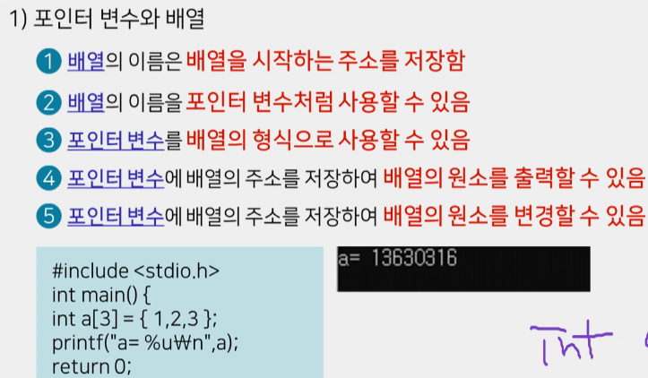
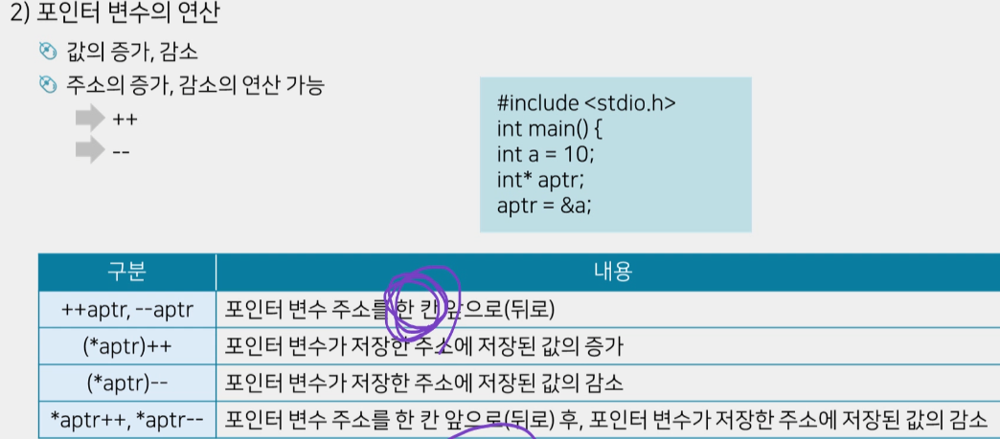

## 대학 C 이론 정리

```js
저급언어
- 기계가 잘 알아들을 수 있도록 작성됨
- 실행 속도가 빠름
- 기계어와 어셈블리어가 있음

기계어
- 0과 1의 형태로 작성됨
- 프로그래밍 언어 작성을 위해 전문적인 지식 필요
- 프로그램 유지보수 어려움

어셈블리어
- 기호코드를 통해 기계와 1:1 대응
- 어셈블러를 통해 번역됨

----------------------------------------------

고급언어
- 사람이 알아들을수 있도록 작성된 언어
- 번역 과정이 필요
- 다양한 종류의 언어가 있음 ( java , c++ , python, pascal 등등)

----------------------------------------------

알고리즘
- 프로그램 설계를 위해 문제해결 방법을 순차적으로 제시한 것
= 자연어(우리가 사용하는 언어를 통해 알고리즘 표현) , 순서도(약속된 도형과 기호를 사용해 문제해결과정 표현) , 의사코드(의사 코드를 사용해 문제해결 과정을 표현) 세가지 방법을 주로 사용

함수
  특정한 작업을 처리하기 위한 코드들의 집합

라이브러리 함수
  C 프로그램에서 기본적으로 제공되는 함수
    미리 제공되어 컴파일러가 인식할 수 있는 함수
      헤더 파일에 사용할 함수가 포함되어있는 헤더파일을 선언해야함

사용자 정의 함수
  사용자가 필요에의해 정의하는 함수

C 에서는 함수를 호출할때엔 항상 함수가 먼저 정의되어있어야한다.
  또는 함수의 원형만 먼저 정의를 한 후 main() 함수 뒤에 함수의 코드나열

리턴값이 있는 함수일경우 리턴 값을 받아줄 변수를 만들어주자

재귀함수
  함수 자신을 반복하여 호출하여 실행하는 함수
-------------------------------------------------------
배열
  동일한 자료형을 가진 데이터들을 동일한 이름으로 저장한것
    인덱스로 각요소 구분
      인덱스는 0부터 시작
동일한 이름으로 배열처럼 선언한다면 쉽고 효율적으로 변수를 관리할 수있다.
  반복문을 통해 입력받거나 출력 할 수 있다.
메모리가 연속되어있으며, 반복문에 유용하다

1차원 배열 : int (data type) num(배열의 이름) [10] (데이터의 개수)
  int num[10];
2차원 배열 : int (data type) num(배열의 이름) [10] (행의 크기) [20] (열의 크기)
  int num[10][20]
배열의 크기 : int 4, char 1, double 8 byte

int a[5] = {0,1,2} // a의 배열에 5개의 배열 생성 후 3개의 값만 들어있을시 나머지 
  //공간(4번째5번째)은 0으로 초기화가된다. but another IDE is trash value output

sizeof 
  크기를 알 수 없을 때 사용 
    전체 배열의 크기를 배열 하나의 크기로 나누어주면 배열의 개수가 나온다.
      //"ex : sizeof(a) / sizeof(a[0]) = 배열의 개수"

배열에서 열의 크기는 반드시 있어야한다.
  하지만 행의 크기는 없어도된다.
    배열 선언 시 행의 크기는 삭제 가능하나, 열의 크기는 반드시 적어야함.

int num[2][2]={{1,2},{3,4}} //첫번째 행 {1,2} 두번째행 {3,4}
int num[2][2]={1,2,3,4} 
위 두개의 2차원 배열은 아래와 같다.
  1 2
  3 4

배열 요소의 개수 구하기
  int a[] = {1,2,3,4};
    int size;
    size = sizeof(a) / sizeof(a[0]);
  printf("%d", size);
=======================================
포인터 변수
  :변수의 주소를 값으로 저장하는 변수
&( 주소 연산자 )
  :변수의 주소는 & 연산자로 접근 가능함 (&a 출력시 : 100)
int *a ( 간접 참조 연산자 )
  :포인터 변수에 들어있는 주소의 값을 가져오는 연산자 ( *b 출력 시 : 10)
주소를 출력하기 위해서 %p or %u 를 사용

포인터 변수도 데이터 타입이있따.

포인터 변수와 배열
  배열의 이름은 배열을 시작하는 주소를 저장
  배열의 이름을 포인터 변수처럼 사용 가능
  포인터 변수를 배열의 형식으로 사용 가능
  포인터 변수에 배열의 주소를 저장하여 배열의 원소 출력 가능
  포인터 변수에 배열의 주소를 저장하여 배열의 원소를 변경가능



배열 이름은 : 주소다
int a[3]={1,2,3};
*a : 1, *(a+1) : 2, *(a+2) : 3 



주소는 4 바이트 단위로 이동

*(&i) : i 의 값
================================================================
지역 변수와 전역 변수의 개념
지역 변수
  함수 내부에서 선언 , 함수 종료 시 소멸
  블록 안에서 선언, 블록 종료시 소멸
  해당 함수 내에서만 유효

전역변수
  함수 외부에서 선언
  프로그램 전체에 대해 유효

저장된 주소가 다르변 변수의 이름이 같아도 다른 값을 가짐

clock() ms 단위로 리턴


```
