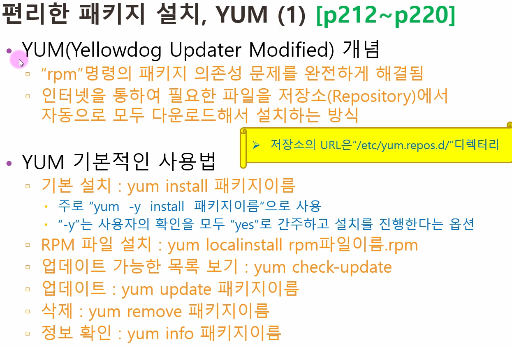
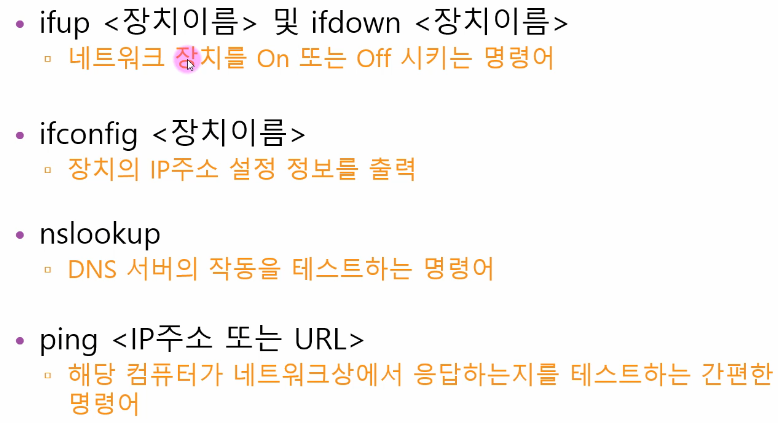

## 대학 리눅스 이론정리 

```js
vmware install , vmware-config setting ( spec )
VMware 특징
  - 1대의 컴퓨터만으로 실무 환경과 거의 비슷한 네트워크 컴퓨터 환경의 구성이 가능
  - 운영체제의 특정 시점을 저장하는 스캡숏 기능을 사용할 수 있다
  - 하드 디스크 등의 하드웨어를 내 맘대로 여러 개 장착해서 테스트할 수 있다
  - 현재 컴퓨터 상태를 그대로 저장해 놓고 다음 사용할 때 현재 상태를 이어서 구동 가능

cmd ipconfig 에서 ip check, 만약 원하는 ip 있다면 vmware workstation pro 에서 edit 에서 ip 변경 설정가능

서버 고정 ip 지정을 안해주면 DHCP 서버에서 자동으로 IP 할당
```


```js
vmware install
- installFile Folder create
- installFile Folder in vmware workstation download
- vmware workstation pro edit network ip setting
- installFile Folder in fedora download
- Server, Server(B), Client Folder create
- vmware Player create && spec setting
- fedora cd room use install
- vmware execute
- Server = 설치 요약 -> 소프트웨어 선택-> development and creative select 누른 후 왼쪽 위 완료 선택
-- 설치대상-> 하드클릭해서 체크된상태 확인 후 완료 선택 ->  설치옵션 계속하기전 내 디스크 -> 파티션 스키마 표준선택 ->
-- 플러스버튼 누른후 마운트 지점에 swap 선택 원하는 용량 4g 선택 -> 플러스누르고 마운트 슬레쉬 선택 원하는 용량 선택안함 -> 완료 선택 -> 설치시작 -> 아이디 암호 설정 -> 완료되면 재부팅 -> 로그인 후 오른쪽 위 사용자 정보 설정-> 디스플레이설정-> 디스플레이설정후 왼쪽 위 현재활동에 제일 아래 클릭 후 모두 클릭 -> 유틸리티 선택-> 터미널 즐겨찾기추가-> 다음 소프트웨어 클릭-> 왼쪽 위 소프트웨어 눌르고 최신 끄기-> 재클릭 전용 끄기-> 재클릭 소프트웨어 공급원 클릭 업데이트확인 하지않기 선택-> 현재활동에 터미널 선택-> cd /etc/yum. repos. d/ -> mkdir backup -> ls -> mv fedora-up* backup -> ls-> backup fedora.repo 확인-> yum -y install system-config-network-> system-config-network -> 네트워크설정 엔터 ->DHCP사용 없음 ->고정IP 입력 ->넷마스크설정 ->게이트웨이설정 ->DNS SERVER 설정 -> 저장 -> 저장&종료 -> terminal 에 systemctl restart network  -> ifconfig -> gedit /etc/sysconfig/selinux -> selinux=disabled 변경 -> 저장 후 닫기 -> 오른쪽위 사용자 설정 ->전원 절전 안함으로변경 -> 전원끄기 ->

스냅샷잡기
-workstation pro 에서 파일 누르고 오픈으로 Server 선택 -> 위에 vm 옵션에 스냅샷 ->take snapshot -> 이름및셋팅 -> 스냅샷지점으로 이동하려면 vm에 스냅샷에 스냅샷 매니저에서 지정한이름으로 위치로 goto  -> player 에서 부팅후 정상작동확인

Client mode 에서 manager mode 변경 = terminal 에서 su - 입력

text mode
- 초기설정을 영어로 쓴다
- 자원을 적게사용한다
- 소프트웨어설정에서 minimal install 선택
- 파티션은 swap 4g
- 필수 패키지2개 = 명령어 yum -y install net-tools system-config-network-tui
- system-config-network -> 네트워크 설정(dhcp 끄기)
- vi text mode 명령어 = vi /etc/sysconfig/selinux -> selinux = disabled 변경(i 누르면 insert mode)-> esc -> :wq(console mode)

-- 해상도 변경
- vi /boot/grub2/grub.cfg -> :set nu -> 75행 -> gfxpayload=800x600x16, 800x600 -> esc :wq

- 재시작 reboot
- 비번 변경 passwd
- 파일 옮기기
-- cd /etc/yum. repos. d/ ->mkdir backup -> ls -> mv fedora-up* backup -> ls-> backup fedora.repo 확인

- 필수 패키지5개 = 명령어 yum -y install bind-utils ncftp wget unzip tar

terminal 에 # 프롬프트는 root 사용자, $ 프롬프트는 일반 사용자
========================================
vi 에디터
  명령모드-> i or a -> input mode -> need save (esc) -> 명령모드
  명령모드-> : -> ex mode(line 명령 모드) -> (저장w)(종료a)(취소i)등->esc or enter -> 명령모드
  명령모드-> : (입력모드) -> q(vi빠져나와 터미널로)
  저장안하고 나가기; :q!
  파일삭제는 rm -f .(파일명)
  현재커서 행삭제; dd(연속두번입력)
  현재커서있는행복사; yy(연속두번입력)
  복사한 내용을 현재 행 이후 붙여넣기; P
  방향키; hjkl
  페이지 이동; space bar
------------------------------------------------------------------

명령어
종료-
shutdown -P now                = shutdown -P +10 (10분뒤 종료) shutdown -P -c (예약취소)
halt -p
init 0
시스템 재부팅; shutdown -r now
reboot
init 6
로그아웃;
  logout
    exit
명령어모드에서 윈도우x 돌아가기; startx
자동완성; 파일명의 일부만 입력 후 Tab key 를 눌러 자동완성
명령어역사; history
덮어씌기; -sf
사용자모드에서 관리자모드; su-
파일확인; ls
파일자세히보기; ls -l
X WINDOW 에서 텍스트 편집기 degit
텍스트편집기; 
현재디렉토리체크; pwd
홈 디렉토리이동; cd
새로운디렉터리; mkdir
복사; cp
iso 파일 만들기; mount -o loop  myfile.iso  /media/iso/
파일이나 디렉터리 삭제; rm
크기가 0인 새 파일 생성; touch
파일과 디렉터리의 이름 변경 or 위치 이동시 사용; mv
디렉터리 삭제; rmdir (비어있어야함)
텍스트로 작성된 파일을 화면에 출력; cat
텍스트로 작성된 파일의 앞 10행 또는 마지막 10행만 출력; head, tail
텍스트로 작성된 파일을 화면에 페이지 단위로 출력; more
more 와 용도가 비슷하지만 기능이 더 확장된 명령; less
file이 어떤 종류의 파일인지 표시; file
ls -a (숨긴파일보기) , ls -al (숨긴파일 상세보기)
파일 설치 ex: rpm -Uvh galculator-2.1.2-1.fc19.x86_64.rpm
설치된 파일확인 : -qi
파일 삭제: -e
다른 모니터: chvt 숫자
-------------------------
사용자와 그룹 관련 명령어
  사용자 생성시 옵션
    (-u : id 지정, -g : 그룹 지정, -d : 홈 디렉터리 지정, -s : 셀 지정)
useradd : 새로운 사용자를 추가 (ex: useradd newUser)
passwd : 사용자의 비밀번호를 지정하거나 변경 (ex: passwd newUser)
usermod : 사용자의 속성을 변경 (ex: usermod -g root newUser)
userdel : 사용자를 삭제 (userdel newUser)
chage : 사용자의 암호를 주기적으로 변경하도록 설정 (ex: chage -m 2 newUser)
group : 현재 사용자가 속한 그룹을 보여줌 (ex: groups)
groupadd : 새로운 그룹을 생성 (ex: groupadd newGroup)
groupmode : 그룹의 속성을 변경 (ex: groupmod -n newgroup mygroup)
groupdel : 그룹을 삭제 (ex: groupdel newgroup)
gpasswd : 그룹의 암호를 설정하거나, 그룹의 관리를 수행 (ex: gpasswd newgroup)

system-config-users (download)
  yum -y install system-config-users
========================


파일 상세보기에서; - 은 file, d가붙으면 디렉토리, l은 링크

cd가 자동으로 연결되었다면 umount /dev/cdrom 으로 끊어주자

dvd/cd device ; /dev/cdrom
연결되어있는 장치확인; mount
장치연결하기; mount /dev/cdrom /(장치명?)
장치연결끊기; unmount (장치명ex(/dev/cdrom))
도움말; man ls

가상콘솔-
- 가상의 모니터, 페도라는 총 6개의 가상콘솔을 제공함
- 각각의 가상콘솔로 이동하는 단축키 Ctrl + alt + F2~F6 ( F1 은 x 윈도우 모드 )

런레벨-
init 명령어 뒤에 붙은 숫자를 런레벨이라고 부름
================================================================
사용자와 그룹:
  리눅스는 다중 사용자 시스템
  기본적으로 root 라는 이름을 가진 수퍼유저가있으며,
    모든 작업을 할 수 있는 권한이있음
  모든 사용자를 하나 이상의 그룹에 소속되어있음
  사용자는 /etc/passwd 파일에 정의되어있음
사용자 파일의 제일 윗줄:
  root:X:0:0:root:/root:/bin/bash
    (root 비밀번호는 따로 설정, 루트의 아이디 0 번, 사용자 그룹 아이디 0 번 
      /root:/bin/bash 는 홈 디렉토리)
사용자의 비밀번호는 /etc/shadow 파일에 정의되어있다.
  그룹은 /etc/group 파일에 정의되어있따.
리눅스에서는 기본적으로 루트라는 관리자 그룹을 만들어주고 0번을 할당한 후 
  기본적으로 루트 관리자를 만들어줌
그룹을 생략하게되면 리눅스가 기본적으로 사용자의 그룹을 알아서 만들어준다.

/etc/skel 
  사용자가 만들어질때 skel 에있는 내용물을 가지고 복제하여 만들어진다.

RPM ( Redhat Package Manager)
  확장명은 *.rpm, 이를 패키지라고 부름
```


```js
RPM 명령어 옵션
```


```js
RPM 단점 :
의존성 문제가있다, 하지만 이를 해결하기위해 YUM 이 등장했다.

```




```js

네트워크 관련 필수 개념

```


```js

리눅스에서의 네트워크 장치 이름
  :fedora 19 는 lanCard ens32 or ens33 으로 할당
  :이전 버전에서는 eth0,eth1 등으로 인식
  :Vmware 에 fedora 를 설치할 경우 버전에따라 완전히 다른 이름으로 인식

```

```js

중요한 네트워크 관련 명령어

```





```js

네트워크 보안을 위한 SELinux

```


```js

파이프, 필터, 리디렉션

```


```js

프로세스, 데몬(1)

```


```js

서비스와 소켓(1)

```


```js


```

```js


```

```js


```

```js


```

```js


```

