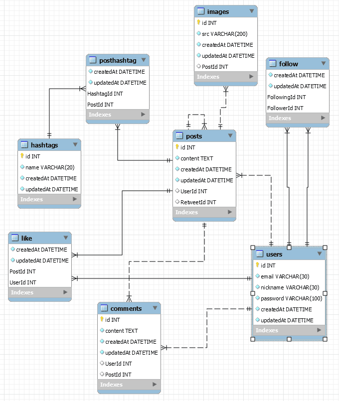

## 노드버드 백단 공부 모음



```js

=============node.js nodeBird BackEnd Start===============


설치 등 필수 요소, 개념

node 는 npm 으로 설치를 안해도된다, 노드가 http 라는 모듈을 제공한다

app.js 를 실행하는 순간, node runtime 은 코드를 실행해서, http 가 
  서버 역할을 해주는것 

node.js 는 js runtime 이다 (js 코드를 실행할수있게해주는)

const http = require('http')
const server = http.createServer((req, res)=>{
	console.log("req.url : " + req.url + ", req.method : " + req.method)
	res.end('hello node')
})
server.listen(3000, ()=> { // localhost:3000
	console.log('서버 실행 중')
})
위와 같이 첫 코드 실행 시 테스트 코드로 확인, 
  실행은 node app.js 로 실행

항상 소스 코드가 바뀌었을땐 서버를 껏다가 다시 켜줘야한다 명심!

기본적인 원리는 createServer 에서 요청 url 에 따라서 응답을 해준다.
  응답을 안보내면 특정시간(대략30초)후에 브라우저가 자동으로 응답 실패 처리

res.end() 는 한번만 사용해야한다

express 사용 시 아래와 같은 코드로 테스트 코드 체크 
const express = require('express')
const app = express() // 호출 한번 해줘야함
app.get('/', (req, res) => {
	res.send('hello express') // end === send
})
app.get('/api', (req, res) => {
	res.send('hello api') // end === send
})
app.get('/api/posts', (req, res) => {

})
app.listen(3000, () => { // localhost:3000
	console.log('서버 실행 중')
})

자주 사용함
  app.get : 가져오다 , 
  app.post : 생성하다 , 
  app.put : 전체 수정 , // 통째로 덮어 씌우는등 
  app.patch : 부분 수정, // 닉네임 등
  app.delete :  삭제하다 , 
  app.options : 찔러보기 , // 서버야 ~ 할 수 있나?
  app.head : 헤더만 가져오기 // 바디의 부가정보, 요청과 응답에대한 부가정보


----------------------------------------------------------------
post 와 delete 요청은 browser 주소창은 get 요청이라 get 방식으로 안된다
  front 에서 처럼 axios 와 같은걸로 js 로 post 요청을 보내거나
    postman 과 같은 tool 이 필요하다, 
postman 에서는 post, put, fetch 등 과 같은 요청을 사용 할 수 있다

Swagger tool 로 api 문서를 뽑는다
--------------------------------------------------------
해당 디렉토리 이동 후 npm init 해주고 package.json 생성

npm i express  (내부적으로 http 를 사용하기에 서버를 돌릴 수 있다)

npm i sequelize sequelize-cli (JS 로 SQL 을 조작할 수있게해줄 라이브러리)
npm i mysql2 (node 와 MySQL 을 연결 시켜주는 드라이버)
npx sequelize init (sequelize setting)
npx sequelize db:create     (db 생성 명령어)
npm i -D nodemon@2       (연결 자동화(알아서 재실행해줌)) (package.json 에서 "dev": "nodemon app")
npm i bcrypt (비번 암호화 라이브러리)
npm i cors ( cors 보안 정책)
npm i passport ( 카카오 네이버 등등 로그인할때 도와주는 라이브러리)
npm i passport-local (email or ID 로 로그인할때 도와주는 라이브러리)
npm i express-session (session 라이브러리)
npm i cookie-parser 
npm i datenv (secret key hide 라이브러리)
npm i morgan (요청과 응답 기록 라이브러리)
npm i multer (back 에서 multipart/form-data 받으려면 필요한 라이브러리)
npm cache clean --force (Cache 초기화)
npm i swr (LOAD get 요청 간단하게해주는 next 에서 만든라이브러리,SSR 됨)
npm i moment (날짜 관련 라이브러리)

npm run build (next build 호출)
"build": "next build",
"start": "next start"

npm i @next/bundle-analyzer (file 용량 체크)
npm i cross-env (env 설정 window 에서도 가능하게 해주는 라이브러리)
npm i pm2 (server state check)
--------------------------------------------------------
백엔드 서버 역할
  saga 에서 axios post 해서 보내는 경로가 백엔드 서버,

프론트와 백을 나눈 이유는 대규모 앱이 되었을때를 대비하기 위해서다
  각 기능별로 서버를 나눠주는 경우가 많다 (특정 요청이 많을 수 있기때문)

프론트는 ssr 을 해주고 백엔드는 api 를 제공해준다

서버가 메모리나 cpu 가 부족해서 펑 터질 것을 대비해서 
  스케일링(새 컴퓨터로 복사)을 해준다, 요청을 스케일링된 컴퓨터와 나눠갖게

백엔드는 데이터만 db 에서 가져와서 가공해서 전달 역할

/favicon.ico GET 
  : browser 가 직접 요청하는것이며, 신경안써도됨

여러개의 데이터가 필요하다면 한번 요청에 여러개의 데이터를 묶어서 한번에 응답
  또는 요청을 여러번 보내서 응답을 조금씩 나눠서 하거나, 요청과 응답은 1:1

서버도, 프론트 서버도 3000번 포트로 노드가 엽니다

주소창에 입력해서 접근가능하다면 get 요청이라 생각하자

res.json([ // data 는 보통 json 으로 표현,api 들은 json 으로 응답

rest api는 일종의 규칙입니다. http 요청 주소와 method를 
  rest api 규칙에 따라서 만드는 것이고요.
method를 영어로 따지면 동사에 해당한다고 보시면 되는게 rest api에서는
 주소는 명사만으로 이루어져야 한다는 규칙이 있습니다. 
  명사만으로는 요청의 의미를 잘 표현할 수 없기에 동사인 
    method를 같이 넣어줍니다
      
method 라는것은 rest api 와 별개로 http 가 지원하는 요청 방식이고 
  rest api 란 이미 존재하던 method까지 사용하여 규칙을 만든것을 의미하고 
    rest api 방식을 도입한 웹을 restful 하다고 표현
      get, post, delete, patch, header 등 정확히 지키는 걸 rest api 라함

OAuth
인터넷 사용자들이 비밀번호를 제공하지 않고 다른 웹사이트 상의 자신들의 
  정보에 대해 웹사이트나 애플리케이션의 접근 권한을 부여할 수 있는 공통적인 
    수단으로서 사용되는, 접근 위임을 위한 개방형 표준이다. 
      이 매커니즘은 여러 기업들에 의해 사용되는데, 
        이를테면 아마존, 구글, 페이스북, 마이크로소프트, 
          트위터가 있으며 사용자들이 타사 애플리케이션이나 
            웹사이트의 계정에 관한 정보를 공유할 수 있게 허용한다
용어
OAuth에 관련된 용어들을 간략히 설명한다.
  사용자(user): 서비스 제공자와 소비자를 사용하는 계정을 가지고 있는 개인
  소비자(consumer): Open API를 이용하여 개발된 OAuth를 사용하여 
                    서비스 제공자에게 접근하는 웹사이트 또는 애플리케이션
  서비스 제공자(service provider): OAuth를 통해 접근을 지원하는 
                          웹 애플리케이션(Open API를 제공하는 서비스)
  소비자 비밀번호(consumer secret) : 서비스 제공자에서 소비자가 
                                      자신임을 인증하기 위한 키
  요청 토큰(request token) : 소비자가 사용자에게 접근권한을 인증받기 위해
                   필요한 정보가 담겨있으며 후에 접근 토큰으로 변환된다.
  접근 토큰(access token) : 인증 후에 사용자가 서비스 제공자가 아닌 
            소비자를 통해서 보호된 자원에 접근하기 위한 키를 포함한 값.
인증방식
  소비자가 서비스제공자에게 요청토큰을 요청한다.
  서비스제공자가 소비자에게 요청토큰을 발급해준다.
  소비자가 사용자를 서비스제공자로 이동시킨다. 여기서 사용자 인증이수행된다.
  서비스제공자가 사용자를 소비자로 이동시킨다.
  소비자가 접근토큰을 요청한다.
  서비스제공자가 접근토큰을 발급한다.
  발급된 접근토큰을 이용하여 소비자에서 사용자 정보에 접근한다.

애매하면 post 를 사용하자

http 분리가 어려워서 코드가 지저분해진다

express router 분리를 하자

node 에서는 import export 를 사용하지않으며, require 를 사용한다
  (지원은 하긴하지만 import export 를 잘 안씀)

front 에서는 import export 를 많이 사용
  webpack 이 import export 한것들을 내부적으로 require 랑 모듈 export 로
    바꿔준다

백엔드 주 역할은 데이터 요청을 했을때  db 에서 데이터를 꺼내 프론트에 제공

saga에서 api 요청을 보내고 받아오는건 브라우저에서 
  벡엔드로 요청을 보내고 받아오는 것

프론트서버로 요청을 보낸 주소의 페이지만 렌더링해서 가져옵니다. 
  다른 페이지는 나중에 가져옵니다

es6 문법인 import export와 commonJS 명세를 따르는 
  require, module.exports가 있고 런타임인 노드는 
    기본적으로 commonJS 명세를 따르기 떄문에 require을 쓰는 것이고 
      프론트는 '바벨'을 사용하는 경우가 많기 때문에 
        es6문법을 commonJS 명세로 바꾸어줘서 사용 가능

dataBase 는 보통 개발용 테스트용 배포용 으로 따로 둠

sudo npx sequelize init 으로하면 똑같이
  Unexpected token 'export' 이거 한줄만 나옵니다
:노드 버전이 12나 14버전 맞으시죠? npx sequelize init 
  (그냥 sequelize init과는 완전 다른 결과를 낼 수 있습니다) 명령어는 현재 
    프로젝트 폴더(package.json 위치)에서 호출하시는 거고요?node_modules에서 sequelize-cli 찾아서 안에 lib 폴더가 들어있는지 확인

워크벤치로 확인하시면 기본적으로 1000개만 보여주는데 
  Limit to 1000 rows 옵션을 더 늘리시면 더 많이 표시됩니다

sequelize 에서는 table 을 model 이라고 부른다,
--------------------------------------------------------
module.exports = (sequelize, DataTypes) =>{ // 모델의 기본 꼴
/*define('User' 모델 이름이 자동으로 소문자가되고, 복수가되서
users 로 MYSQL 에 테이블 생성, sequel 과 mysql 의 규칙*/
	const User = sequelize.define('User',{ // 사용자 정보
		// id: {}, 아이디는 굳이 안적어줘도된다, id 가 기본적으로 들어있다
		email: {},
		nickname: {},
		password: {},
	},{ // user model 에 대한 셋팅
		charset: 'utf-8',
		collate: 'utf8_general_ci', // 한글 저장
	})
	User.associate = (db) => {}
	return User;
}
--------------------------------------------------------
model 들을 독립적으로 만들어주고, 서로 무슨관계가있는지 파악
  관계 파악되면 associate 로 관계 설정

Sequelize 를 공식문서대로 만들면 나중에 타입스크립트 할때 타이핑이 귀찮아짐
  그러므로, nodeBird 방식으로 만들자, 하지만 class 방식이 제일 최신이다

user.js를 바꿔도 실제 table에는 반영되지 않습니다. 
  처음 테이블을 생성할 때만 user.js를 보고 생성하고 
    수정사항은 반영하지 않습니다. 워크벤치에서 user.js에 맞춰서 똑같이 변경

sequelize.sync() 할 때 자동으로 mysql 테이블도 같이 생성됩니다

mysql2 와 mysql 모듈의 차이점
  :커넥션 부분에서 좀 차이가 있는 것 같습니다. 저는 2를 쓰는 걸 더 추천

db.Post.belongsTo(db.User) // 게시물은 작성작에게 속해있다 (다대 일 관계)
db.Post.hasMany(db.Comment) // 게시물에 댓글이 많이 있다 (일대 다 관계)

db.Post.belongsToMany(db.Hashtag) // 다대 다 관계
  (임의 테이블이 생기며, Post 와 Hashtag 가 합쳐져 HashtagId,PostId 생김)
    (임의 테이블(sequelize 가 알아서 만들어줌))

db.Post.hasOne(db.User) // 일대 일 관계

/*다대다,임의테이블 이름(Like) 설정, 나중에 as(별칭) 에따라 
		user.getLikers 처럼 게시글 좋아요 누른 사람을 가져오게됨*/
		db.User.belongsToMany(db.Post, {through: 'Like', as: 'Liked'})

belongsTo 로 들어가는 곳엔 UserId: 1, PostId: 3 이런식으로 db 에 생김

/* 같은 테이블을 사용 할땐 as 및 foreignKey 설정해주며, 
      서로 반대로 foreignKey 를 설정해주면 key 이름으로 설정됨 */
		db.User.belongsToMany(db.User, 
      {through: 'Follow', as: 'Followers', foreignKey: 'FollowingId'})
		db.User.belongsToMany(db.User, 
      {through: 'Follow', as: 'Followings', foreignKey: 'FollowerId'})

// PostId 에서 RetweetId 로 바뀜
		db.Post.belongsTo(db.Post, {as:'Retweet'})

table 구조 잡는건 엄청 복잡하고 어렵다 신중히 생각을 하자

장바구니 모델과 실제 구매한 모델을 따로 두는게 맞습니다. 
  페이먼트는 당연히 실제 구매한 모델과 연결되어있어야하고요

원칙적으로 데이터베이스에는 배열이 들어갈 수 없습니다
  (요즘 DB는 가능하긴 한데 정규화 원칙에는 위배됩니다)

as는 js단에서 사용하는 이름입니다. foreignKey는 실제 테이블 컬럼명입니다.
  기본적으로는 둘다 사용하실 필요가 없습니다(자동 생성되므로) 
    다만 겹치는 게 발생할 경우에만 지정합니다

다대다 관계랑 일대다 관계는 생성 메커니즘이 다를 수밖에 없습니다. 
  다대다는 foreignKey로 생기고, 일대다는 as로 생깁니다

// 모델 불러오기
db.Comment = require('./comment')(sequelize, Sequelize) 

모델들의 모양이 module.export 로 함수인 모양이있다
  함수를 require 해서 함수를 실행해줄것이며, 함수 내부가 실행되면서 
    모델이 실제로 sequelize에 등록이된다

sequelize 에서 models 등록, express 에서 sequelize 등록해줘야함

// db 를 반복문 돌면서 db 에서 찾아냄, 모델들의 associate 를 실행해줌
Object.keys(db).forEach(modelName => {
	if (db[modelName].associate) {
		db[modelName].associate(db);
	}
});

const db = require('./models') // db 에 sequelize 넣어놓은 상태

1. 클래스로 작성하시는 걸 추천드립니다.

보통 id는 의미가 없는 값을 두는 게 낫습니다. 
  예를 들어 mail같은 경우는 고객이 mail을 바꿔달라고 할 수도 있습니다

belongsToMany는 belongsTo와 완전히 다르다고 생각하셔야 합니다. 
  belongsToMany의 경우에는
    as: 'Liked', foreignKey: 'Likers'
      as: 'Likers', foreignKey: 'Liked',
        이렇게 foreignKey를 넣어주어야 합니다. 
          또한 as랑 foreignKey랑 서로 반대를 가리키고 있어야 합니다

기존 DB는 전혀 변경할 필요 없습니다. 기존 DB 테이블 구조를 보고 
  시퀄라이즈 모델로 만들고,쿼리 모델 완성 후 하나씩 대체해나가면 됩니다

시퀄라이즈 특성상 테이블 변경은 되지 않습니다. 
  추가 테이블은 생성될 수 있습니다만 
    추가로 시퀄라이즈 모델을 만드신 게 아니라면 생성되지 않겠죠

리트윗은 belongsTo만 적어주셔도 됩니다. as는 테이블 컬럼명을 
  정하는 역할이 아닙니다.foreignKey로만 정하게 됩니다. as는 노드에서 
  그 컬럼명을 어떻게 호출할지에 대한 설정이라고 보시면 됩니다

foreignKey대신 as를 사용하는 이유는
1. as를 기반으로 foreignKey를 생성
2. as로 설정하면 나중에 Retweet으로 불러오기 편함

프로젝트를 진행할때 항상 순서도를 그려놓고 port number 도 적어놓자
  브라우저,프론트는 같은 프로그램,백엔드 다른프로그램,db 다른 프로그램

회원 가입
1. browser 에서 signUp 을 누르면 onSubmit 이 실행되면서,
onSubmit 안에 data에 email,password, nickname 이 들어가고 
front 의 sinup.js 에서 SIGN_UP_REQUEST 가 dispatch 되면 
sagas    user.js 로 넘어가게되며,takeLatest 가 실행되며, 
function* signup() 으로 가서 yield delay 가 있다면 지워주고, 
function signUpAPI(data) {
	// back end server addr
	// data 는 email, nickname, password object
	return axios.post('http://localhost:3065/user', data)
}
function* signUp(action) {
	try {
		//yield delay(1000)
		const result = yield call(signUpAPI, action.data)
		console.log('sign up result : ' + result)
		yield put({
			type: SIGN_UP_SUCCESS,
			data: result.data
		})
으로 수정(browser 에서 backend server 로 axios 를 통해 요청 보냄) 후
back end 에도 userRouter 를 만들어준다 
const userRouter = require('./routes/user')
app.use('/user', userRouter) // user 가 prefix 로 붙는다
routes 폴더에 user.js 만들어주고 , 
const router = express.Router()
// router 를 일치하게 만들어줘야함
// 비동기는 await 를 붙여줘야한다
router.post('/', async (req, res, next) => {//await 을 사용하려면 async 함수로 만들어줘야한다
	try { //에러가 발생하면 express 가 알아서 브라우저로 이런 에러가 났다고 알려줌
		const hashedPassword = await bcrypt.hash(req.body.password, 11) // 11 은 해쉬화 하는것, 숫자가 높을 수록 보안성 높아지며 단점은 시간이 오래걸림
		/* POST/user/ === front 의
			axios.post('http://localhost:3065/user') 와 같다 */
		// require 로 구조 분해했기에 db.User.create 와 같다
		await User.create({ // User.create 가 원래 비동기 함수인데 await 을 사용해서 res.send('ok')가 실행 됨
			// req.body 는 front 에 saga user 에서 data 로 받은것임
			email: req.body.email, // data.email 이 req.body.email 로 변경
			nickname: req.body.nickname,
			password: hashedPassword, // 암호화 된 비번으로 넣어주자
		})
		res.send('ok')

	} catch (error) {
		console.error('await User.create error : ' + error)
		next(error)
	}
})
회원가입 요청 오면 backEndServerRouter 에서 요청 받을 수 있도록 세팅


겟이랑 딜리트 요청은 데이터를 못넘기는게 post put patch 는 넘길수있따

req.body 는 그냥 사용하는것이 아니라 app.js 에서 
다른 router 들보다 위에 작성해줘야함(위에서부터 아래로 실행되기때문에)
// req.body 사용하려고 설정
// front 에서 받은 data 를 req.body 에 해석해서 넣어주는 역할을 함
// use 안에 들어가는 것을 middleware 라고 함
app.use(express.json()) // use 는 app 에 express server 에다가 뭔가를 장착한다는 뜻
app.use(express.urlencoded({extended: true}))
// 위 두개의 차이점은 app.use(express.json()) 은 front 에서 json 으로 보냈을때 json 형식을 req.body 에 넣어주고
// app.use(express.urlencoded({extended: true})) 는 form submit 을 했을때 url encoded 방식으로 넘어오는걸 처리해줌
설정 해줘야함

비밀번호를 그대로 적어주면 보안에 위배됨
  (npm i bcrypt 비번 암호화 라이브러리 사용)

에러가 발생하면 express 가 알아서 브라우저로 이런 에러가 났다고 알려줌

비동기 함수인지 아닌지는 공식문서를 보고 판단해야한다

요청/응답은 헤더(상태, 용량, 시간, 쿠키)와 
  바디(데이터)로 구성이되어있다

상태 number 
200 번대는 성공
300 번대는 리다이렉트
400 번대는 클라이언트 에러
500 번대는 서버 에러

crypto는 암호화 알고리즘들 묶어놓은 모듈이고요 bcrypt는 하나의 알고리즘입니다

익스프레스의 next()와 제너레이터의 next()는 이름만 같지 다른 next입니다

서버에서 에러가 날 때마다 매번 그 자리에서 처리할 수도 있지만,
대부분의 에러는 비슷한 방식으로 처리합니다. 에러가 발생하면 콘솔에
에러를 기록하고 클라이언트에게는 어떤 에러가 발생했다고 말해주는
식이죠. 따라서 중복을 줄이기 위해 next(error)로 에러 처리 
미들웨어라는 곳으로 에러를 보낸 후, 에러 처리 미들웨어에서 어떠한 
에러든 비슷한 방식으로 에러를 처리할 수 있게 하는 방식을 취합니다

대부분의 웹사이트는 세션을 사용합니다. 토큰을 사용하실 때는 액세스
 토큰은 로컬스토리지에 보관하시면 됩니다. 리프레시토큰은 반드시 
 httpOnly 쿠키로 하셔야 합니다.
로그아웃을 서버로 보내야하는 이유는 리프레시 토큰을 제거하기 
위해서입니다

CORS (보안정책)
cors는 자체는 요청한 도메인이 요청받은 도메인과 서로 다른경우 일어나는 
에러인데, 요청받은 서버쪽에서 요청한쪽에 클라이언트의 도메인(포트포함)을 
허용해줘야 해결이 되야한다고 알고 있습니다. 그리고 이런 cors정책이 있는 
부분은 브라우저이기 때문에 브라우저 외적으로 요청이 가거나 브라우저를 속이는 
방식으로는 cors에 걸릴일이 없습니다.(browser 에서 front 보내고 back으로)

cors를 해결하기 위해서는 프론트쪽에서는 설정할게 없고 요청받은 서버에서 요청이 오는 클라이언트 스킴,도메인,포트를 등록해줘야합니다.

OPTIONS
  Access-Control-Allow-Origin 이 있나 없나 체크 

proxy
브라우저에서 프론트서버로 보내서 백엔드 서버로 

// 3060 에서 보낸 요청은 허용하겠다 라는 의미
res.setHeader('Access-Control-Allow-Origin', 'http://localhost:3060')

sequelize 가 알아서 createAt, updatedAt 을 기록해줌

next.js 자체가 프론트서버가아닐까요 ?...; 그렇게알고있엇는데...
:첫 로딩만 서버고 그 다음부터는 브라우저입니다.
  첫 로딩을 SSR 해주는 게 next.js의 역할이고요

DataTypes.STRING을 늘린다고 실제 DB의 길이가 늘어나지 않습니다. 
  워크벤치 등을 이용해서 실제 DB의 길이를 늘려주세요

로컬호스트는 안 되는 sns 서비스가 있습니다. 
  로컬호스트가 안 되면 실제로 배포해본 다음에 테스트해야합니다

// localhost 중복 없애기
	return axios.post('/user/login', data)
sagas index 에서 axios 코드 추가
axios.defaults.baseURL = 'http://localhost:3065'
기본 URL 을 따로 설정해줬기때문에, 
return axios.post('http://localhost:3065/user/login', data) 코드는
return axios.post('/user/login', data) 와 같이 사용 할 수 있다
--------------------------------------------------------
passport 기본 꼴
const passport = require('passport')
const local = require('./local')
module.exports = () => { // app.js 에서 실행
	passport.serializeUser(()=>{

	})
	passport.deserializeUser(()=>{

	})
	local() // local 에 module.exports 가 index.js local()에서 실행
}
--------------------------------------------------------
passport business logic
module.exports = () => {
	passport.use(new LocalStrategy({
		usernameField: 'email', // front LoginForm.js 의 (email, password)
		passwordField: 'password', //req.body.password
	}, async (email, password, done) => { // 로그인 전략 설정, 기존 유저 있는지 체크
		try { // async 요청 할때엔 항상 server error 발생 할 수 있기에 try... catch 사용하자
			const user = await User.findOne({
				where: {email}
			})
			if (!user) {
				// 첫번째자리(서버에러) 두번째자리(성공) 세번째자리(클라이언트 에러)
				return done(null, false, {reason: '존재하지 않는 이메일입니다!'})
			}
			// db 에 저장된 비번과 사용자가 입력한 비번 비교
			const result = await bcrypt.compare(password, user.password)
			if (result) { // 사용자의 암호가 맞다면
				return done(null, user) // 두번째자리(성공)에 사용자 정보
			}
			// 사용자의 암호가 틀리다면
			return done(null, false, {reason: '비밀번호가 틀렸습니다!'})
		} catch (error) {
			console.error('LocalStrategy error : ' + error)
			return done(error)
		}
	}))
}
----------------------------------------------------------------
passport.authenticate 는 req,res,next 를 사용 할 수 없지만,
  사용할수있게 미들웨어 확장을 해줬다 (express 기법 중 하나임)
// 전략 실행 // POST /user/login // 미들웨어 확장
router.post('/login', (req, res, next) => {
	passport.authenticate('local', (err, user, info) => {
		if (err) {
			console.error('passport.authenticate error : ' + err)
			next(err) // 미들웨어 확장으로 next 를 사용 할 수 있게되었따
		}
	})(req, res, next)
})

응답을 res.json(user)로 보내주셨는데 제가 res.send(user)로도 
  바꿔서 해보니깐 둘이 다른게 없더군요. 둘의 차이점
: send는 만능이라고 보시면 됩니다. 알아서 타입을 확인해서 보냅니다. 
  다만 개발자입장에서는 뭘 보내는건지 모르므로 직접 명시해서 보내면 좋다

패스포트 연결 시 req에 login메서드가 생깁니다. passport.initialize에서
   req에 isAuthenticated login logout등을 추가합니다

혹은 백엔드개발자도 초보여서 이게 400에러인지, 500에러인지 헷갈려서
   잘못 내려주는등의 실수를 할 수 있는건가요?
:네 개발자가 실수로 잘못된 코드를 내려줄 수도 있습니다. 실패한 경우에도 
성공으로 처리할 수도 있고요. 그런 경우 프론트 개발자와 백엔드 개발자가 
소통해서 찾아내는 수밖에 없습니다

if-else를 안쓰시고, 계속 if만 쓰시던데 속도의 차이가 있는건지, 
  가독성 때문인건지 특별한 이유가 있나요
:저렇게 해야 if문의 depth 가 안 깊어집니다. 
  가독성 때문입니다. fast return이라는 기법입니다

passport.use할 때 new LocalStrategy를 등록하면 
  local 이름으로 등록됩니다. 다렉토리명과 함수명은 상관없습니다

생성자에서 'Strategy'앞의 문자열을 인식한다는 의미일까요?
예를 들어 new KakaoStrategy() 했을 경우
passport.authenticate('kakao', ...) 로 가능 한걸까요
:아뇨, 내부적으로 문자열이 정해져있습니다. 
  그래서 그 내부 문자열이 뭔지 공식문서를 보고 알아야합니다

passport랑 express-session은 이어져있어서 passport로 로그인하면 
기본적으로 세션에 저장됩니다. 일반적으로는 passport로 구글 로그인을 하시면 
되고요. 리엑트 브라우저에서 소셜 로그인으로 했다면 서버에는 데이터가 가지 
않아서 그 부분은 따로 작성해야 합니다

기본적으로 세션쿠키는 브라우저 종료 시 제거됩니다. 동시접속자가 많을 경우 
서버 세션이 많이 늘어나 메모리가 부족할 수 있습니다. 그래서 실무에서는 
세션을 메모리에 저장하지 않고 레디스같은 별도 디비에 저장합니다
쿠키만 지워지고 서버의 세션은 안 지워집니다.
 즉 메모리는 계속 늘어날수밖에 없어 배포 시에는 메모리스토어를 안 씁니다

 원래 app.use(미들웨어)하는 것을
app.use((req, res, next) => {
  미들웨어(req, res, next);
})
로 확장할 수 있습니다. 중간에 다른 코드를 껴넣고 싶을 때 사용합니다

kakao login
https://github.com/ZeroCho/nodejs-book/blob/master/ch9/9.5/nodebird/passport/kakaoStrategy.js
https://github.com/ZeroCho/nodejs-book/blob/master/ch9/9.5/nodebird/routes/auth.js
auth.js에서는 /auth/kakao랑 /auth/kakao/callback(redirect uri로 등록한 것) 보시면 됩니다. 일단 서버가 두 개입니다. 프론트와 백엔드로요.
그래서 먼저 카카오 로그인을 할 때 주소를 백엔드로 두시고(어차피 
리다이렉트는 필수입니다) 백엔드 로그인을 진행하면 됩니다.
그러면 백엔드 서버에는 로그인 되어있는 상황이고, 프론트에서는 로그인이 안 
되어있는 상황입니다. 그래서 프론트 서버에도 로그인을 해줘야하는데, 
리다이렉트uri를 프론트 서버의 한 라우터로 연결해서(라우터 만드는 방법은 
nextjs api routes 참고하세요) 거기에도 똑같은 세션 쿠키를 심어주어야 
합니다. 그 후 프론트 라우터에서 다시 브라우저 화면으로 리다이렉트해주면 
됩니다. 브라우저 - 백엔드 - 프론트엔드 라우터 - 브라우저 라고 보시면 
됩니다. 쿠키 공유가 핵심입니다
쿠키는 요청을 보낼 때 자동으로 보내져서 건들 게 없습니다

로그인 과정
로그인 폼에서 로그인을 하면 이메일과 패스워드를 넘겨서 사가로 가서 
데이터로받아서 3065의 유저로그인으로 데이터를 보내면 req.body 로 변해서
passport.authenticate local 실행이되는데 실행되면 전략으로가서 
로컬 스트레트지가되서 레큐바디 이메일 레큐바디 패스워드가 실행되서
성공하면 done(null, user) 실패하면 error 
성공하면 콜백으로가서 패스포트 로그인을 시도하는데 문제가 없다면
패스포트 시리얼라이즈로 가서 프론트로 응답을 해준다 
(res.json(user) 하는 순간에 쿠키와 사용자 정보랑 같이 front 로 보내준다)

로그인을하면 브라우저와 서버와 같은 정보를 들고있어야한다,

나중에는 아예 세션 저장용 db 로 redis 를 사용한다

passport 는 서버에 사용자의 모든 정보를 가지고있기보단 id 만 가지고있고
그 해당 아이디로 db 에서 사용자의 정보를 찾아 가져오는 방식을 사용

데이터를 기반으로 만들어낸 문자열, 시크릿이 해킹당하면 데이터가 노출될수있다
노드버드 시크릿 키를 알면 복원 할 수 있기에 숨겨놔야한다 

.env
dotenv 파일은 깃이나 깃허브에 올리지않으며, 핵심 관리자들만 가지고있다가
프로젝트 실행할때에만 잠깐 넣어서 실행하는 방식으로 사용한다

제로 /.env 요청을 하면 파일이 다운받아지는 건 아니시죠? 
  그렇다면 문제는 없습니다.
만약 탈취된거라면 많이 반성하셔야 합니다. 
저런 요청은 진짜 보안 신경 안 쓰던 옛날 프레임워크들을 노린 겁니다. 
그냥 get요청만 안 되게 하면 끝입니다. aws waf 주소 차단도 적용하세요

세션쿠키(connect.sid)를 secret으로 암호화하는 겁니다. 
나중에 복호화할때도 secret으로 복호화하는 것이고요

jwt를 활용하여 한계정에서 중복 로그인을 허용할때 서버에서 기기별로 제어를 
하고 싶을때 각 기기들으 정보를 어떤식으로 확인을 하는것인가요?
:기들의 쿠키에 식별용 토큰을 넣어두면 됩니다

리프레쉬토큰도 액세스토큰과 마찬가지로 만료기한이 거의 다되면 새로 
발급받아서 사용하는식으로 로그인을 유지시키는건가요? 아니면 리프레쉬토큰은 
만료기한 없이 영구적으로 로그아웃 전까지 가지고있는건가요
: 네 리프레시 토큰이 만료되면 보통 로그인을 다시 해야 합니다. 
  만료기한 없는 토큰이 제일 위험합니다.

jwt토큰은 쿠키에 안 담는 것이 좋습니다 강좌 진행 후 제 생각이 바뀌었습니다. 
응답 온 토큰을 로컬스토리지에 저장 후 요청 보낼 때 헤더에 담는 게 낫습니다.

만료기한을 정하지 않고요. 리프레시토큰에도 만료기한이 있어서 로그인 시 
체크해서 재발급하는 로직을 추가하는게 좋습니다

큰 용량이 크다면 로컬스토리지에 저장해서 필요할 때에만 전송해야 
서버 트래픽을 줄일 수 있습니다

req.logout()은 serializeUser() 호출 시 done 된 쿠키와 
  user.id를 없애는기능을하나요?
:req.login 때 세션에 저장되어있던 정보(쿠키-유저아이디 페어)를 없앱니다

req.login 메서드는 passport를 연결할 때 생깁니다. req.logout, req.user, 
req.isAuthenticated도요.
req는 프론트에서 보내는 요청 자체에 대한 정보를 담고 있는 객체입니다

세션 정보가 메모리에 남아 있어 서버를 껐다 켜면 
  메모리가 날라가서 세션이 사라집니다

serialize는 직렬화, deserialize는 역직렬화인데요.
직렬화라는 것은 어떤 데이터를 다른 곳에서 사용할 수 있게 다른 포맷의 
데이터로 바꾸는 것을 의미합니다. 지금 패스포트에서는 시퀄라이즈 객체를 
세션에 저장할 수 있는 데이터로 바꾸고 있습니다.
반대로 역직렬화는 다른 포맷의 데이터로 바뀐 데이터를 
원래 포맷으로 복구하는 것입니다. 세션에 저장된 데이터를 다시 시퀄라이즈 
객체로 바꾸는 작업을 의미합니다

deserialize
(라우터에 접근하게되면 라우터 접근전에 deserializeUser 를 실행해서 
저장해놨던 아이디를 토대로 사용자 정보를 복구해서 req.user 로 만든다)
 deserialize 에서 복구된 값은 req.body가 아니라 req.user에 들어갑니다. 
그리고 deserializeUser는 serializeUser의 user.id를 가져오는 게 아닙니다. 
세션쿠키를 통해서 메모리에 저장된 id를 찾아서 가져오는 겁니다.
req.login 시에 serializeUser가 호출되면서 done이 호출될 때 res.setHeader 
되는 것이고, 세션쿠키도 그 때 만들어집니다

세션쿠키로 세션ID를 찾아 그 세션 안에 들어있는 DB ID를 찾습니다

세션은 데이터를 저장할 수 있는 공간이면 됩니다. 서버 메모리도 될 수 있고 
파일도 될 수 있고 DB도 될 수 있습니다(설정하기 나름입니다

await을 붙이지 않으면 axios.post는 리턴값이 promise[pending]이라는 객체가 
됩니다. 아직 완료되지 않은 프로미스입니다. 거기에는 data라는 것이 아예 
들어있지 않습니다. 그래서 undefined가 뜨는 것입니다. saga는 이것을 call의 
결과라고 생각해서 처리해버립니다.
await이라는 키워드가 중요합니다

보통은 백엔드 서버에서 구현합니다. 프론트서버에서 구현할 때는 cors 
문제때문에 그러는 경우가 많은데요. 그 때도 프론트 서버에 proxy를 설정하지 
패스포트 자체를 프론트에서 구현하지는 않습니다

npx sequelize init으로 만들어진 폴더 중 마이그레이션 폴더의 
역할 및 마이그레이션뜻이 궁금합니다
:나중에 테이블 컬럼을 변경하거나 추가/제거할 때 models 안에 파일을 바꾼다고 
그대로 반영되지 않습니다. migrations를 통해서 실제 테이블을 변경해주어야 
DB에 반영됩니다. migrations 문서를 작성해두면 좋은게 나중에 문제가 생겼을 
때 롤백을 할 수 있습니다
마이그레이션 폴더에 기록은 남지 않습니다.
마이그레이션 폴더 안에 파일들을 보고 마이그레이션이 진행됩니다. 진행 후에는 
직접 models를 수동으로 수정도 해줘야합니다

서버와 통신할때는 네트워크 탭을 봐야한다 ( 크롬 )
  login 을하고 네트워크텝에서 login 을 눌러보면 내 정보와 
    Set-Cookie 에 connect.sid = (여기 들어있는게 내 쿠키 정보)

passport.deserializeUser(async (id, done) => {
  아이디로 부터 db 를 통해서 사용자 정보를 복구해냄 
  router 가 실행되기전에 매번 실행된다

req.session.destroy() // session 에 저장된 쿠키와 내 아이디 없앰

hashMany 라서 model: Post 가 복수형이 되어 me.Post 가 된다
--------------------------------------------------------
db 에서 원하는 정보 가져오기
/*router.post('/login', (req, res, next) => { // POST /user/login
})*/
// 전략 실행 // POST /user/login // 미들웨어 확장
router.post('/login', (req, res, next) => {
	passport.authenticate('local', (err, user, info) => {
		if (err) {
			console.error('passport.authenticate error : ' + err)
			return next(err) // 미들웨어 확장으로 next 를 사용 할 수 있게되었따
		}
		if (info) { // 클라이언트 에러
			return res.status(401).send(info.reason) // 401 은 허가되지 않음
		}
		return req.login(user, async (loginErr) => { // passport login err
			if (loginErr) {
				console.error('passport login error : ' + loginErr)
				return next(loginErr)
			}
			const fullUserWithoutPassword = await User.findOne({ // 모든 정보를 다 가지고있는 password 제외
				where: {id: user.id},
				//attributes: ['id', 'nickname', 'email'], // 내가 원하는 정보만 가져올수있다
				attributes: {
				exclude: ['password'], // 비밀번호 정보는 들어오지 못하게한다
				},
				include: [{ // models 의 user 에 내가쓴 게시글 팔로우 팔로윙 을 가져옴
					model: Post,
					attributes:['id'],
				}, {
					model: User,
					as: 'Followings',
					attributes:['id'],
				}, {
					model: User,
					as: 'Followers',
					attributes:['id'],
				}]
			})
			return res.status(200).json(fullUserWithoutPassword) // 사용자 정보를 front 로 넘겨줌
		})
	})(req, res, next)
})
--------------------------------------------------------
사이트에서 새로고침하면 로그인 해제가되는데, 이 문제는 나중에 
SSR 을 해결해야 로그인 유지가 가능하다 

클라이언트에서 만료체크를 하고 액세스토큰을 서버에 보내는 게 괜찮아보입니다. 
서버에 요청을 하나라도 덜 보내는 게 좋습니다. 어차피 서버에서도 체크는 
하겠지만요

리프레쉬토큰도 영구가 아닙니다. 일주일, 한달 이정도 기간 안에 만료시키는
 것이 좋습니다. 그정도 기간 안에 특정 동작을 한다면 리프레시토큰을 
 재발급해주는 것도 방법이고요. 만료 기간 안에 활동을 안하면 로그아웃 
 시켜야합니다

요즘은 세션스토리지를 써도 브라우저가 종료되지 않아서 토큰이 안 지워집니다. 
프론트에서 주기적으로 체크해서 지우는 게 좋습니다

쿠키는 모든 요청에 포함되어 트래픽 용량이 늘어납니다. 저도 요즘에는 
로컬스토리지에 토큰을 담아 필요할 때만 오쏘라이제이션 헤더에 넣고 있습니다

deserializeUser는 로그인 후 발생하는 모든 라우터 요청 직전에 다 실행됩니다.
예를 들어 로그인 후 GET /abc를 하면 그 라우터를 실행하기 전에 
deserializeUser가 먼저 실행돼서 abc라우터의 req에 req.user를 넣어줍니다

orm 자체는 기본적으로 대규모시 문제가 될 수 있습니다. 
그럴 때는 raw query를 써야합니다.
에러가 발생해도 에러 처리를 제대로 해두면 서버가 멈추지는 않습니다. 그리고 
멈춘다해도 배포 시 사용할 pm2라는 서비스가 다시 살러냅니다

세션 쿠키가 브라우저에 들어오려면 프론트 요청 axios에서 옵션으로 
withCredentials: true를 해주어야 합니다

sequelize 로 받은 데이터는 json 으로 받는다 (정확히는 js 로 받음)

자동로그인은 정챌에 따라 다 다르다
  자동로그인은 신뢰할수있는 기기라는 가정하에 로컬스토리지로 해도된다

로그인의 경우에는 isNotLoggedIn 를 적지 않아도 크게 문제가 없을까요?
:로그인한 사람이 또 로그인 요청을 보내게 되는 상황을 원천적으로 차단할 수 
있으니까요
--------------------------------------------------------
게시글 순서글
PostForm 에서 addPost(text)를 dispatch 하면 reducer 의 addPost 로
ADD_POST_REQUEST 요청을 하면 data 를 가지고 sagas 의 post 로 가서
제러네이터 함수 addPost 에 액션에 데이터가 담기면  action.data 로
데이터를 꺼내서 addPostAPI 의 data 에 전달되면 axios.post 에 /post 로
백엔드 서버애 데이터가 감, 
--------------------------------------------------------
댓글 순서
CommentForm 에서 comment 를 submit 을 하게되면 commentText, postId,userId 가 ADD_COMMENT_REQUEST 타입을 따라 sagas 의 post 에 제러네이터
 함수 addComment 에 액션에 데이터가 담기면  action.data 로
데이터를 꺼내서 addCommentAPI 의 data 에 전달되면 axios.post 에 /post 로
백엔드 서버애 데이터가 감,
// router.post('/:postId/comment', 는 동적으로 게시글이 바뀌기때문에 /:postId/comment 로 설정
router.post('/:postId/comment', async(req, res, next) => { // POST  /post/1/comment
	try {
		const comment = await Comment.create({
			content: req.body.content,
			PostId: req.params.postId, // 동적으로 바뀌는 postId 를 설정
			UserId: req.user.id, // 게시글을 누가썼는지
		})
	const post = await Post.create({ // create 를 하면 post 에 게시물이 담김
		content: req.body.content,
	})
		res.status(201).json(comment) // front 에 응답
	} catch (error) {
		console.error(error)
		next(error)
	}
})
--------------------------------------------------------
댓글 응답 순서
댓글을 작성하면 front 의 sagas 에 post 에서 addComment 의 result.data 로
데이터가 담겨서 ADD_COMMENT_SUCCESS 로 SAGA 로 돌아오며 reducer 의 post 에 ADD_COMMENT_SUCCESS 에서 

라우터 미들웨어들이 실행될 때에서야 req.params에 값이 담깁니다. 그 전에는 
어떤 부분이 params인지 알 수 없으니까요

네트워크탭 들어가서 login요청 눌렀을 때 set-cookie가 있는지와 그게 
application탭의 cookie에도 기록되는지 파악이 필요합니다

프론트에서 user.id를 redux에서 받아서 백엔드로 보내주는데 백엔드에서는 
세션을 통해서 받은 userid를 사용하는데요.
프론트에서 그럼 user id를 굳이 보내지 않고 정의도 하지 않아도 괜찮겠죠? 
따로 쓰이는 부분이 없는데 보내지고 있어 여쭤봅니다
:네 안 보내셔도 됩니다

sequelize.define에 추가한다고 tag 컬럼이 생기지 않습니다.
Post 테이블 지웠다가 다시 생성하면 tag 컬럼이 추가되어 있을 겁니다

orm을 쓰면 오타를 막을 수 있고, 컬럼명 수정, 추가, 삭제 시 영향이 가는 
쿼리를 파악할 수 있으며, 쿼리 실행 전과 후로 특정 기능을 수행할 수 있게 
하는 등 편리한 기능들이 많습니다. 단점은 성능이 raw보다는 느리므로 대규모 
데이터를 다룰 때는 raw로 보내면 됩니다

이런식으로 테이블을 만든 이후 수정할 수 있을까요?
id 하고 content 사이에 nickname 이라는 컬럼을 하나 더 넣고 싶은데 아예 
테이블을 삭제하고 다시 만들어야 하나요
:워크벤치에서 바로 수정할 수 있습니다. (테이블 내용 보는 버튼 오른쪽 버튼)
또는 시퀄라이즈 모델 수정 후 db.sequelize.sync({ alter: true }) 해도 
수정됩니다

일단 reducer는 동기적입니다. dispatch 안에는 객체를 넣으면 액션이 
실행됩니다. addComment는 동적 액션 크리에이터인데 사실 리액트 컴포넌트
 내에서는 동적 액션 크리에이터가 그리 필요하지 않아서 바로 객체 내부에 
 변수를 사용해서 할 수 있습니다.
리액트 동적 액션 크리에이터가 필요하진 않지만 함수로 만들어두면 깔끔해서 
그렇습니다. addComment를 안 쓴건 만들었는지 까먹어서 그랬습니다. 이렇게 
일관성이 없을 수 있는데 이건 나중에 redux-toolkit을 쓰면 해결됩니다

data of undefined가 사가에서 뜨면 무조건 사가쪽 코드 에러

도메인이 다르면 cors 문제가 생김 (쿠키 전달도안됨)
엑세스 컨트롤 얼로우 오리진을 허용을 헤더로 해줘야한다
또한 쿠키는 back 에 app.js 에 
app.use(cors({ // 보안정책
	origin: true, // * 대신 보낸 곳의 주소가 자동으로 들어가 편리하다, access allow control origin
	credentials: true, // true 로 해주면 쿠키전달됨
}))
 
, {
		withCredentials: true, // cookie relay
	}
front 에서는 
function addPostAPI(data) { // 3 전달되면
	// data content 가 req.body.content 로 백엔드에 변환
	return axios.post('/post', {content: data}, {
		withCredentials: true, // cookie relay
	}) // 4 데이터가 간다 back
}
해줘야 서로간에 쿠키전달 됨
front 에서 일일이 다 적지 않고 index 에 
axios.defaults.withCredentials = true // cookie relay

쿠키 만료기간을 늘려서 갖고 있으면 따로 로컬스토리지에 저장할 필요도 
없습니다. 쿠키가 만료되기 전까지는 계속 자동 로그인이 되는 겁니다
기본값은 브라우저 종료시입니다. expire을 몇년 뒤로 설정하세요
세션스토리지는 쿠키와 별도의 저장공간입니다

사용자가 자동로그인을 선택할 수 있게할려고하는데, 어떻게 다이나믹하게 설정할
 수 있나요?
:그 때는 req.session.cookie.maxAge나 expires로 설정하시면 됩니다

axios base 설정을 saga index 에서 설정하는 이유가 있을까요??
: 프론트에서는 saga코드에서만 쓰이기때문

서버는 세션을 저장해둘뿐 어디에 보내지는 않습니다

req.session은 사용자마다 다르게 부여됩니다. 즉 req.session은 그 요청에 
대해서만 유효하므로 userId가 여러 개가 될 일은 없습니다. req.session.id는 
현재 요청을 보낸 사용자의 id 하나가 됩니다

로그인할 때 응답에 쿠키를 심어보내줍니다. 브라우저는 그 쿠키를 저장해두고 
요청을 보낼 때 계속 재사용하고요. passport가 내부적으로 express-session을 
사용해 보냅니다

브라우저에서 오는 쿠키값을 해독한뒤 store에서 
req.session에 값을 가지고 온다

브라우저에 접속해서 서버로 부터 데이터를 받아올때 그때부터 이미 로그인이
되게하려면 서버사이드렌더링이 필요하다 (SSR)

클라이언트 사이드 렌더링 (CSR)
csr인 경우는 화면 먼저 불러오고 화면 로딩 후 데이터를 불러오는 거

서버가 재시작하면 로그인이 풀린다, 이유는 서버에 세션이 날아가기때문에

새로고침하면 모든 상태가 초기 상태로 초기화됩니다. me의 초깃값은 null이니
 me는 새로고침하면 null이 됩니다

LOAD_USER_REQUEST는 서버사이드렌더링이 필요한 경우 pages에서만 dispatch할 
수 있습니다. getServerSideProps가 pages 내에서만 호출가능하기 때문입니다. 
AppLayout에서 dispatch할 수도 있지만 이것은 서버사이드렌더링이 안 됩니다

브라우저에서 connect.sid 쿠키가 사라지거나 서버쪽에서 세션이 파괴되는 경우,
 둘 중 하나만 해당해도 로그아웃된 것으로 칩니다

res.redirect(프론트주소)로 리다이렉트하는 방법이 있을 것 같습니다. 이 때 
res.cookie를 사용해서 connect.sid 부분은 프론트로 같이 넘겨주어야 서버랑 
프론트가 같은 로그인 쿠키를 공유할 것  같네요.
카카오 로그아웃은 카카오 Javascript SDK를 사용해서 로그아웃을 해야합니다

쿠키에 한글을 보낼 때는 encodeURIComponent('노드') 이런식으로 넣어서 
보내주셔야 합니다. 받는 쪽에서는 decodeURIComponent(인코딩된값)으로 
해독하시면 되고요.
writeHead는 res.send나 res.json보다 위에 적어주셔야 에러가 안 납니다.
쿠키에 사용자 이름을 보내기보다는 connect.sid같이 express-session에서
 제공하는 세션쿠키를 보내주시는 게 좋습니다

게시글 가져오기 
findAll 에서 limit 과 offset 을 사용하지 않는 경우
사용자가 중간에 게시물을 추가하거나 삭제했을 시 게시물이 꼬인다
// 1번 게시글부터 10번 게시글까지, offset 10이면 11번부터 20번까지
offset: 0, 
//where: {UserId: 1}, // 1 번 아이디를 가진 사람의 게시글 가져오기

immer 를 쓰면 프록시가 객체를 대신 관리합니다. draft라는 것으로요. 그리고 
최종적으로 바뀐 부분을 보고 새로운 객체를 만들어냅니다

associate가 제대로 되어있어야만 include로 불러올 수 있습니다. as를 
사용하는 경우 include에서도 as 이름이 정확하게 일치해야 합니다

시퀄라이즈에서 가상 테이블을 구현하여 사용할 수 있을까요?
:https://velog.io/@gyu716625/TIL20.07.26%EC%9D%BC-sequelize%EC%97%90-view-table-%EC%A0%81%EC%9A%A9%EC%8B%9C%ED%82%A4%EA%B8%B0

보통 한 번 서버로부터 받은 데이터는 메모리에 캐싱합니다. 캐싱은 직접 
구현하셔도 되지만 swr같은 프론트 라이브러리를 쓰시는 게 좋습니다. state로 
들고 있는 것은 그렇게 좋지 않습니다. 뒤로가기 같은 브라우저 동작이랑 충돌날 
가능성이 높고, 직접 모든 것을 다 구현해야 하니까요.
swr같은 프론트 라이브러리로 프론트에서 캐싱하거나, 서버쪽에서 검색어별로 
캐싱해두는 것이 좋습니다. 저는 swr 추천드립니다.

에러 확인
1. console check
2. network check , (db input check )
3. terminal window check 
4. for redux in state, diff 등등 check 
5. code checking warning

return axios.patch(`/post/${data}/like`) // 4 데이터가 간다, like & unlike 는 patch ( 게시글에 일부분 수정이기때문 )

db 조작 할땐 항상 await 을 붙여주자 

put과 patch의 차이점은
put은 자원의 전체 교체이고
patch는 자원의 부분 교체

게시글을 수정할때에는 patch를 사용하하여 게시글 id 값은 필수로 받아오고 
수정하고 싶은 나머지 data값들만 받아와서 수정하면 되는건가요?
:patch 써서 id와 수정 데이터 보내시면 됩니다

이미지도 patch 쓰시면 됩니다. 게시글 id로 수정하고, id에 해당하는 이미지 
row들 찾은 뒤 수정하고자 하는 row 수정하시면 됩니다

add <- 관계 테이블에 데이터 추가
get<- 관계 테이블에 데이터 가져오기
set <- 관계 테이블에 데이터를 새 데이터로 대체하는 것
remove <- 관계 테이블에 데이터 삭제했을

시퀄라이즈가 UserId를 넣었다고 해서 addUser를 없앨만큼 정교하게 데이터를 
파악하지는 않습니다

시퀄
파인드 원, 올 로 조회 
크레이트 생성
디스트로이 삭제

draft.me.nickname = action.data.nickname // 내 닉네임을 action.data 를 
통해 들어온 nickname 으로 변경

nickname change back
router.patch('/nickname', isLoggedIn, async (req, res, next) => {
	try {
		await User.updata({
			nickname: req.body.nickname, // 프론트에서 제공한 닉네임으로, 닉네임을 수정
		}, {
			where: {id: req.user.id} // 내 아이디에 닉네임을 프론트에서 받은 닉네임으로 수정
		})
		res.status(200).json({nickname: req.body.nickname})

이렇게 where 조건 2가지면 2가지 조건을 다만족해야하나요? 
where: {
  id: req.params.postId,
        UserId: req.user.id,
    },
:전부다 만족해야 합니다. or 문법은 따로 있습니다. [Sequelize.Op.or]

useCallback 안에 넣으신 것은 성공하든 실패하든 
무조건 변경되었다는 메시지가 뜬다

리듀서는 처음 설계를 잘 해놓으면 추후 추가 컨텐츠 코딩이 수월하다

반복문 안에서 onClick 이있다면 반복문에 대한 데이터는 온클릭으로 넘김
고차 함수를 사용해서 아이템에 대한 데이터를 보내고 싶을때 사용 
맵 안에 데이터를 넣고 싶다면 고차 함수 사용 

user.addFollowers(req.user.id)는
user의 팔로워로 req.user.id를 추가한다 입니다.
당연히 팔로워아이디가 req.user.id고 followingId가 req.params.userId가 
되겠죠. belongsToMany할 때만 서로 반대로 넣어주시면 실제 사용 시에는 
자연어 읽듯 헷갈리는 부분 없이 넣으실 수 있습니다

else를 안 넣으셨네요. else 를 안 넣으면 무조건 아래도 실행

내 Followers를 모두 찾을 때를 생각해봅시다. 아이러니하게도 followerId가 
아니라 followingId를 봐야 찾을 수 있습니다. followingId가 내 아이디랑 
같은 로우의 followerId를 모두 불러오면 그게 내 follower들입니다. 그리고 
이게 바로 foreignKey의 역할입니다. 원하는 것과 연결된 외부의 것을 
가리킵니다. 그래서 제가 설명에서 belongsToMany는 as와 foreignKey가 
반대라고 한 겁니다

followers는 배열입니다. 즉 followers[0].id, followers[1].id 등으로
 배열에서 회원 한명한명에 접근해서 id에 접근

관계 테이블만 get, add, remove, set 등을 쓸 수 있는 겁니다

const onCancel = (id) =>( ) => {
dispatch(...)
}
여기서 가운데에 빈 (  ) 괄호는 무슨 역할을 하는건가요??
:원래는 이벤트리스너에서
const onCancel = () => {
  // 내용물
}
이벤트 리스너 연결 시 onCancel만 넣기(괄호 안 붙이기)
고정입니다. 매개변수에 아무것도 넣을 수 없습니다
그런데 혹시나 내용물을 동적으로 바꾸고 싶은 경우에는
const onCancel = (id) => () => {
  // id 사용 가능
}
대신 이벤트 리스너 연결할 때도 onCancel(id)로 호출
이런 식으로 id로 한 번 더 감싸주고 id를 내부에서 사용할 수 있습니다

시퀄라이즈  함수
//post.addUser ,/post.setUser /post.getUser단수로 생성된다
등을 통해서 디비에 추가 삭제 등등을 하시던게 
혹시 어떤 관계 일 경우에 가능하나요 ?
모든 associate 한 관계에서 생기는 건가욤 ?
:네 모든 관계에서 다 생성됩니다.
단, 1인지 '다'인지에 따라 단수 복수가 달라지는 차이점은 있습니다.

back 에서는 multipart/form-data 형식을 못받음
  처리하려면 npm i multer 미들웨어를 설치해줘야함

multer 는 app.js 에 장착 할 수 있지만 보통 router 마다 장착 함
  어떤 폼은 이미지를 하나만 올릴 수 있고 어떤 폼은 여러개 어떤폼은 텍스트만
    multipart 로 보낼 수 있기때문에 app.js 는 모두 공통으로 들어가기때문에
    router 별로 넣는다.

하드디스크에 저장하면 나중에 백엔드 서버가 요청을 많이 받으면 
서버 스케일링을 해줘야하는데, 같은 서버를 여러대 복사를 해야하는데
컴퓨터에 업로드 폴더에 넣어놓으면, 서버를 복사할때마다 이미지가 
같이 복사되서 넘어간다, 이미지는 용량이 크기때문에 복사까지된다면
서버에 공간을 계속해서 잡아먹는다, 디스크도 다 돈이다, 나중에 문제됨
실습할때만 잠깐 하드디스크에 저장하고 나중에 aws 배포하면서 s3 서비스로
대체를 한다, 스토리지 옵션만 s3 로 갈아 끼워주면 multer 가 알아서 
하드 디스크가 아니라, 스토리지로 올려준다, 

파일 네임쪽은 복잡하다, 파일명이 중복될 수있다, 기본적으로 node 는 
기존 파일을 덮어씌워버린다, 그래서 업로드 할때마다 업로드 날짜를 시간초까지
붙여줘야한다, 밀리초까지 나오기때문에 겹칠일은 거의 없다, 

const path = require('path') 는 node 에서 제공함
  path 를 통해 파일의 확장자를 꺼내올수있따

done(null, basename + new Date().getTime() + ext) // 이름 뒤에 시간 초와 확장자 붙여주기

limits: {fileSize: 20 * 1024 * 1024}, // 파일 용량 설정 20mb 동영상이라면 좀더 올려줘야한다 100,200mb 정도

이미지나 동영상은 서버에 많이 부담이되며, 그것은 다 돈이다, 
그래서 프론트에서 클라우드로 바로 올리는 형식으로 한다 

// 이미지를 여러장 올리려고 array 사용, 한장만 올리게하려면 single 사용, 
//text 만 사용은 none() 사용,업로드가 하나가 아닌 두개 이상씩있다면 필즈 를 사용
router.post('/images', isLoggedIn, upload.array('image'), async (req, res, next) => { 

console.log('back routes/post : 이미지에대한 정보::: ', req.files)

res.json(req.files.map((v)=> v.filename)) // 어디로 업로드되었는지 프론트로 응답

업로드 프로세서
form 전송할때 한방에 올려주는 방법
멀티파트 형식으로해서 보내주기, 단점은 한방에 올리기때문에 이미지 미리보기
같은것은 좀 애매하며, 컨텐츠 업로드 했을때 업로드한 이 후 이미지 리사이징 
등 업로드하는 시간이 좀 오래걸림
두번째
두번보내는 방법으로 첫번째는 이미지 선택해서 이미지만 데이터를 보내고 
서버에서 업로드를 해둔상태에서 업로드 해둔 정보를 활용해서 서버쪽에서 
주소를 알면 미리보기를 할 수 있다, 리사이징도 가능, 사용자는 컨텐츠 작성
하는 동안에 이미지 등을 미리 처리, 단점은 요청이 두번 왔다갔다하기때문에
백엔드나 프론트에서 좀더 복잡하며, 이미지를 먼저 올린 상태에서 글을 안쓰면
이미지만 업로드되고 게시글은 안써진다, 보통은 이미지는 서버에 그냥 남겨놓음
(이미지는 자산이기때문에) 이미지가 차지하는 공간의 비용보다 이미지의 가치가
높기때문에 서버에 저장해두는 편임

[].forEach.call(e.target.files, (f)=>{ // 배열에 forEach 를 빌려 쓰는 것 
--------------------------------------------------------
const fs = require('fs') // 파일 시스템을 조작할 수 있는 fs 모듈
// fs module 로 uploads folder create
try {
  fs.accessSync('uploads')
} catch (err) {
  console.log('uploads folder 가 없으므로 생성합니다')
	fs.mkdirSync('uploads')
}
--------------------------------------------------------
서버로 이미지를 보내는 방법여러가지가 있다고 생각하는데요.
1. image들과 title, description을 submit 버튼을 유저가 누르게 되면 서버로 한꺼번에 보낸다
2. 유저가 이미지를 올리자마자 프론트앤드에서 서버로 이미지를 바로 보내고 접근할수 있는 url을 response로 받아온다.
2-1 FE는 추가,삭제,순서등을 react state로 관리하고 이미지 title, description과 같은 string 값들을 submit button을 누르게 되면 image들의 url과 같이 서버로 보낸다.
3. 강의에서 말씀하신거처럼 서버를 거치지 않고 프론트에서 클라우드로 바로 올리는 cloudnary 같은 서비스를 사용한다.
:1번 2번 3번 모두 다 유효한 방법입니다. 자기 서비스 정책에 맞게 선택하시면 됩니다.
cloudinary 같은 경우 600gb에 30만원이면 많이 비싸네요. s3같은 것 사용하시면 훨씬 더 저렴합니다. cloudinary 같은 것을 이용하는 이유는 압축, 편집, cdn 등을 추가로 제공하기때문인데 이런 것 안 쓰시면 쓸 이유가 없습니다

formData안에 내용물들이 궁금하여 console로 출력 하는 경우에는 빈객체{}가 나옵니다.이유는,  FormData는 XMLHttpRequest를 사용해 전송할 key/value와 
같이 쌍을 이뤄 컴파일한 "특수한 객체"이기 때문에, 문자열로 표현할 수 없어서 빈 객체가 나옵니다. 반드시 내용물을 찍어볼 때 
"for ...of "를 통하여 내부를 확인하시길 바랍니다!

mac 에서 파일 업로드시 한글깨짐 현상
:맥을 쓰시나요?
https://developer.mozilla.org/ko/docs/Web/JavaScript/Reference/Global_Objects/String/normalize
문자열에 normalize 메서드 한 번 적용하시면 원래대로 돌아온다고 하네요.
기능별로 서버쪽에서는 라우터, 프론트에서는 리듀서 생성한다고 보시면 됩니다

http://localhost:3065/search?year=2020
req.query.year <- 2020
qs모듈이란 ? 뒤에오는 저부분을 req.query에 저장시키는 역할인가요 ?
:네 맞습니다.
extended: true는 querystring 대신에 qs 모듈을 사용해서 쿼리스트링(? 뒷 
부분)을 파싱한다고 설정하는 겁니다.
https://www.npmjs.com/package/qs
qs 모듈이 노드 내장 모듈인 querystring에 비해 기능도 많고(배열 등을 
지원합니다) 활용도가 높습니다

업로드 버튼을 눌러 이미지를 하나만 선택한 뒤 제거 버튼을 눌러 제거하면,
 다시 같은 이미지를 선택했을 때 업로드가 안됩니다. 에러가 발생하는 게 
 아니라 아예 UPLOAD_IMAGES_REQUEST 액션이 디스패치되지 않아요. 
:onChange가 호출되지 않네요. 파일이 기존 파일이랑 달라지지 않아서 
onChange가 실행이 안 됩니다. 이 때는 input에 key를 넣어 강제 리렌더링하면 
됩니다. key는 imagePath.join() 이런거 넣으시면 됩니다

express 가 uploads 폴더를 프론트에 제공할 수 있도록 app.js 를 수정

// 디렉토리 네임은 현재 back 폴더 안에 upload 를 합쳐준다, 
app.use(express.static(path.join(__dirname, 'uploads'))) 
운영 체제의 경로 / \ 구분 때문에 path.join 으로 설정하면 알아서 설정해줌

app.use('/',express.static 의 '/' 는 localhost3065 를 의미한다, 원한다면 /images 와 같이 수정 가능하며 이렇게 바꿀 시엔 
localhost3065/images 와 같이 된다

이미지 삭제
이미지 삭제는 비동기로 REQUEST, SUCCESS, FAILURE 로 reducer 에 만들면
서버에 저장된 이미지까지 삭제 할 수 있다
일반 삭제만 하고 싶다면 동기로 REMOVE_IMAGE 만 사용

이미지가 파일이 아닌것은 req.body 에 넣어준다

img 태그의 role="presentation" 기능
:시각장애인을 위한 스크린 리더에 img가 이미지라는 사실을 숨겨버립니다. 
이미지에 alt를 정확히 제공할 수 없다면 오히려 혼란을 주기때문입니다

PostImages 테이블은 처음에 시퀄라이즈가 associate 실행할 때 이미 생성되어 있습니다.Image.create는 Image 테이블에 로우로 이미지 데이터를 넣어주는 
함수입니다. addImages같은 관계 함수는 addImages([아이디]) 또는 addImages(
[이미지테이블데이터])가 사용법입니다.post.addImages([image테이블 로우 
아이디])를 한다면 연결되겠지만 단순히 post.addImages([image주소])하면 
연결되지 않습니다

db에 담기는 건 이미지 주소(경로)입니다. create하는 건 게시글이랑 어떤 
이미지랑 연관되어있는지 기록하기 위함이고, src의 주소 가지고도 불러올 수 
있죠. 그게 그 파일의 경로니까요

이미지나 파일같은 것을 올릴 때만 formData를 쓰고, 그 외에는 json으로 
하시면 됩니다.

에러가 발생했는데 에러 로깅을 제대로 안 한 경우 에러 메시지 없이 서버가 
종료됩니다. 에러를 처리하는 위치에 console.error(error)를 넣으시거나 
process.on('uncaughtexception') 이벤트를 달아야합니다

프론트랑 백엔드 타입 공유 자주 합니다. 인터페이스로 만든 후 공유하는 
경우가 많습니다. 다만 런타임에서는 다른 데이터가 와서 에러가 발생할 수 
있습니다. 그래서 타이핑을 정확하게 얻기 위해 rest api 대신 sdk
(라이브러리) 식으로 만드는 경우도 있습니다

const hashtags = req.body.content.match(/#[^\s#]+/g)
해쉬태그를 정규표현식으로 원하는 글만 추출 

// slice(1) 은 해쉬태그(#)를 떼어내기위해 사용, toLowerCase 는 소문자로 만드는것(대소문자구분없이 db 에 저장하기 위해)
			await Promise.all(hashtags.map((tag) => Hashtag.create({name: tag.slice(1).toLowerCase()})))
무조건 등록하는게아니라 없으면 등록하는 방식으로 하려면 아래 코드로,
(findOrCreate)없을땐 등록 있으면 가져오는걸로 
await Promise.all(hashtags.map((tag) => Hashtag.findOrCreate({where: {name: tag.slice(1).toLowerCase()}})))
 // 로그인이 안되어있다면 바로바로 막아주는게 좋다, server, front 둘다
if (!id) {
			alert('로그인이 필요합니다!')
		}

ex 1 번 게시글을 리트윗한게 8 번 게시글 

// 자기 게시글을 리트윗하거나 자기 게시글을 리트윗한 다른게시글을 자기가 다시 리트윗하는것을 막을 것임
		if (req.user.id === post.UserId || (post.Retweet && post.Retweet.UserId === req.user.id))

  // content 는 사실 리트윗에 필요없지만, 비워두면 안되기에 설정
await Post.create({
			UserId: req.user.id,
			RetweetId: retweetTargetId,
			content: 'retweet', 

include 가 복잡해지면 db 에서 가져오는 속도가 느려진다
그래서 너무 복잡하다 싶으면 따로 router 를 만들어서 나눠주자

rerendering 이 계속해서 발생된다면, 훅스들을 의심해보자

lastId 방식은 게시글 최소 10개 이상있어야한다

// 보통 get 방식은 데이터를 못 넣기때문에 쿼리스트링으로 넣어줘야한다 (주소), etc : limit=10&offset=10
// 포스트 등은 데이터 캐싱이 안되지만, 겟은 데이터 캐싱을 같이 할 수 있다
	return axios.get(`/posts?lastId=${lastId}`) // 4 데이터가 간다 ,

if (parseInt(req.query.lastId, 10)) { // 초기 로딩이 아닐때
			where.id = {[Op.lt]: parseInt(req.query.lastId, 10)} // id 가 
      lastId 보다 작은([Op.lt]:) < 의미
		}

--------------------------------------------------------
SSR 을 사용하지 않을 거라면 굳이 next 를 사용하지 않아도 된다
--------------------------------------------------------
CSR 방식
새로고침을 하면 프론트서버로 요청을 가서 응답을 browser 로 줄때 
사용자 정보는 담겨있지 않으며, 그 다음에 화면 렌더링 된 후 
LOAD_USER_REQUEST 를 했을 때 백엔드에서 데이터를 가져와서 사용자를
화면에 표시를 해준다

원리
index.js 메인 페이지에서 화면이 로딩된 후 useEffect 를 통해서 
사용자 정보와 게시글 정보를 받아온다. 화면이 처음 로딩될때 사용자 정보
게시글 정보가 없다가 나중에야 불러오기때문에 잠깐 동안에 데이터의 
공백이 발생한다
--------------------------------------------------------
REDUX SSR 방식
처음부터 Browser 에서 front 에서 back 에서 사용자 정보를 가지고 
다시 front 을 거쳐 browser 로 응답을 해주는 것 

처음부터 화면을 받아올때부터 먼저 데이터를 
불러올 수 있다면 데이터가 채워진채로 화면이 그려진다, 그러면
Home Component 보다 먼저 실행되는 것이 필요한데, 
next 9 버전부터 새로운것 3개가 나왔는데 getStatic props, getStatic path
getServerSideProps 세개, export default Home 위에다가 
export const getServerSideProps = wrapper.getServerSideProps((context) => {})
이렇게 넣어주면 됨 이러면 위에 부분이 Home 보다 먼저 실행이 된다
그래야 데이터를 채운 다음에 화면이 렌더링이 된다. 화면이 렌더링될때는
리덕스에 데이터가 채워진 상태로 존재하게된다

원리
init 에서는 초기 상태로 그대로있지만, getServerSideProps 가 실행되면 
실행결과를 HYDRATE 로 보내준다 
--------------------------------------------------------
wrapper
next-redux-wrapper 를 통해 만들어냄 
SSR 을 위해 NEXT 에서 제공하는 4 가지 메서드가 있지만 REDUX 와 함께 사용하기엔 문제가있어서 next-redux-wrapper 가 제공하는 SSR 메서드와 
같이 사용하는게 더 낫다 
--------------------------------------------------------
브라우저에서 백엔드로 데이터를 보낼때 브라우저에서 쿠키를 담아 보낸다
axios 에서 데이터보낼때 헤더에 세팅안해도 알아서 보내줬음
하지만 ssr 에서는 프론트에서 백엔드로 데이터를 보내고있기때문에
서버에서 서버로 보낼땐 쿠키를 자동으로 보내는게아니라 직접 axios 에 
넣어서 보내줘야한다 
렌더링이 완료된 후 브라우저에 그려주기때문에 브라우저가 개입할 여지가없음

터미널에 headers 에 cookie 
back req.headers :::  {
  accept: 'application/json, text/plain, */*',
  cookie: 'Idea-2756c0d4=6763bcf5-fadd-4e19-ab62-97149fff33e8; 
  connect.sid=s%3Ad8XVHkigXT81REMeMCr3tL7D8MHvA_kz.kOKX%2FT5FvjWh8wiIxe%2FGW2Jm
8YaL6q1axMJLcEAa2Qg',
  'user-agent': 'axios/0.26.1',
  host: 'localhost:3065',
  connection: 'close'
}

server 와 server 간 쿠키 ( 중요함 )
//  Home 보다 먼저 실행이 된다 ( browser 가 아닌 front server 쪽에서 실행) (SSR)
// context 는 요청/응답과 SSR에 관련된 정보가 들어있는 객체이고요
export const getServerSideProps = wrapper.getServerSideProps(async (context) => {
	// server 쪽에서 실행되면 context.req 가 존재함, 서버쪽 쿠키 전달
	const cookie = context.req ? context.req.headers.cookie : '';
	axios.defaults.headers.Cookie = ''; // 쿠키를 사용하지 않고 요청을 보낼때는 비워줌
	// cookie 공유 문제를 해결 장치
	if (context.req && cookie) { // 서버일때와 cookie 가 있을때
		axios.defaults.headers.Cookie = cookie; // 쿠키를 써서 요청을 보낼땐 쿠키를 넣어줌
	}
 getServerSideProps는 프론트 서버에서 실행되는 코드입니다. 사용자들은 많은 수의 브라우저로 접근하지만 프론트 서버는 하나이므로 axios.defaults.headers.Cookie=쿠키 로 쿠키를 설정하게 되면 프론트 서버에 이 쿠키가 설정되어 버립니다. 모든 브라우저가 프론트 서버를 거쳐 백엔드 서버로 요청을 보낼 때 같은 쿠키가 적용되어버리는 것입니다.
그래서 한 번 설정했다가 요청을 보낸 다음에는 axios.defaults.headers.Cookie = ''로 비워주는 것입니다.

(브라우저) 쿠키 프론트서버로 전달 ->  (프론트서버) 전달받은 쿠키 저장해서 
백엔드 서버로 요청 -> 백엔드서버 쿠키에 따른 데이터 응답 -> 프론트서버 
데이터와 컴포넌트 조합 -> 브라우저

console.dir(error) 해보면 정확한 구조를 알 수 있습니다.

언제 접속해도 데이터가 바뀔일이없다면 getStaticProps 를 사용, (게시글 등)
접속 할때마다 접속한 상황에따라 화면이 바뀌어야하면 getServerSideProps 사용

다이나믹 라우팅
게시글을 공유하고 싶다면 게시글에 대한 주소가 필요하며 해당 주소는
pages 에 post 폴더 [id].js 로 지정하며 id 는 게시글에따라 1 번게시글
2번 게시글 ... 100번 게시글 등으로 이뤄진다

favicon 
front 에 public 폴더 만들어서 이미지 넣어주고 이미지 이름은 favicon.ico
주소/favicon.ico 접속했을 때 이미지가 뜬다면 크롬 브라우저에서 알아서 긁어갑니다. 만약 못 긁는다면 
<link rel=”shortcut icon” href=”/favicon.ico”> 넣어주어야 합니다.

{/*이미지가 없는 게시물을 공유하면 favicon 이 화면에 뜸, 이미지가 만약 있다면 첫번째 이미지를 공유화면에 띄우기*/}
					<meta property="og:image" content={singlePost.Images[0] ? singlePost.Images[0].src : 'https://nodebirds.com/favicon.ico'} />

app.js 가 document 로 감싸지면서 제일 위에있는 html 헤드 바디 등 수정가능
// document 커스텀 기본 꼴
export default class MyDocument extends Document {
	// document 와 app.js 에서는 사용 getInitialProps (SSR Method)
	static async getInitialProps(ctx) {
		const initialProps = await Document.getInitialProps(ctx)
		return {
			...initialProps,
		}
	}
	render() {
    return (
		<Html>
			<Head>
				<body>
				<Main/>
				<NextScript/>
				</body>
			</Head>
		</Html>
    )
	}
}

// ServerStyleSheet 는 styled component 를 ssr 할 수있게 제공
import {ServerStyleSheet} from 'styled-components' 

// 한글or특수문자 들어가면 error, encode 로 감싸주자
	return axios.get(`/hashtag/${encodeURIComponent(data)}?lastId=${lastId || 0}`)
//front 에서 encode 로 요청이왔고 응답은 decode 로 설정
where: {name: decodeURIComponent(req.params.hashtag)}, 

getStaticPaths ( 컨텐츠의 제한을 두는 경우 사용 블로그 등등 )
getStaticProps 와 같이 사용한다, 다이나믹 라우팅일때 사용한다
getStaticPaths 가 없다면 에러 발생
export async function getStaticPaths(){
  const result = await axios.get('/post/list')
  return {
    paths: [
      { params: { id: '1'}}, // 1번 게시글 미리 빌드 됨
    ],
    fallback: false,// false 는 params 에 적히지않은 경우 에러발생,
    //true 로 하면 에러가 발생하지 않음 (대신 SSR 이 안됨)
  }
}
다이나믹 라우팅이기때문에 아이디가 여러가지로 바뀔수있는데, 
getStaticProps 는 미리 빌드해서 html 로 만든다
fallback : true 로 설정 시 ssr 은 안되지만 
CSR 을 할 수 있게 잠깐 기다려주는 역할을 하는 코드
if (router.isFallback) {
  return <div>로딩중 ...</div>
}
폴백이 true 인데 만약 현재 경로가 없다면, 거기에 해당하는 getStaticProps
부분을 server 로 부터 불러온다, 예를들어 params 2 번 아이디라면 
getStaticPaths 에서 2번 아이디가 있는지보고 있다면 html 을 가져오면되는데
없다면 getStaticProps 을 그려준다 그동안에 로딩중 ... 위에 코드 실행됐다가
나중에 데이터가 오면 로직 실행


redux action 대신 swr 을 사용해보자 
swr 준비
// fetcher 는 공유해서 사용하거나, 특정 swr 은 개조해서 사용
// fetcher 를 다른걸로 바꾸면 graphql 도 쓸수있다
// data, error 가 둘다 있다면 성공했거나, 실패했거나, 둘다 없다면 로딩중
	const fetcher = (url) = axios.get(url, {withCredentials: true}).then((result)=> result.data)
//followers 불러오기
	// data, error 가 둘다 있다면 성공했거나, 실패했거나, 둘다 없다면 로딩중
	const {data: followersData, error: followerError} = useSWR(`http://localhost:3065/user/followers`, fetcher) //fetcher 가 url 를 어떻게 가져올지에 대한걸적어줌
	//followings 불러오기
	const {data: followingsData, error: followingError} = useSWR(`http://localhost:3065/user/followings`, fetcher) //fetcher 가 url 를 어떻게 가져올지에 대한걸적어줌

훅스들이 실행되기전에 return 을 사용하면 훅스컴포넌트에서 에러 발생시킴
return 이 hooks 보다 위에있을 수 없다

router  도 middleware

wildcard === params 는 제일 아래로 두는게 좋다 
안그러면 /:userId 부분에서 다 걸린다
router.get('/:userId', async (req, res, next) => { // GET /user/1

limit: req.query.limit, //  limit 만큼 더 보여준다

중복 데이터 관리
useEffect 에 followersData 의 id 로 비교해 기존 state 에 concat 하면 됨

프로그래밍 적으로 주소를 옮길때는 Router 를 사용, 링크는 Link 를 사용하고
그 Link 로 가려면 Router 로

예전에는 as 로 사용했어야했는데, next 9 버전되서 간단해졌다
Router.push(`/hashtag/${searchInput}`) // searchInput 해쉬태그로 이동
동적 라우팅 주소를 입력해주면 알아서 그 주소로가서 알아서 ssr 실행해서
화면을 그려준다

moment library 에서 data-fns 로 넘어가는 이유
불변성때문이며, dayjs 로 넘어가는 이유는 데이터 용량때문이다
moment 사용법 momentjs.com 에서 .format() 검색하면 다양하게 설정 가능
npm i moment 로 설치 후, 
moment.locale('ko') // 한글로 바꾼다
// moment() 만 추가하면 현재날짜의미,
<div style={{ float: 'right'}}>{moment(post.createdAt)}</div>
//{moment(post.createdAt)} 포스트 생성일이 moment 객체로 바뀜
<div style={{ float: 'right'}}>{moment(post.createdAt).format()}</div>

배포
실제 서버에 배포
배고파기전에 빌드과정이 필요하다 
빌드 과정은 개발과정을 거치면서 리덕스 데브툴도 연결되어있고 넥스트가 
그때그때 코드 스플릿팅해놓은것들을 미리 준비해놓은 과정?
빌드를하면 html css js 결과물이나오는데 결과물을 가지고 웹서버에 올려두면
결과물들이 실제 브라우저,사용자들의 브라우저로 전달되는것임

npm run build 
build (code 가 바뀌었다)하면 git hub 에 push 를 한다, cicd 도구가있는데 
코드에대한 테스트도해주고 build 도 해주며, 중간에 에러가있을시 알림으로
배포 실패했다고 나옴, build 나 테스트해주는 cicd tool 을 깃헙이랑 연결을
해놔서 깃헙에 푸쉬를하면 알아서 cicd 툴 돌아가고 빌드랑 테스트 다 통과하면
아마존 웹서비스 서버로 배포를 해주는 중간역할을 해주는게 cicd tool 

만약 파일이 1 mb 가 넘어가면 코드 스플릿팅을 진행해서 리액트.레이지
또는 서스펜스라는 기능으로 용량을 쪼개는게 좋다 

공용 파일
 ├ chunks/framework.1daf1e.js                                 39.9 kB
  ├ chunks/main.3b7e1b.js                                      6.9 kB
  ├ chunks/pages/_app.e71ad1.js                                12.6 kB
  ├ chunks/webpack.e06743.js                                   751 B
  └ css/350a07c9110ed41fdc11.css                               72.9 kB

람다 와 검은색 동그라미는 한번씩은 SSR 을 한다는 것
대신 검은동그라미는 미리 HTML 로 만들어져있는것
404 페이지는 처음부터 서버쪽과 상관없이 그냥 정적인 페이지라는 의미
λ  (Server)  server-side renders at runtime (uses getInitialProps or getServerSideProps)
○  (Static)  automatically rendered as static HTML (uses no initial props)
●  (SSG)     automatically generated as static HTML + JSON (uses getStaticProps)

NEXT 공식문서에서 404 PAGE 에대한 커스터마이징 설명이있다
에러 내용은 사용자들에게 안보여주는게 좋으며, 차라리 커스터마이징해서
해결방안 제시를 적어놓는게 좋다

js, type, css 등 용량이 1mb 이상되면 gzip 으로 만들어줘야좋다
브라우저가 gzip 을 압축 해제를 해주며, js,css 등 파일들은 gzip 으로 
압축해주는게 좋다 

compression webpack plugin 은 내장되서 더이상 설치할 피료가 없게됨
compress: true, // compression webpack plugin 을 대체함

webpack, next config 모두 커스터마이징 가능

next config js 가 next build 할때 next 할때(npm run dev) next config 
js 가 한번 쭉 읽힘 
"build": "ANALYZE= true NODE_ENV=production next build", 하면
process.env analyze 가 true 가 되며 process NODE_ENV 가 production 
되며, 실행한 다음 next build 
단점은 윈도우에서는 안되며, 리눅스 또는 맥에서는 됨
그래서 npm i cross-env 설치
"build": "cross-env ANALYZE= true NODE_ENV=production next build",
npm run build 하면 analyze 가 true 가 되면서 
enabled: process.env.ANALYZE === 'true', 가 true 가 됨
그러면서 서버 구조에대해 인터넷창으로 보여준다
만약 moment 의 다국어 지원으로 많은 언어가있다면 내가 원하는것만 남겨두고
정리 할 수 있다, 정리 방법은 how to load only locales i want 검색하면
new webpack.ContextReplacementPlugin(/moment[/\\]locale$/, /^\.\/ko$/),
위와 같이 webpack config js 에 넣어주자 
(노드버드 앱을 완성하고 나서 하자)

게시글 수정 기능 작동해보자

Model 의 init 을 호출해줘야 table 이 생성 됨

//static 함수 사용으로 model 최신화 권장 이유: 타입스크립트 할때 나중에 도움이됨 타입추론이되기때문에
/*sequelize.define{ 이 Model.init 으로 된다고 보면 됨*/
module.exports = class Comment extends Model {
	static init(sequelize) {
		return super.init({ // 상속 받은상태에서 부모를 호출할땐 super 사용

immer 가 기본적으론 익스플로러에서 지원이안되지만 동작하는 방법이 있음
enableES5 를 켜줘야 produce 가 ie11 에서 동작가능하다, 원래는 
프론트 소스코드 제일 위에 놓으면되지만, 넥스트는 다른게 리액트돔에랜더가
없고 넥스트에서 알아서 처리하기때문에 처음 시작하는 코드에 넣을 수 없다
권장하는 방법은 produce 를 직접 만드는것
front 경로에 util 폴더에
import produce, {enableES5} from "immer";
export default (...args) => { // 프로듀스 함수 확장
	enableES5()
	return produce(...args)
}
위와 같은 코드 추가해주고 immer 사용 했던 file 들의 import 를
import produce from '../util/produce' // ie11 지원하기위해 따로 produce 함수 만듬
경로 수정해주면 됨

// swr 사용시 ssr 코드  
	return { props: {data:123}} //server 에서 받은 data 가 있으면 data 를 props 로 넣어주면 전달됨
전달받은 데이터를 fetcher 다음에 initialdata 로 넣어주면 swr도 ssr이 됨

css 도 ssr 적용 되었는지 확인하는 방법
localhost3060 들어가서 js 를 꺼보는 방법 
크롬 개발자모드에서 셋팅즈의 설정에 Debugger 에서 js disable 하고 
새로고침하면 서버에서 주는대로 html 대로 받아서 확인하면된다

draft.imagePaths = draft.imagePaths.concat(action.data)//기존이미지가있으면 기존이미지에 추가된 이미지 같이 업로드되게


```
