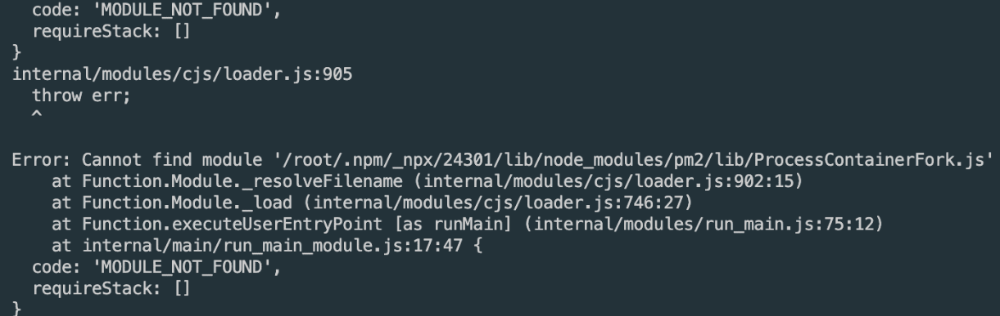
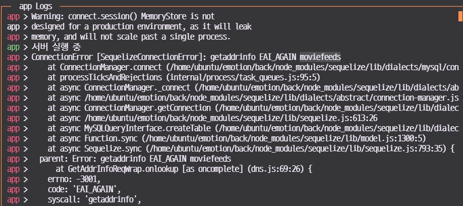

## 커뮤니티 게시판 질의 응답 모음

```js
input 내부의 해시태그들의 색상을 바꾸시려는 것인가요? 기본적으로 input 내부 
텍스트는 css 개별 적용이 어렵기에 쉽지 않습니다. react-mentions처럼 
라이브러리 쓰시는 것이 좋습니다

Promise.all은 동시에 실행된다기보다는 각자 실행된 내부의 것들이 모두 
완료되길 기다려주는 것입니다. 모두 완료된 후에 await으로 return 값을 제공

findOrCreate가 [값, 불리언]으로 반환하는 겁니다. promise.all은 []로 
반환합니다. 둘이 합쳐져서 [[값, 불리언]]인 것

Sequelize Create와 ADD의 차이점이 궁금합니다.
: create를 쓸 때는 model에서 기재했던 define안에 들어있는 값들을 넣어서 
생성할때 사용하고, add를 쓸때는 associate 과 연관된 값들을 넣을때 
사용,retweet은 post테이블과 post테이블간에 관계입니다. 즉 create로 해도 
똑같습니다. XXId같은 것을 알아서 연결하는 것이 add고 직접 넣는 것은 
create입니다

게시글 작성 후 삭제 시 워크벤치 게시글 ID는 변경안되나요?
:네 한 번 사용한 id는 재사용하지 않습니다. 재사용하려면 auto_increment 
값을 1로 초기화해주면 됩니다. 워크벤치 테이블 옵션에서 바꿀 수 있습니다.

정확하게 Promise.all을 어떤 경우에 쓰게 되는 건지 , 비동기적 상황에서 모든 
처리가 완료될때 까지 기다리는건가요 ? await을 동시에 여러번 하는거다고 
생각해야하는건지 ,,,
:req.body.image가 [이미지1, 이미지2]라고 해볼게요.
.map((image) => Image.create({ src: image })를 하게 되면
[create({ src: '이미지1' }), create({ src: '이미지2' })]가 됩니다.
create는 Promise 이므로 await 을 해주어야 하는데 보통 Promise 의 배열은 
Promise.all로 await 을 해줍니다. await Promise.all 까지 하게 되면 모든 
Promise 가 완료될때까지 기다립니다. 기다린 후에 결과가 변수에 들어갑니다.
결과로 [등록된이미지1, 등록된이미지2]가 나옵니다

같은 모델끼리는 belongsTo만 해주시면 됩니다. 어떻게서든 모델들 간의 관계를
 시퀄라이즈가 파악할수 있으면 됩니다. belongsTo는 필수이지만 hasMany나 
 hasOne은 필수가 아니라고 보시면 됩니다

_.throttle(scroll, 500) 을 useEffect에 넣으면 hasMorePosts, 
loadPostLoading, mainPosts가 바뀔 때마다 함수가 새로 생성됩니다. 함수가 
새로 생성되면 _.throttle이 과거 기록을 기억 못합니다.
_.throttle(scroll, 500)와 scroll을 useEffect 바깥으로 꺼낸 뒤 useMemo로 
감싸서 고정해둔 뒤에 재사용해야 합니다.

이번 챕터에서 작성한 구조로 실제 상용화된 제품을 낼 경우 혹시 더 보완해야할 
점이 있을까요?
:csrf나 xss 공격 방지를 해야합니다

! 질문: next.js에 Server Side Rendering을 적용하기 위해선 api 서버가 
배포가 되어있어야 하나요?
:네 api 서버가 실행중이어야 합니다.

import { wrapper } from '../store/configureStore'; // export 와
import wrapper from '../store/configureStore'; // export default
두 방식의 차이점은 변수로 지정하냐 안하냐의 차이인가요?
:아뇨. export를 어떻게 했냐의 차이입니다. 
export wrapper  vs export default 입니다.

default 부분에서 combineReducers({ state, action}) 이 부분 return 할때 
state, action 인자를 어떻게 넘겨받는건지 궁금합니다. 
:state, action 인자는 rootReducer = (state, action) => 여기의 state, action을 그대로 combineReducer에 넣는 겁니다.
combineReducers는 (...reducers) => (state, action) => state의 고차 
함수이고 combineReducer는 (state, action) => state 함수 꼴입니다.
combineReducer(state, action)로 호출하면 완성된 state가 나오게 됩니다

toolkit과 saga
:saga가 기능적으로는 훨씬 좋긴 한데 막상 기능을 다 쓰는 게 아니다보니 
요즘은 코드량이 반으로 줄어드는 toolkit으로 넘어가는 추세
toolkit은 thunk를 쓰다보니 비동기 관련된 기능이 조금 부족하다 느낄 때 
saga를 추가로 연결해서 쓰곤 합니다

context 는 요청/응답과 SSR에 관련된 정보가 들어있는 객체이고요

router.replace는 ssr이 아니라 csr입니다.

toolkit 쓰는경우에는 END 대신 어떤것을 쓰면되나요??
:END는 없고요. 그냥 await store.dispatch(액션()) 하면 됩니다.

더미데이터만으로는 서버사이드렌더링 연결하기에 어려울까요 ? ㅠㅠ..
:더미데이터로도 서버사이드렌더링 가능합니다. 서버에서 더미데이터를 넣어서 줄 
것입니다.

HYDRATE가 실행되면 이전 데이터가 모두 초기화됩니다. 불러오고 싶은 데이터가 
있다면 모두 getServerSideProps 내부에서 dispatch 실행하셔야 합니다.

실무에서는 보통 내 정보를 SSR하지 않습니다. 이 강좌는 ssr 예시를 보여주기 
위한 거고요. 내 정보를 ssr해야 할 이유가 하나도 없습니다. 내 정보는 
useEffect에서만 불러오시면 됩니다

처음페이지의 정보를 다른 페이지로 넘어갈 때 유지하면서 다른 데이터를 요청하고 싶은데 그러려면 넘어갈 때 똑같이 요청을 해야하나요??? 예를들어 리스트페이지에서 디테일페이지로 넘어갈 때 리스트 데이터를 그대로 가지고 디테일 페이지로 가고 싶습니다
:SSR 기준으로는 똑같이 요청해야 합니다. 이게 싫으시다면 getInitialProps를
 써서 첫 렌더링만 서버 사이드렌더링을 하고 다음 렌더링부터는 클라이언트 
 렌더링을 하는 게 좋습니다
getInitialProps를 _app.js에서 쓰려는데 브라우저에서만 실행되는 부분을 만들 
수 있나요?? 
브라우저에서만 실행되는 부분은 if (process.browser) {} 또는 if (typeof 
window !== 'undefined') {}로 감싸주시면 됩니다

 createWrapper의 역할을 간단히 말씀드리자면 기존 getServerSideProps, 
 getStaticProps같은 next의 라이프사이클에 redux를 결합시키는 역할을 
 한다고 보시면 됩니다. 그래서 wrapper.withRedux로 페이지를 감싸게 되면 
 redux가 결합된 라이프사이클을 사용할 수 있게 됩니다

vue로 치면 created() 라이프싸이클훅이랑 비슷한건가요 ? 
:vue의 created는 componentWillMount(최신 리액트에서 deprecated됨)이랑 
비슷합니다.
getServerSideProps는 vue에는 해당하는 개념이 없고 vue 프레임워크인 
nuxt 에는 비슷한 개념이 있습니다.
next에서 새로 만들어진 라이프사이클이라고 보시면 됩니다.

리액트에서도 로그인 후 새로고침을 했을때 바로 로그인창이 보이게 하는 기술이
 있나요?
:SSR을 안 한다면 잠깐 로딩창을 보여주어야 합니다. 일반 리액트에서도 
react-dom/server를 사용해 서버사이드렌더링을 할 수 있습니다

getServerSideProps는 서버에서 실행됩니다. 서버에서 리덕스 스토어가 새로 
생성된 후 실행되는 것이라 기존 클라이언트 스테이트에 접근할 수 없습니다

프론트서버에 접근하려면 먼저 브라우저에서 주소를 입력해야하는데 이 때 
프론트서버로 브라우저의 쿠키가 같이 전달됩니다. 즉, 겟서버사이드프롭스가 
브라우저의 쿠키를 따로 가져오는게 아니라 겟서버사이드프롭스 실행 시 이미 
브라우저로부터 쿠키를 갖고 있는 상태입니다.
브라우저(쿠키동봉) -> 프론트서버 -> 백엔드서버

1. getServerSideProps가 프론트 서버에서 실행되는 코드라고 하셨는데, 이는 back 디렉토리에 백엔드 서버 코드의 (req,res,next)=>{
...
return res.status(200).send('ok')
}
처럼 프론트 서버의 특정 라우터로 요청이 갔을 때 실행되는 부분이라고 이해했는데 맞나요..?
:네 맞습니다. 각 페이지가 각 라우터라고 보시면 됩니다.
첫 요청만 서버 라우터처럼 작동하고(데이터+페이지까지 모두 렌더링) 그 
다음부터는 클라이언트사이드 라우팅입니다. 이 때는 서버에서 json 데이터
(getServerSideProps에서 return한 값)만 받아옵니다

getServerSideProps에서는 항상 context.req값이 있습니다

next 자체가 프론트 서버입니다. 빌드된 결과물은 .next 안에 나오는 게 
맞고요. 개발 시에는 pages나 다른 파일들을 수정할 때마다 빌드가 다시 됩니다. 
(배포용 빌드는 직접 하셔야 합니다)

쿠키에 access token이나 세션 id 인증 정보를 저장한다면 CSRF 공격으로 API 
콜을 해커가 요청하면 쿠키가 서버로 자동으로 보내지기 때문에 공격자는 유저 
액션 수행할 수 있다
:csrf는 어차피 따로 방어해야 합니다

SSR적용하고 페이지에서 로그인 여부에따라 접근불가능한 페이지를 결정할때 
보통은 실무에서 어떻게 처리하나요? getServerSideProps안에서 cookie여부로
 redirect를 하나요? 활용해볼 좋은 예시가 있을까요? 
:네 getServerSideProps에서 쿠키를 넣어서 axios로 백엔드 서버에 
로그인되어있는지를 요청한 후 로그인되어있지않다면 redirect합니다.
백엔드에 내가 로그인했는지 안했는지 판단해주는 라우터가 있으면 됩니다
(req.user 검사)

사실 실무에서는 개인정보  관련된 것은 SSR 안 하는게 정신건강에 이롭습니다. 
실수로 한 사람의 정보가 다른 사람에게 들어가면 골치아파져서요.

(브라우저) 쿠키 프론트서버로 전달 ->  (프론트서버) 전달받은 쿠키 저장해서 
백엔드 서버로 요청 -> 백엔드서버 쿠키에 따른 데이터 응답 -> 프론트서버 
데이터와 컴포넌트 조합 -> 브라우저

context.req는 브라우저에서 프론트서버로 보낸 요청 객체

sameSite 쿠키 설정은
app.use(session({
  cookie: {
     secure: true,
     sameSite: 'none'
  }
})

getServerSideProps는 frontend 서버에서 실행이 되는데 frontend 서버도 
backend 서버처럼 하나이기 때문에 저쪽에서 컨트롤해줄수 있는건가요 ? 
정확하게 잘 이해가 안가서 문의드립니다.
:네 getServerSideProps는 프론트 서버에서 실행되는 코드입니다. 사용자들은
 많은 수의 브라우저로 접근하지만 프론트 서버는 하나이므로 axios.defaults.
 headers.Cookie=쿠키 로 쿠키를 설정하게 되면 프론트 서버에 이 쿠키가 
 설정되어 버립니다. 모든 브라우저가 프론트 서버를 거쳐 백엔드 서버로 요청을 
 보낼 때 같은 쿠키가 적용되어버리는 것입니다.
그래서 한 번 설정했다가 요청을 보낸 다음에는 axios.defaults.headers.
Cookie = ''로 비워주는 것입니다.

getServerSideProps에서는 브라우저에서 쿠키를 들고 next.js 서버로 오기 
때문에 cookie를 가지고 올 수 있다고 이해했는데 getStaticProps는 빌드 시에 
실행되기 때문에 cookie를 들고있지 못한걸로 이해했는데 맞나요? 
:네 맞습니다. getStaticProps는 개인데이터는 불러올 수 없습니다

첫 로딩만 ssr이고 그 다음부터는 csr입니다

 json() 은 “json 데이터”를 자바스크립트 객체로 변환해준다고 되어있는데 
 “fullUserWithoutPassword”  는 시퀄라이즈에서 보내는 데이터 아니었나요? 
 json()이 시퀄라이즈 데이터도 js 객체로 변환시켜주나요?
:네 json할 때 시퀄라이즈 데이터에서 불필요한 것은 빼내고 json 데이터로 
변환됩니다.

만약 이벤트 페이지를 변경하거나 삭제하고싶을때 
이벤트 정보가 담긴 DB 는 삭제 또는 수정해도 이미 html 로 만들어놔서 그대로 
보여주고 서버를 껏다 켜야지만 삭제 또는 수정한 내용이 적용되는건가요?
:서버는 다시 시작 안 해도 될 것 같고 export 빌드만 다시해서 html js파일만 
다시 만들면 될 것 같습니다.

https://nextjs.org/docs/advanced-features/debugging
이 부분에 debugging tool 사용법

nextjs에서 page별로 컴포넌트를 만들면 자동으로 nextjs가 page별로 
검색엔진에 노출이 될 수 있도록 알아서 html과 같은 것들을 설정해주나요?
:페이지별로 따로 만들어주지만 내용물은 직접 넣으셔야 합니다. ssr을 해주는 
것이지 seo에 완전 맞추는 건 사용자 몫입니다.

SSR 이외에도 그냥 무조건 nextjs로만 web을 만드는 분?들도 계실까요? CRA보다
 개인적으로 훨씬 가볍고 좋다고 느껴서요. CRA의 기능을 안써봐서 그럴수도 있구요.
 :ssr을 하지 않더라도 쓸만 합니다. 다만 페이지구분이 모호한 서비스는 
 넥스트를 쓰는 이점이 없습니다.

이건 논외 질문인데 CRA했을때 vulnerability (취약성) 같은 경우는 어떻게 처리하시나요 
? npm audit --force 해도 없어지지 않는것들이 있더라고요. 실제로 CRA를 
안쓰시면 모르겠지만 혹시 방법을 아시는지 궁금하여 여쭤봅니다
:high severity는 수동으로 수정하는데 나머지는 저도 무시하고 넘어갑니다.

모든 페이지에 서버사이드 렌더링 하는 함수 넣으셨잖아요
그러면 그냥 모든 컴포넌트가 공통으로 사용하는 front 폴더에
_app.js 파일 에 서버사이드 렌더링 하는 함수 넣어놓으면 공
통으로 적용되는거 아닌가요 ???
:getStaticProps랑 getServerSideProps는 _app.js에서 못 씁니다.

메모리는 크롬 profiler 탭 이용하시면 됩니다.
서버 cpu 사용량 체크는 datadog 쓰고 있습니다.

검색엔진 노출 필요없으면 ssr 안 하셔도 됩니다. 다만 말씀하신것처럼 로그인이
 잠깐 풀려보이는 현상이 있을 수 있어 이런 경우는 getServerSideProps 필요합니다.

getStaticProps는 정적인 페이지를 미리 만들어두는 것입니다. 어떻게 보면 
미리 만들어서 저장하고, 저장한 값을 두고두고 쓴다는 점에서 캐시와 비슷

함수를 제외한 대부분의 코드는 두 환경(browser&server)에서 다 실행됩니다. 
함수같은 것들은 호출하기 전에는 실행되지 않고요. 함수도 호출한다면 서버든 
브라우저든 실행됩니다

삭제한 포스트로는 들어갈 수 없습니다. 다만 에러가 안 뜨게 하려면
if (!post) return <Redirect to="/" />;
기존 return 위에 이런 것을 넣어주면 됩니다.

auto_increment를 1로 초기화해야하는데 sql문을 사용해야 합니다. 그런데 id에 
너무 신경쓰실필요는 없습니다. id가 연속적이면 예측이 돼서 문제가 되는 
경우도 있습니다.

Link를 누르면 서버사이드렌더링이 아니라 클라이언트사이드렌더링을 하므로 
잠깐동안 데이터가 비어있을 수 있습니다. 따라서 singlePost가 null일 때는 
로딩창을 띄우거나 하세요.

포스트 제목으로 user를 조회한다는 말씀이신가요? 이 경우는 User include 
Post를 한 후, include 안에서 where을 써야 합니다.
포스트 제목으로 post를 조회할 때는 정확하게 포스트 제목을 입력해야 합니다. 
띄어쓰기까지요. 단어 일부로 검색하고 싶다면 SQL Like query 찾아보시면 
됩니다

1) `localhost:3000/post` 여기서 포스트 작성을 합니다.
2) 그래서 작성후에 저장이 되면 `localhost:3000/post/id`
이쪽으로 라우팅을 하려고 하는데요.  어떤식으로 라우팅을 트랜지션해야할지 잘 
모르겠어서요. 
상태는 리덕스 스토어를 사용하고 있습니다.
3) 저장 시 성공하면 백엔드쪽에서 포스트 정보랑 id를 json으로 넘겨줍니다.
:post가 완료(SUCCESS)될 때 postDone reducer state를 true로 만들거나 post의 id를 기록하시고요.
useEffect에서 postDone에 아이디가 들어오면 그걸 바탕으로 router.push하시면 됩니다.
:
답변감사드려요~ 그럼 제가 저기 위에  useEffect 주석한것같은 방식으로 
해야되겠네요~ 그런데 저 방식으로 했을 때는 뒤로가기하면 /post -> /post/id 
로 계속 리다이렉션 되던데
만약 success done 상태를 기준으로 useEffect에서 라우팅을 한다면 라우팅 
직전에 success done을 null 이나 다른걸로 다시 변경해주는 방식으로 
해야겠네요 맞을까요??
:
네 router.push한 후에 바로 postDone을 제거하는 액션을 dispatch하세요.

index page에서 link태그로 해당 주소로 이동하면 아래와 같은 오류가 뜹니다
추가로 혹 getServersideprops 에서 Request Header에 있는 쿠키를 가공하는
 법을 알려주심 감사하겠습니다.
(Cookie: refreshToKEN=~~~ , accessToken= ~~~ )인데
이중 accessToken 결괏값만 꺼내에 axios.default.headers.common
["x-access-token"]= 에 넣어주고싶습니다.
:클라이언트에서는 getServerSideProps의 데이터를 따로 가져오기때문에 
잠깐동안 onestore가 없을 수 있습니다. if (!onestore) return null;
넣어주시면 로딩 끝난 후 화면 뜰 것 같습니다.
const response = await axios.메서드(토큰요청)
axios.default.headers.common["x-access-token"]= response.헤더의 토큰;
이렇게만 들어가면 될 것 같습니다.

query 질문 prams.id 값을 랜덤한 문자열로 바꾸는것은 어떻게하나요?
:이것은 몽고디비가 생성해주는 랜덤objectid입니다. 유명한 라이브러리로는 
shortid같은 패키지가 있습니다.

styled-components 대신에 emotion 사용해서 실습하고 있는데, emotion 
공식문서에서 10버전 이상부터는 next에서 SSR 적용이 된다고 나와있는데요. 
:getInitialProps를 없애도 될 것 같네요.

다른 방식의 컴포넌트 스타일링도 ssr을 적용해야될까요?
:별 문제는 없을 것으로 보입니다. 사실 css는 굳이 ssr을 적용할 필요가 없긴 
하니까요.

처음 next에서  ssr 적용을 안했을 경우 css가 안먹히는 이유는 무엇인가요?
:styled components는 따로 SSR 세팅(_document.js)을 안 하면 서버사이드 
렌더링이 안 됩니다. 동적으로 스타일 태그를 생성하기 때문입니다.

next를 사용하게 되면 기본적으로 서버사이드렌더링이 되는건 아니지 않나요 ? 
기본적으로 next의 pages는 서버사이드 렌더링이 됩니다. getServerSideProps는 추가적으로 데이터까지 가져오는 것이고요.
ssr을 제외한 상황에서는 모두 styled-components가 동작합니다.

SSR 시 발생하는 에러는 서버쪽에서 찍히기 때문에 next.js 개발 하다보면 
서버쪽 데이터 문제라는 것을 쉽게 찾을 수 있습니다. 특히 redux 관련된 
에러라고 추측되는 경우는 hydrate 부분 콘솔로그 찍어보면 확인됩니다
hydrate 액션쪽에 console.log 찍어보세요. 또는 configureStore에서 debug: 
true로요

SSR시에는 서버에서 제일 먼저 실행됩니다.
클라이언트에서는(Link로 이동할 경우) 별도로 서버로 요청이 간 후 따로 
실행돼서 결괏값이 hydrate를 통해 전달됩니다. 이 때는 useEffect 이런 것이 
먼저 실행될 겁니다.

현재 next-redux-wrapper를 쓰고 있다면 페이지가 넘어갈 때마다  hydrate 
액션이 호출되는데 이 때문에 유지가 힘듭니다. 유지하려면 
next-redux-wrapper를 제거해야 합니다
제가 내린 결론은 redux랑 next.js랑 같이 안 쓰는게 좋다는 것입니다. swr로
 대체하는 것이 나은 것 같습니다

getserversideProps를 쓰더라도 첫 로딩때만 서버에서 화면을 그려서 주고, 그 
이후에는 json으로 데이터를 전달합니다. 그래서 그 이후에는 계속 csr이나 
마찬가지입니다.

컨텍스트는 여러개 생성 가능해서 하나는 리덕스 주고 하나는 리액트쿼리 주고 
할 수 있는 겁니다
:
답변 감사합니다. 컨텍스트도 리덕스 스토어 처럼 프로젝트에 하나만 정의 해야 
하는 줄 알았네요

라우터는 위에서 아래로 검색합니다. user/:userId가 user/followings보다 
위에 있으면
user/followings 요청이 들어올 때 user/:userId에 걸려버립니다.
user/:userId가 user/followings보다 아래 있으면 user/1 요청이 들어올 때 
user/followings랑은 불일치하니 넘어가서 user/:userId에 걸립니다

key는 그냥 문자열일 뿐입니다. url이 될 수도 있고 그냥 고유한 값이 될 수도 
있습니다. fetcher에 따라 뭘 하는지가 달라지는 것이고요. 상태를 저장하는 
걸로 이해하셔야 합니다. 같은 key이면 같은 데이터를 불러오게 되고, api콜을 
하는 것은 fetcher에 의해서 일어나는 일일 뿐입니다. a와 b컴포넌트는 각각 
api call을 하지 않습니다. 둘 중 먼저 렌더링되는 컴포넌트에서 api 호출을 
하면 다른 컴포넌트는 앞의 값을 받아옵니다. 일정 시간(설정 가능)이 지나야 
새로 요청을 하게 되는 것이고요

redux의 dispatch와 같이 useSWR로 api 콜 시점을 정할수도 있을까요 ? 
:네 가능합니다. 
https://swr.vercel.app/docs/conditional-fetching 
// 조건부로 가져오기
const { data } = useSWR(shouldFetch ? '/api/data' : null, fetcher)
// ...또는 거짓 값을 반환
const { data } = useSWR(() => shouldFetch ? '/api/data' : null, fetcher)
// ...또는 user.id가 정의되지 않은 경우 오류가 발생합니다.
const { data } = useSWR(() => '/api/data?uid=' + user.id, fetcher)
이렇게 state를 두어 조절하면 됩니다.

실무에서 next.js가 아닌 react.js로 프로젝트를 진행한다면 redux(saga),
 swr, react-query 중에 제로초님이라면 어느것을 선택하시나요?
redux를 사용하는것보다 react-query를 사용하는게 요즘 트렌드일까요?
:저는 redux-toolkit + swr/react-query조합으로 쓸 것 같습니다. swr이냐 
react-query냐는 팀원들간에 정해보고요. redux가 하향세긴 해도 여전히 대세는 
맞습니다
:
reudx-toolkit에  미들웨어를 saga로 사용하는것은 어떻게 생각하시는지 
궁금합니다!
:필요하다면 같이 써도 괜찮습니다.

swr을 쓰면 컴포넌트 랜더링 플로우가 어떻게 되나요?
일단 프로필 컴포넌트 안에서 콘솔 로그 찍어봤는데 
followersData, followingsData를 마치 await해서 받은 다음
한 번에 랜더링 되더라고요.
근데 강의 내용중에 { data, error }가 둘 다 없으면 로딩중이라 하셨는데 
그럼 순서가 
swr get request -> render ->  swr get success -> render
이렇게 작동된다는 건가요?
:네 원래는 로딩중, 로딩완료 이렇게 두 번 렌더링됩니다. 다만 next의 ssr이랑 
같이 합쳐두었을 경우 데이터는 이미 불러온 상태이므로 로딩완료 한 번만 
렌더링됩니다.
:
getServerSideProps를 export한 페이지에서는 useSWR훅도 ssr로 작동한다는 
말씀인가요?
:useSWR에 옵션으로 initialData를 주면 ssr로 작동합니다.
:
initialData를 주지 않고 url, fetcher만 인자로 넘겼는데도 콘솔이 한 번만 
찍힌 이유는 무엇 때문이죠?
:fetcher 내부에 콘솔로그를 찍고, 만약에 그 콘솔로그가 프론트 브라우저 
말고도 프론트 서버에 찍힌다면 fetcher도 서버에서 실행되어서 결과가 나타난 
것입니다. 서버에 없다면 브라우저에서 렌더링된 것입니다.
:
넥스트가 기본적으로 ssr을 진행하면서 useSWR을 서버단에서 실행해줬단 
말씀인가요?
:넥스트가 ssr을 위해서 컴포넌트를 한 번 실행하니까 그 때 useSWR도 한 번
실행되긴 합니다.
:
왜 그런 건지 알아냈어요.
처음 profile 페이지로 이동하면 많이 찍히는데
그 이후에는 swr이 같은 url 에 대해서 캐싱을 해놓는 듯합니다.
const useSWR = (url, fetcher) => {
    const [data, setData] = useState();
    const [error, setError] = useState();

    useEffect(() => {
        fetcher(url).then(setData).catch(setError);
    }, [url]);

    return { data, error };
};
swr을 대충 이런 커스텀 훅으로 이해하면 될까요?
처음엔 empty data, empty error를 리턴하고 
이벤트 루프가 promise가 done된 테스크를 stack에 올릴 때
setData를 실행해서 data를 갱신한 다음 profile 컴포넌트를 리랜더링하고
다시 호출된 swr은 갱신된 data를 리턴하는 식으로요.
url이 달라질 때마다 새로 가져오구요.
:네 맞습니다. 저기 useEffect에 추가적으로 주기적으로 재요청한다든가의 
로직이 추가되는 개념입니다. 실제 구현은 다양한 옵션들로 인해 훨씬 
복잡해졌지만요.
https://github.com/vercel/swr/blob/master/src/use-swr.ts

swr이 react-query보다 강점인 점이 있을까요?
:next.js를 만든 vercel이 만든 게 swr입니다. 같은 회사에서 만들어서
 시너지가 좋습니다. 기능 자체는 react-query가 더 많다고 생각됩니다.

캐싱이라는 것은 무언가를 잊어버리지 않고 저장하고 있는 겁니다. swr은 서버에
 요청도 보내고, 설정에 따라 주기적으로 요청을 보내기도 합니다

swr은 데이터를 가져오는데 (GET) 에 특화 되어 있다는 걸 알게되었습니다.
그러면 POST를 사용하고 싶을때는. ..axios을 사용하여 받을 값을  mutate로 
 업데이트를 해주는건가요 ?!
:네 axios로 가져온 후에 swr로 만든 저장소에 mutate 로 넣으시면 됩니다.

예를들어서 ..서버가 구축이 안된 상태에서는 swr를 활용할수 있는 방법이 
없을까요 ?
이전 챕터에서 서버가 구축 안된상태에서는 faker를 사용해서 임시로 데이터들을 
넣어주었는데  swr을 사용할 경우에는 어떻게 해야하나요 ?
:useSWR('키', () => 값)
값에 더미값을 넣으면 됩니다.
:
swr로는 상태 관리가 그러면 불가능 하죠 ? 그러면 swr로 받아온 값들을 리덕스에 useSelector 처럼 여러 컴포넌트에서 사용할 수 없겠네요 ..?props로 
넘겨주는 방법 말고는.. ?
:const { data } = useSWR('키', fetcher) 만 넣으면 모든 컴포넌트에 
공통으로 사용됩니다. 키가 같으면 같은 data에요.

리덕스와는 완전히 별개라고 봐도 되나요? 
그렇다면 극단적으로 생각했을 때 넥스트에 리덕스와 리덕스 사가 도입없이 
swr만 도입해도 현재와 비슷하게 구현이 가능한가요?
swr은 데브툴즈를 사용할 수 없는데 리덕스에 비해서 디버깅이 많이 어렵지는 
않을까요..?
:네 리덕스를 완전히 대체할 수 있습니다.
디버깅은 리덕스보다 어렵습니다. 디버깅이 리덕스의 강점이긴 해서요.
디버깅을 원하시면 swr이랑 비슷한 react-query를 사용해서 react-query-devtools를 연동하는 게 좋습니다.

궁금한 점은 그럼 앞으로 get방식으로 load만 하는 과정은 swr을 통해서 하고,
post나 patch와 같이 db 수정이 필요한 경우는 redux로 하면 되는걸까요?
그리고 loadMyInfo나 loadPosts같은 경우에도 swr로 대체해서 사용해도 무리가 
없을까요??
:네 get요청은 차차 swr로 대체하시면 됩니다.

swr을 설치하면 vulnerabilities 오류가 발생합니다.
:npm audit fix 해보세요. high vulnerabilities 는 해결하는 것이 좋습니다.

기본적으로 swr는 주기적으로 데이터를 최신으로 갱신하지만, 강제로 mutation을 
사용해서 swr로 가져온 데이터를 수정할 수 있습니다.
https://github.com/vercel/swr#mutation-and-post-request

swr사용시 cycle
swr을 사용하면 redux lifecycle에서 벗어나는거죠? 혹시 swr을 사용하면서 
redux dev tools에서 과정을 볼 수 있는 기능이 있나요?
그리고 swr을 사용하면 redux를 사용하는 것 처럼 에러관리나 흐름확인을 잘 
못할 것 같은데, 그래도 코딩이 간단해진다는 이유로 사용하는건가요?
:redux와는 별도로 분리됩니다. 불러오는 것만으로는 swr이 redux에서 LOAD류
만드는 것보다는 쉽습니다. 서버사이드 렌더링도 간단하고요. 데이터 캐싱같은
것도 알아서 처리해주어서, 직접 처리해야하는 Redux보다 좋은 점이 많습니다.
에러관리나 흐름도 그렇게 어렵지는 않습니다. 상태는 로딩/성공/실패 세 개밖에 
없으니까요.

노드버드에 채팅을 구현할려고 하는데 
대충 Chat table 만들고 User 랑 관계정의 시켜서 테이블 쭉 쌓으면 될것같은데 
모든 채팅 정보가 한테이블에 있으면
나중에 규모가 커진다고 가정했을때 시간이 오래걸리것같습니다.
아무리 sql이 조회가 빠르다해도 채팅의 경우 다른 Post 나 User 테이블보다 
훨씬 많이 쌓일테고
유저 개개인의 채팅한 정보가 한곳에 모이다보니
A 와 B 채팅 정보를 가져오는데 모든 사람의 테이블을 다 조회하면 시간이 
오래걸릴것같은데 이런경우는 어떻게 처리하는게 좋을까요?
채팅부분만 mongo 써야될까요? 
:이게 해결방법이 상당히 많습니다. 일단 카카오톡급 규모가 아니라면요. 
sql상에서도 채팅이 어느정도 처리가 됩니다. 어차피 불러올때 모든 내역을 
불러오는게 아니라 화면에 보여질정도만 불러오는 것이기때문에 간단하게는 
날짜별로 테이블을 따로 만들면 됩니다. 그래서 테이블에 있는 로우 숫자를 
줄이세요. 그 다음에 서버단에서 로직으로 어떤 테이블에서 채팅데이터를 
불러올지 조절하면 됩니다.
이런 용도로는 dynamodb도 괜찮습니다. 알아서 나눠주거든요.

"<Link href=''>" 를 적용한 부분들은 모두 탭에 로딩바가 생기지 않습니다만 요청 
성공하고, 페이지 출력까지 잘 됩니다.. 다른 질문에도 로딩바가 생성 안되는 거 
같던데 이유를 모르겠어서요!
:싱글페이지 애플리케이션이라서 로딩바가 안 생기는게 맞습니다. 예전 버전에서는 
생겼는데 이제는 생기지 않습니다.
HYDRATE가 되면 서버 사이드 렌더링에서 불러오는 상태 이외에는 모두 초기 
상태로 변경됩니다. 그래서 이전 상태가 유지되지 않습니다.
:
아 그렇군요.. 그럼 loginDone 상태 유지 하고 싶으면 쿠키의 존재 여부 같은 
걸 확인해서 추가로 바꿔주는 식으로 해야되는 건지.. 감이 안잡히네요 ㅜ
SSR 에서 요청한 action의 상태 이외의 상태는 초기화 되버린다는 게 그냥 
넘어가도 되는 부분인지 잘 모르겠어서요
:loginDone 과 관련된 상태들도 다 서버사이드렌더링하는 수밖에 없습니다.
저는 ssr 시 상태관리가 힘들어서 그냥 리덕스 떼어버렸습니다.
:
아 역시 장단점이 다 있군요 ... 이거저거 찾아보고 고민해보다가 
rootReducer에 case HYDRATE: 의 return 부분을 상태를 덧씌우는 식으로 
변경을 해봤습니다. 제가 원하는대로 작동은 되는거 같긴 한데.. 아래 방법은 
억지스러운 느낌일까요..?ㅋㅋㅋ (아 참고로 isLoggedIn은 초기에 작성한 거 
변경을 안해서 그렇습니다!)
const rootReducer = (state, action) => {
switch (action.type) {
case HYDRATE:
 return {
 ...action.payload,
 user: {
 ...action.payload.user,
 isLoggedIn: state.user.isLoggedIn,
 },
 };
default: {
const combinedReducer = combineReducers({
user,
postReducer,
});
return combinedReducer(state, action);
}
}
};
:아, 그렇게 HYDRATE를 커스터마이징 하셔도 됩니다. 바꾸고 싶은 것만 바꾸고 
나머지는 안 바꾸도록요

NEXT_REDUX_WRAPPER_HYDRATE가 실행되기 전 잠깐 동안 redux stata가 비어있는 상황이 나오네요.

moment 를 실험삼아 써보다가 페북이나 유튜브처럼 방금, ~분전 등으로 표시되는 
fromNow() 를 써봤는데 분명 방금 쓴 댓글인데 10분이나 22분전으로 막 
표시되는 등 시간 정확성이 떨어지는데 이유가 뭘까요?? 다른 것들은 시간 
표시가 잘 되었는데 말이죠
:startOf 때문인 것 같습니다. hour를 넣으면 분이 00분이 됩니다.

추가적으로 next/dynamic의 용도가 만약 페이지가 1mb정도 됐을때 코드 스프릿 
용도로 쓰는건가요 ?
:next/dynamic 도 주 용도가 용량을 줄이는 것은 아니지만 불필요한 ssr을 없애서 
용량도 줄이고 로딩 속도도 향상하는 효과를 볼 수 있습니다

페이지를 이동할 때 매번 next_redux_wrapper_hydrate가 매번 실행되는게 
맞는건가요?
:네 맞습니다. getServerSideProps를 쓸 때 각 페이지는 SSR되므로 hydrate가 
필요합니다. 이 부분이 어떻게 보면 getServerSideProps의 단점입니다.
예전 getInitialProps를 쓸 때는 첫 페이지 로딩만 SSR되고 그 다음부터는 CSR 
되기는 했습니다. 만약 이런 기능을 원하신다면 getInitialProps를 쓰는 게 
맞습니다.
지금은 서버사이드만 할 때는 getServerSideProps로, 클라이언트 사이드만 할 
때는 SWR로 나뉘어졌습니다. 그렇다고 getInitialProps가 없어진 것은 아닙니다.
https://github.com/vercel/next.js/discussions/10930
여기서도 활발한 논쟁이 일어나고 있는데, 공식문서에서는 getInitialProps 대신 getServerSideProps를 권장한다고 되어있는데 실제로는 조금 잘못된 설명이 아닌가 싶습니다.

next build는 무조건 production이라고 합니다. 수정하는 방법은 해당 이슈 
읽어보세요.

https://www.npmjs.com/package/next-compose-plugins
위 라이브러리를 사용해서 적용하는게 깔끔합니다. 안 그러면 with안에 with안에 
with가 들어가는 구조가 되어버립니다

저는 antd이게 이만한데 왜케크죠???ㅋㅋ..
혹시 이거 정상인가여? 아님 제가뭐 잘못한건가요??
:압축 전의 css네요 import할 때 antd.min.css를 대신 써야 할 것 같습니다.

실무에서도 immer를 많이 사용하나요 ?
어느 게시글에서 읽어 봤는데 immer를 사용하는 경우 좀 무거워진다는 글을 
봤는데 데이터가 적은 경우에만 사용하는게 맞는걸까요 ??
:이머 엄청 많이 씁니다. 특히 리덕스 팀에서 만든 redux-toolkit에 기본 
내장되어 있어서 더 많이 쓰게 되었습니다.데이터가 많아도 저는 쓸만 했습니다.

custom css configuration 을  해서 built in css support가 
중단되었다고하는거 같은데, 해당 링크에 들어가보면 외부 css 관련 플러그인을 
사용했을때 뜰 수 있다라고 하는데 그 상황은 아닌거같고요.
혹시 어떻게 해야 웹팩 오류가 안나게 설정을 할 수 있을까요?
:less-loader에 jsEnabled가 deprecated 되었다네요. 다른 방식으로 
적용했습니다

현재 aws ec2 2개 활용하여, 프론트 및 백 배포하였고
두  서버 모두 nginx를 활용하였습니다. 
궁금한 점이 기존 aws에 clone한 repo를 지우고 새로운 repo로 clone해도 
배포에 문제가 없을까요?
고려할 부분을 미리 생각해보았는데, nginx와 .env
2가지 가 떠오르는데 배포 전에 질문 드립니다.
nginx 설정은 변경이 필요없을까요?
.env는 추가 예정입니다.
:같은 포트에 서버를 띄운다면 엔진엑스 설정은 안 건드셔도 됩니다.

1. next.js docs 나 구글에 검색한 대부분의 경우 app.js에서
props로 Component와 함께 {...pageProps}를 같이 받아오는데
이는 _app.js에서 getInitialProps를 사용하거나 SSR 적용시 swr에서 필요한 
props를 받아오는 경우가 아닌이상 사용할 필요가 없어서 이번 강의에는 
사용하지 않으신건지 궁금합니다.
:1. 네 강좌에서는 필요 없어서 안 넣었는데, 저 부분 없으면 에러나는 경우가 
많아서 넣으시는 게 낫습니다. 관련 질문들도 좀 많았습니다.
2. getInitialProps를 _document.js 에서는 적용해주셨는데 이는 모든 페이지에 getInitialProps를 적용하기 위함이라고 생각하면 될까요? (모든 
페이지에 styled-components(CSS)를 SSR 하기 위함일까요?)
:2. document.js의 getInitialProps는 스타일드컴포넌트와 혹시나 _app이나 
pages에서 getInitialProps가 있을까봐 넣긴 했습니다.

최종적으로 swr과 nest를 typescript와 함께 nodebird 에 적용해보려고 하는데 
리팩토링 가능할까요?
: 가능합니다. 다만 swr로 리덕스 대체가 가능하긴 한데 좀 억지로 하는 
느낌이라 전역 스토어가 있어서 같이 쓰는 게 좋긴 합니다. 또는 swr을 
리덕스툴킷쿼리로 대체해서 많이 씁니다.

프론트 서버는 front 폴더에서 배포하시면 되고, 백엔드 서버는 따로 배포하셔야 
합니다. 익스프레스가 지원되는 곳으로요. 그런데 웬만하면 같은 서비스를 
쓰셔야 도메인간에 쿠키 공유가 될 겁니다.
:
그럼 일반적으로 front와 back을 동시에 배포를 해야한다면 어떤 배포툴을 
사용하나요?? 그리고 프로젝트에서 front폴더만 빼서 배포하고 back폴더 빼서 
각각 배포하는 거 맞나요??
:사실 동시에 배포할 일이 많나 잘 모르겠습니다. 일반적인 회사는 
프론트개발자랑 백엔드 개발자가 나뉘어져있어서 서로 다른 타이밍에 
배포하거든요. 네 폴더는 따로따로입니다.

saga 사이드이펙트 질문
1. 예를 들어 로그인이나 로그아웃을하고 로컬스토리지를 삭제하는 로직을 
리듀서는 무조건 순수함수여야 하니  saga에서 yield call로 작성하면 될까요?
:1. 네 리듀서는 상태만을 변화시키는 순수함수인게 좋습니다. saga에서 
호출하세요.
2. 로컬스토리지로 jwt 토큰을 저장하였을 때 만료기한을 설정할수 없다고 
알고있는데 그렇다면  토큰의 만료기한 정보만을 가지고 지우는 등의 제어를 
하는건가요?
:2. 만료기한은 jwt 토큰 내에만 들어있는지라, jwt 토큰을 사용할 때 
만료기간을 체크해서 지났다면 갱신요청+로컬스토리지에서 제거하시면 됩니다.

mysql 데이터베이스를 운영하면서 새로운 테이블 또는 컬럼을 추가할 때 
sequelize migration을 이용해야 한다고 들어서(기존 데이터를 보존하기 
위해서) 공부를 하고 있고 적용을 해보았습니다. 잘 작동하기에 문제는 없는데 
mysql workbench를 이용하는게 더 직관적이고 편해서 이쪽을 이용하는 편입니다.
혹시 migration을 꼭 이용해야만 하는 장점이 있을까요? 딱히 그런게 없다면 
워크벤치를 계속 이용해도 괜찮을 까요?
:마이그레이션은 DB변경 내역을 코드로 추적하는 용도로 씁니다. DB를 어떻게 
변경해왔는가가 코드에 전부 남기 때문입니다. git같은 것이라고 보셔도 됩니다. 
필수는 아니기 때문에 이런 내역이 필요없다면 그냥 워크벤치에서 바꾸셔도 
됩니다.

배포환경에서 테스트해보시면 되는거고요. 배포때는 빌드하셔야 합니다.
배포전(개발모드, npm run dev)에서는 ssr 안 되니 확인하실 필요 없고요. 배포 
하기 위해 build한 후에 npm start해서 체크할 때 안 되는지 되는지 확인하시면 
됩니다

타입스크립트 에러는 당연히 브라우저에 안 나옵니다. 타입스크립트는 컴파일 
분석이고 브라우저는 런타임 분석입니다. 컴파일과 런타임 찾아보세요.

이전에 sleact 강의를 들은곳에서는 타입 지정을 해주지 않을시에 에러가 브라우저에서도 표시되는게 기억나서요. 다시 돌아가서 확인을 해봤는데 거기서는 표시해주더라고요.
이것과 다른 설정이 있었던걸까요?
:next의 실행방식과 sleact 의 실행 방식이 달라서 그렇습니다. 애초에 
브라우저는 타입스크립트를 모르고, 소스코드도 이미 자바스크립트로 바뀌어있기 
때문에 타입스크립트 에러 상관 없이 돌아갑니다.

모든 page에 ssr 말고 index page만
index page만 getServerSideProps로 서버에서 데이터를 먼저 불러오고 다른 
page들은 userEffect로 CSR 방식으로 데이터를 불러와도 NEXT를 사용하는데에 
검색엔진 노출, 코드스플리팅등의 이점은 그대로 적용되는걸까요? 또 한 
page안에서 서버에서 미리 불러올 데이터와 useEffect로 불러올 데이터 등을 
나눠줘도 될가요?
ex)  게시글 data는 서버에서, 사용자가 로그인 체크는 useEffect로
왜냐하면 /login page에서 로그인해서 얻은 정보가 index page로 돌아오면
 NEXT_REDUX_WRAPPER_HYDRATE 액션시에 초기화가 되더라구요.
:그렇게 하면 index 페이지만 ssr 됩니다. 코드스플리팅은 적용되지만 index 
제외한 다른 페이지는 노출되지 않을 겁니다.

실무에서는 백엔드와 프론트 엔드 중 데이터를 처리하는 로직을 어디에 주로 
두는지 궁금합니다.
주로 프론트 엔드를 최대한 가볍게 만드는 것이 좋은가요?
:아뇨 프론트를 최대한 무겁게 만들고 백앤드를 가볍게 만들어야합니다. 보안에 
위협되는 데이터가 없고 프론트가 버벅이지 않는 한에서요.

로그인 후 페이지 이동 문의드립니다!
:useEffect로 loginDone이 true가 되면 페이지 이동하시면 됩니다.

router.query 이용해서 주소값을 넘겨줄 때
type: LOAD_USER_REQUEST,
디스패치 부분에 동적 data를 넘겨주고 싶은데 방법을 몰라 질문 드립니다.
가입 시 회원마다 각각의 개인 트위터 피드를 부여하고 웹 페이지가 로드될 때 
해당 페이지가 누구의 페이지인지 사용자의 정보를 가져오려고 하는데요! 
getServersideProps가 가장 먼저 로드되는데, 여기에 data를 어떻게 넣을 수 
있을까요? 
:https://github.com/ZeroCho/react-nodebird/blob/master/ch7/front/pages/user/%5Bid%5D.js
여기서 context.params.id를 쓴 것처럼 하시면 됩니다. 다만 주소에 [id]같은 
공간이 마련되어 있어야 합니다.

개발 환경으로 하셨나요?? 배포 환경으로 하셔야 합니다. npm run build 후 npm 
start해서요.

App 사용중에 배포되면 에러가 발생할거 같은데 이런경우 해결방안이 있는지 
궁금합니다.
A라는 버전으로 배포하고하고 특정고객이 A버전의 App을 사용중에
B라는 버전을 배포하는 경우. A버전을 사용중인 고객은 새로운 페이지 진입시 
버전이 바껴있기때문에 에러가 발생할거 같은데 이경우.. 방안이 없는 걸까요? 
:서비스워커를 사용해서 새로운 업데이트가 올라올 경우 기존 버전 고객들한테 
새로고침을 눌러서 버전을 업데이트하라고 안내할 수 있습니다. 이 부분은 PWA
(progressive web app)를 공부해보셔야 합니다.

next에서 폰트를 사용하려면 어떻게 해야하나요?
https://stackoverflow.com/questions/52636562/how-lead-my-nextjs-app-to-accept-otf-and-ttf-fonts
next-font 사용하시거나
public폴더에 폰트 넣은 후 @font-face 사용하는 두 가지 방법 중 하나 쓰시면 
됩니다.

.env를 git에 올리는 건 좋지가 않고요. 저는 s3같은 저장소에 넣어뒀다가 
.env를 서버 시작 전 미리 다운로드받아두거나
.env를 안 쓰고 aws parameter store같은 곳에서 값을 받아서 process.env에
 대입해서 실행하곤 했습니다.

배포 질문드립니다.
front 와 back 두개 인스턴스 만들어서 따로 배포하는데 그 이유가 있을까요?
ssr 하려면 front back 두개 인스턴스가 필요한건가요? 
:인스턴스는 하나만 있어도 됩니다. 하나의 인스턴스 안에서 서버 두 개 
실행하면 되고요. 다만 이럴 때 nginx 같은 서버가 추가로 더 필요합니다. 
보통은 하나의 인스턴스 안에 하나의 서버를 두기때문에 두 개의 인스턴스를 한
 겁니다. 설정도 간단하고요.

모리 부족입니다. 로컬에서 빌드하고 빌드한 결과물까지 git으로 보내서 
서버에서는 실행만 하세요.
배포는 이게 가장 쉬운 방법입니다. 좀 더 편리하게 하는 방법은 있는데, 
편리하게 하기 위한 세팅이 또 많이 들어갑니다. docker를 배운다든지, 
cloudFormation을 배운다든지요.

tsc 했을 때 멈추는거라면 서버 성능이 딸리는 겁니다. 서버 업그레이드(유료) 
하시거나 로컬에서 tsc 후 서버에서는 결과물 받아 실행만 하셔야합니다

서버는 node app으로 켜시면 안 되고 pm2(npm start)로 켜셔야 합니다. node 
app으로 켜면 터미널을 끌 때 서버도 같이 꺼집니다.

DB 용량이 어느정도 늘어나고, 트래픽도 늘어나면 RDS같은 관리형 서비스로 
넘어가야 합니다.
지금 가장 큰 문제는 DB 용량보다 백엔드서버의 트래픽이 늘어나면 백엔드 
서버를 늘려야하는데 백엔드 서버가 여러 개가 되면 DB도 여러 개가 된다는 
것입니다.

예를들어, 배포후에 서비스를 하는 중이었는데, 추가기능을 업데이트하려고 
합니다. 테이블이 추가되고 컬럼이 추고 되는 등 데이터베이스의 구조가 
바뀌었을 경우에, 실무에서 보통 어떻게 처리하나요? 기존 디비에 들어있는 
내용을 유지는 하면서 새로운 컬럼이 추가되는 경우도 생길수 있을거 같습니다. 
또  FK때문에 테이블을 다시 지우도 다시 만들어야하는 상황도 생길수 있을거 
같은데, 이런 경우는 어떻게 다루나요?
:db 테이블이 변경되는 경우에는 orm에서 제공하는 migration이라는 기능을 
이용합니다. 테이블을 지우는 건 최대한 지양하시는 게 좋습니다. 그래서 처음 
설계를 잘 하는게 중요한 것입니다. 웬만하면 테이블을 지우는 상황은 잘 나오지 
않습니다. 대부분 다 change column이나 add column같은 쿼리로 어느 정도 
해결 되거든요.
:
구글에 디비 마이그레이션을 하는 기본적인 자료는 있는데 실무에서 하는 방법이 
나와 있는걸 찾기가 어려운데 혹시 추천해주실만한 사이트나 블로거 혹은 유투버 
있으실까요? 책이나 영어여도 상관없습니다 아무리 검색해도 구글링이 부족한지 
도움을 요청합니다
:https://sequelize.org/master/manual/migrations.html
이렇게 공식문서만 보시면 됩니다. up은 migration 수행 사항, down은 롤백 시 
수행할 사항 적으시면 됩니다.실무라는게 뭐 별다른것이 있는게 아닙니다. 그냥 
잘 되면 실무에서도 쓰는거고 잘 안 되면 꽝인 겁니다

echo는 서버의 환경변수를 표시하는거고요. 프로세스의 환경변수는 노드 
내부에서만 조회 가능

다른 프로세스간에는 메모리 공유가 안 됩니다

nestjs로 배포를 하려고 하는데요
nestjs 에서는
pm2 설치ㅣ 후 
start:prod : pm2 start dist/main 이렇게 적어주면 되나요 ?
실행했는데 오류가 나서 질문드렷습니다
:dist/main.js

배포완료되고 pm2로 서버를 실행하고 나면, app.js가 이미 메모리에 .env파일을 
읽어들였기 때문에 pm2덕분에 백그라운드로 노드를 실행시켜놓고 .env파일을 
지울 수 있는 것 같습니다. 서버가 죽어서 pm2가 서버를 재시작시키는 경우를 
제외하면 어차피 process.env에 저장되어있을테니 .env파일을 삭제시켜도 
무방할 것 같은데, 맞나요?
:네 가능합니다. 근데 노드는 싱글스레드 특성상 서버가 쉽게 죽을 수 있고,  
pm2가 죽은 서버를 되살려낼 때는 문제가 될 것입니다.

 .env파일을 서버에 올리지 말라고 했는데, .env값 들은 어찌되었든 
 서버재시작처럼 동적으로 요구되는 경우가 있을텐데 .env파일을 서버에 
 올려놓지 않고서 이를 어떤식으로 해결하나요?
:.env는 깃헙같은데에만 안 올리면 되지, 서버에는 올려도 됩니다. 서버 해킹이 
무섭다면 aws parameter store같은 곳에 올리고 로딩합니다.

sudo npx pm2 list 해보세요. 그리고 npx pm2 list 해보세요. sudo를 붙였을 
때 나온다면 sudo npx pm2 kill로 죽여야하고, sudo 안 붙였는데 list가 
나온다면 npx pm2 kill로 죽여야 합니다.

    if (stats.uid === 0) {
                    ^
TypeError: Cannot read property 'uid' of undefined
:node 14 버전을 설치해보세요. 노드 다시 설치하니 해결되었습니다.

```



```js
:인스턴스부터 새로 생성해서 다시 하니까 작동됩니다 ㅠㅠ 이 에러는 처음부터 다시해야하는 에러

도메인작업까지 해야 쿠키가 공유가 된다
:ip면 로그인이 안 되실 겁니다. 같은 도메인을 적용하셔야 쿠키가 서로 
공유됩니다.

npx sequelize db:create를 입력해서 다시 데이터베이스를 복구 했습니다
:테이블은 언제나 재생성할 수 있습니다. 다만 그 안에 데이터를 복구할 수가
 없습니다

```



```js
:DB 연결 정보를 잘못 적으신 것 같습니다. config/config.js에서요(또는 
거기에 연결된 .env에서)

빌드시 메모리 부족으로 계속 빌드가 멈추는데요 구글링해서 옵션도 다 붙여보고 
해도 똑같네요,,
질문글들을 보니까 .next를 서버에 전송하여 실행하라는 답글을 봤습니다. 
이부분이 잘 이해가 안가서요.
혹시 .next폴더는 용량이 크니까 커밋푸시로는 안올라가니까 lfs를 사용해서? 
깃헙에 올려하는것 같던데
이런식으로 올리고 ubuntu에서 그냥 git clone하라는 말씀 맞나요
:네 맞습니다. 로컬에서 .next 만든 후 git-lfs로 커밋하고 가져오라는 
것입니다.

프론트 서버 백엔드 서버 모두 정상적으로 켜지기는 합니다.
근데 프론트 서버에서 백엔드 서버에 요청을 보내면 백엔드 서버에는 반응이 
전혀 없고 프론트 서버에서는 response객체가 없다는 에러메세지를 띄웁니다.
아무래도 프론트 서버에서 요청을 잘못 보내는 것 같은데,  로컬에서 프론트 
서버를 띄워서 클라우드에 올라간 백엔드 서버에 요청을 보내면 정상작동하긴 
합니다. 근데, 클라우드에 올라간 프론트 서버는 백엔드 서버를 찾지 못하는데 
왜 그럴까요??
: ec2에서 프론트서버 인바운드/아웃바운드 아웃바운드가 전부 허용으로 
되어있나요? 그게 아니면 요청이 외부 서버로 나가지 않습니다.
보안 그룹 문제

원래 index.json이 오는건가요?
네트워크 탭입니다.
질문을 드린건 로그인 후 성공이 됐는데도 user에는 null로 되어있어서 
확인해보니 2번째 줄 login에는 회원에 대한 정보가 나와있는데 index.
json에서는 모든 state값이 null로 되어있어서요!
프론트 서버, 백 서버 monit에도 에러는 없구요!
아 index.json에는 pageprops가 있고 그 안에 state들이 있는데 모두 빈객체나 
null로 전달이 되네요
:ssr 후에 브라우저에서 페이지 이동 시에는 getServerSideProps가 실행되어 
json형식으로 데이터가 옵니다.

set-cookie가 secure가 아니라서 적용되지 않았다입니다. https를 적용하셔야 
할 것 같습니다.

지금 Request Headers의 Cookie를 보시면 connect.sid가 있습니다. 이게 
있으면 로그인된 상태라는 것입니다.
일단 개발자도구 Application 탭 -> Cookie -> 자신의 사이트 에서 connect.
sid 쿠키를 지워보세요. 그러면 로그인이 될 것입니다.
그 후에 새로고침을 해서 로그인이 유지되는지 확인해보세요.

index 페이지 속도 관련인데요, 배포 환경 기준 index 페이지 로드에 약 5~6초 가량 걸립니다. 다른 페이지 ssr 1~2초 걸리는건 귀여운 수준이네요..

로초님이 Link들에 prefetch={false} 거실때 전 패스했는데 그게 느려지는 
원인이 될 수 있을까요? 개선해야 한다면 어떤 방향으로 개선하는게 좋을까요?
:prefetch 자체는 페이지 넘어갈 때 속도가 증가되고, 첫 로딩과는 크게 관련은 
없습니다.
redux에서 throttling같은거 5초로 걸어두신 건 아니죠?

data들은 db에 넣어놓고 뿌ㄹ렸는데
새롭게 mysql을 설치하면서 그 data들을 다시 aws 서버에
올려줘야하는 거 같더라구요
그럼 이 상황에서는 어쩔 수 없이 insert를 또 해줘야하나요
cmd 창에서 ?
아니면 다른 방법이 있을까요 ? 기존의 데이터를 그대로 옮기고 싶은데
:mysqldump 검색해보세요. 데이터를 통째로 다른 서버로 옮길 수 있습니다.

```


```js
:크롬 재설치하고 쿠키 및 사이트 데이터 삭제하니 너무 잘되네요...

도메인에 네임서버 붙여주는 작업은 이해하겠는데
api.abc.com
www.abc.com 
이렇게 할당? 하는 작업
:서브 도메인 할당

app.js 와 config를 수정했는데도
쿠키가 생성되고 있지 않습니다..
요청이 자꾸 52.79.88.109 가서 
sagas 폴더의 index.js에 가서 axios 설정을 봤는데도 왜 52.79.88.109 
보내는지 모르겠네요.
:해결했습니다. 분명 서버엔 코드가 제대로 수정됐는데 왜 안되지 싶어서, pm2를 
전부 죽였는데 프론트 서버가 계속 돌아가더군요.
이상해서 포트를 확인해보니 계속 돌아가고 있었습니다. 알고보니 sudo를 적지 
않아 root 계정이 아니라, 제대로 정지 재시작이
안되고 있었습니다. sudo를 입력하지 않아도 제대로 됐다고 떳는데, 실제론 
안되고 있었나 봅니다...

로그인까지는 성공했는데 이상하게 set-cookie 부분에 domain이 안들어가고 
있습니다. Application탭으로 열어도 쿠키는 없구요..
:보니까 domain에 api.harrybird.ml로 되어있네요.
지금보니까 session 옵션이 passport.session에 들어있네요. ㅎㅎㅎ
session에 들어있어야 합니다.

프로필 페이지에서 401 에러가납니다 ㅜㅜ
:쿠키 문제 같은데요. 프론트에서 withCredentials true는 하셨죠? 백엔드 
express session 미들웨어에서 cookie 도메인에 .webcenter.one 넣으셨나요?
:
크롬 캐시 다 날리고 다시 접속해보니 프로필로 갔을대
401 문제는 사라졌습니다. ㄷㄷ;;
근데 프로필에서 다시 홈으로 가면 로그인이 풀려있고
다시 로그인하려고 하면 "로그인하지 않은 사용자만 접근가능합니다" 메세지가 
뜹니다 ㅜㅜ
:이건 프론트에서 서버사이드랜더링 문제같습니다. 새로고침을 해도 로그인이 
계속 풀려있나요? 일단 서버사이드렌더링 잘 안되는 문제도 쿠키 문제는 
맞습니다.
getServerSideProps에서 console.log cookie 하셔서 브라우저의 쿠키가 
프론트 서버쪽에서도 동일하게 뜨는지 확인해봐야할것같습니다. 그리고 
백엔드에서는 req.user가 생기는지도요.
:getServerSideProps의 로그는 프론트 서버에서만 보입니다. pm2 logs 
--lines 100 이 명령어로 확인 가능합니다.
새로고침 시 로그인이 풀리는 문제는 쿠키 문제가 맞습니다. cookie 로그를 
확인해보세요.
전체적으로 Send를 사용해서 보내시는게 맞죠? axios.defaults에 쿠키를 
설정하는데 Send에는 설정이 안되는것같은 의심이드네요
:
최종원인은 제가 reducer 핸들러 리팩토링한 부분에 있었습니다.

++++++ First Load JS의 용량을 줄이는 방법
혹시나 누가 궁금해 할까봐 + 메모장으로 남기기 위해 써놓습니다.
1. First Load JS의 용량을 줄이는 방법은 사용하지 않은 종속성을 지우시면 
됩니다!
(ex. redux에 있는 faker, shortId 등 , 컴포넌트에 귀찮아서 냅둔 import 들)
ㅡㅡㅡㅡㅡㅡㅡㅡㅡㅡㅡㅡㅡㅡㅡㅡㅡㅡㅡㅡㅡㅡㅡㅡㅡ
2. 더 줄이고 싶다면 추가로 지연로딩 기능을 넣어주시면 됩니다.
SSR을 사용하면서 작동하지 않는 React.Lazy (지연로딩)기능을  'next/
dynamic'을 통해 같은 방식의 동작을 구현함으로써 모듈을 빌드 타임(컴파일?)이 
아닌 런타임에 불러오도록 합니다. 이를 통해 번들 파일을 분리하고 퍼포먼스를 
향상 시켜준다고 합니다.
ㅡㅡㅡㅡㅡㅡㅡㅡㅡㅡㅡㅡㅡㅡㅡㅡㅡㅡㅡㅡㅡㅡㅡㅡㅡ
참고 글 링크
구글 검색에 'next/dynamic'을 검색하시면 한글 자료로도 많이 나오네요!

backUrl을 프론트 서버 주소로 적어놓아서 index.saga에 axios defaultUrl  
설정이 프론트 서버로 되었기 때문에 발생한 에러였

back end 서버 app.js 에서 서버 실행할때 port 80 으로 해줘야 맞지 않나요? 
그런데 80으로 서버를 실행시키면은 error 가 납니다. address already in use 
80 이라는 에러인데 그 전에 pm2 로 실행시킨 서버가 죽지 않는 느낌입니다. 
리눅스 명령어로 80 포트 프로세스를 찾아봐도 프로세스가 돌아간다는 건 찾지 
못했습니다. 
:sudo pm2 kill 하세요.
프로세스 찾으실 때도 sudo lsof -i tcp:80 하시고요.
만약 차이가 없다면 sudo su로 root로 들어가서 하시면 됩니다.

토큰 방식으로 하면..  좀 더 간결해보이는데 세션방식을 사용하신 이유가 
궁금합니다!
:대부분의 웹사이트(95% 이상)는 세션/쿠키를 사용합니다. 토큰은 토큰나름대로 
장단점이 있죠.

로그인은되는데 로그아웃이 local 에서는 작동하지만 server 에서는 
작동하지않으며 에러를 출력합니다
: back, front 에서 application 에 cookie 를 삭제하시고 다시 ㄱㄱ

s3에 업로드시에 aws에서 제공하는 location 주소를
iframe tag에 연결하면 바로 다운로드가 되더라구요.
그래서 해결 방법을 찾았는데, aws meta 데이터 형식을
content-Type : 'application/json' 으로
수정하면 다운로드가 되지 않더라구요. 이 방법은 제가
수동으로 진행한것이고, 혹시 upload시에 저렇게 셋팅할수 있는 방법이 
있을까요?
:storage: multerS3({
    s3: s3,
    bucket: 'some-bucket',
    contentType: '여기',
    key: function (req, file, cb) {
      cb(null, Date.now().toString())
    }
  })
이렇게 세팅할 수 있습니다.

기존에는 Warning이 발생하지 않아서 검색해보니, 스택오버플로우에 
RedisStore를 적용하라는 답변이 있어서 해당 내용 적용하면 될까요..?
:contentType에는 undefined나 함수가 들어와야한다고 해서, 타입 맞추어주니
해결

제가 발급받은 키 중간에 // 과 같은 문자가 섞여있었는데요
.env 파일에 넣으니까 // 다음 키 부분이 주석처리가 되더라구요
그럴때는 백틱을 사용해서 감싸줘도 될까요?
해당 키는 그냥 삭제하고 재발급 받긴 했습니다.
:큰따옴표로 감싸시면 됩니다.

SignatureDoesNotMatch: The request signature we calculated does not 
match the signature you provided. Check your key and signing method.
:일단은 access_key나 secret 문제로 보이긴 합니다. 띄어쓰기같은 게 
마지막이나 처음에 들어가진 않았는지 찾아보시고, 키를 새로 발급도 해서 
교체해서도 해보세요.

back서버는 aws credentials를 갖고 있어서 ec2에서 s3 접근허용을 해주면 
접근이 됩니다. pre-signedurl 은 저도 안 해봐서 모르겠습니다.
다만 설명을 읽어보건데 이미지 데이터를 서버를 안 거치고 올리는 것이 
서버측의 부담이 상당히 덜어집니다. 또한 다운로드받을 때도 서버를 안 거치고 
받을 수 있다면 서버의 부담이 줄어드니까 그 자체로는 이득이 있는 것 
같습니다. 어차피 s3에 객체는 저장되는 거니까 업로드만 프리사인드, 
다운로드는 서버 거쳐서도 할 수 있을 것 같은데요?


배포단계에서 도메인 사지 않고 IP 주소로 cookie 허용 해보려고 하는데, 
session 안 cookie의 domain에 ip 주소를 넣어봐도 cookie가 공유되지 
않습니다. 혹시 어떻게 backend와 frontend  서버를 연결 할 수 있을까요? 
:백엔드랑 프론트 서버가 다른 경우 ip로만 하면 어렵습니다. 하나의 
인스턴스에 두 서버를 띄우는 수밖에 없습니다.

 back 서버를 브라우저에 서버 컴퓨터 ip로 접근하면 '/' 경로로 접근하게 
 되는데, 브라우저에 서버 컴퓨터 ip를 입력하면 어떻게 바로 돌아가고 있는 
 서버의 라우터를 호출하게 되는 건가요??
예를 들어, 제 컴퓨터에 back 서버를 켜놓은 상태에 누군가가 제 컴퓨터 ip에 
접근하게 되면 제 로컬 서버는 바로 '/' 경로의 라우터를 호출하게 되나요?? 
아니면 프로젝트에 어떤 특정 코드가 그걸 하게 만들어 주는 건가요??
:인터넷상에서는 ip가 해당 서버의 주소라서 어디에서나 ip만 있으면 해당 
서버를 찾을 수 있습니다.(공개 ip인 경우)
ip 뒤에 따로 경로를 표시하지 않으면 기본 경로는 / 입니다.
:
서버 컴퓨터가 아닌 컴퓨터의 아이피로 접근하면 404화면이 뜨나요??
:404조차도 서버 컴퓨터여야 뜨는 겁니다. 서버가 아니면 응답없음이 뜹니다.

만약 도메인을 사지 않을 경우에는 한 컴퓨터로 서버를 두대 돌리라고 하셔서 
프론트서버와 백엔드 서버를 가상컴퓨터 한대에서 돌렸습니다.
프론트서버는 빌드하다가 메모리 부족으로 그냥 .next만 원격저장소에서 
받아와서 사용중인데 ip를 들어가보면 
80번 포트를 이미 사용중이라고 뜹니다.
어느 서버를 포트를 바꿔야하나요?
:80번 포트에 서버를 이미 실행하셨을 겁니다.
lsof -i tcp:80 해서 나오는 pid를
kill -9 <pid> 하시면 꺼집니다.

pm2 start app.ts --node-args="--max-old-space-size=200"
위의 방법으로도 해봤지만 메모리가 300MB 넘어가면서 역시나 죽어버립니다.
aws 인스턴스 재부팅만 10번 넘게 한 것 같습니다...
프론트 서버도 nextjs 빌드할 때 죽어버려서 로컬에서 빌드하고 깃으로 올려서 
사용하고 있었습니다.
백엔드 서버에서는 어떡하면 좋을까요?
aws 서버를 업그레이드 한 단계 업그레이드를 고민하고 있습니다...
t2.small이 시간당 20.30원. 한 달에 1만 5천원 정도 청구 예상이 되네요
:파일이 타입스크립트네요? 타입스크립트를 어떻게 실행하신건가요?
:npm i -g pm2
pm2 install typescript
pm2 start app.ts 로 실행했습니다.
이전 강의까지는 잘 실행이 됐었는데 'S3 연결하기'부터 안 되더라구요.. 
(강의는 10:00 까지 시청한 상태입니다!)
aws s3를 타입스크립트로 진행하면 문제점이 발생하나요?
:일단 typescript 는 바로 실행할 수 없습니다. 먼저 tsc를 통해 app.js로 
빌드한 후에 pm2 start app.js 하셔야 합니다.
:
tsc로 빌드하니까 잘 되네요!!

accessKeyId, secretAccessKey  를 사용해서 node에서 s3에 접근권한을 
얻어서 s3에 이미지를 업로드할수 있게 되고 url을 받아올 수 있게 됩니다. 이 
url을 클라이언트에서 받아서 사용을 할때 질문이 있습니다. 
img.src에 올라간 이 url은 제가 다른 프로젝트를 만들고 img.src에 넣게 되면 
그대로 적용이 되던데 이것을 막을 수 있는 방법이 있을까요? 유저들이 s3에서 
받아온 이미지를 어디선가 쓰기를 원하지 않을때 어떻게 해야될지 궁금합니다. 
예를 들어 binary로 받아서 URL.createObjectURL()로 바꿔준다던지 이런 
방법이 사용될까요? 
:버킷 설정할 때 권한을 public 줬던 것 기억하시나요? 이 설정때문에 모든 
사용자가 접근 가능합니다.
브라우저에 이미지가 표시되는 순간 그 이미지를 다운로드하는 것은 막을 수가 
없습니다. 주소로 접근하는 것만 막을 수가 있는데 이를 위해서는 보통 
CloudFront 서비스를 많이씁니다. CDN 역할도 하면서 사용자별로 접근 권한을 
설정할 수 있습니다.
:
비디오 같은 경우에는 url로 
버킷에서 데이터를 받아올 경우 오래걸릴 것 같은데 이때는 
스트리밍 서비스를 따로 구축해야되나요? 
:비디오가 어떤 식으로 로딩되는지 잘 모르겠습니다. 만약에 100% 로딩이 끝난 
후에야 화면에 뜬다면 문제가 됩니다. 이럴 경우는 스트리밍을 직접 구현하거나 
스트리밍 서비스를 써야 합니다.
s3에 비디오를 서비스하면 돈이 상당히 많이 나옵니다.

시 도메인을 구입하지 않으면 이강의에서 배포하는 것처럼 배포는 할 수 없는 
것인가요??
:도메인이 없어도 IP로는 배포가 됩니다. 다만 https 적용은 못 합니다.

여러사이즈로 리사이징한다고 가정하면 보통 리사이징당 하나의 람다함수를 
쓰나요? 아니면 람다함수하나로 모두 처리하나요??
:람다함수는 정해진 메모리 시간제한이 있어서 여러 사이즈로 리사이징할 때 
하나의 함수만으로는 힘들 수 있습니다.

람다함수가 끝나는 시간을 클라이언트가 알수있는 방법은 없을까요?
:단순 업로딩이 아니라 리사이징이라서 예상 시간 예측이 어려울 것 같습니다.

핸들러는 코드 -> 런타임 설정에 있습니다.

이미지 리사이징할 thumb 폴더가 생성되지 않고 있습니다.
:람다를 만드실 때 s3에 접근할 권한을 넣지 않으셔서 그런 것 같습니다. 람다
 함수 만들 때 역할 고르는 선택지가 있는데 그 역할이 s3 접근 권한을 갖고 
 있어야 합니다.
https://aws.amazon.com/ko/premiumsupport/knowledge-center/lambda-execution-role-s3-bucket/

s3에 보통이미지를 저장할때 보통 한 폴더에 모든 이미지를 저장하나요?(프로필 
사진, 제품사진 등등) 아니면 이미지 용도에 맞게 폴더를 분리하는 편인가요? 
따로 폴더를 분리 하지 않고 하나의 폴더에만 저장해도 상관은 없을거 같긴한데
:컴퓨터에서 폴더를 두는 것과 이유가 같습니다. 그룹별로 묶기 위해서죠.

만약 여러개의 폴더로 이미지파일을 분리한다면 lambda 함수 설정(trigger)
에서 접두사에 해당 폴더명을 여러개 적어도 상관없나요?
:두사에 여러 폴더를 적는 게 허용된다면 적으시면 됩니다. 허용 안 된다면 
람다를 여러 개 만드셔야 하고요.

서버의 크롤러가 크롤링을 진행하는 과정이
주어진 url에 먼저 request를 보내서 html문서를 내려받고 그 다음에 meta 
태그를 분석하는 것이 맞나요??
:네. html 문서를 요청한 후 파싱하여 meta 태그를 찾습니다.

이미지 1장 올릴 때는 잘 되는데 2장을 한번에 업로드 할 때
original 폴더에는 올라가는데 thumb 폴더에는 안올라가네요
:람다쪽 문제로 보입니다. 람다 모니터링에 에러 메시지 있을 겁니다.


```


