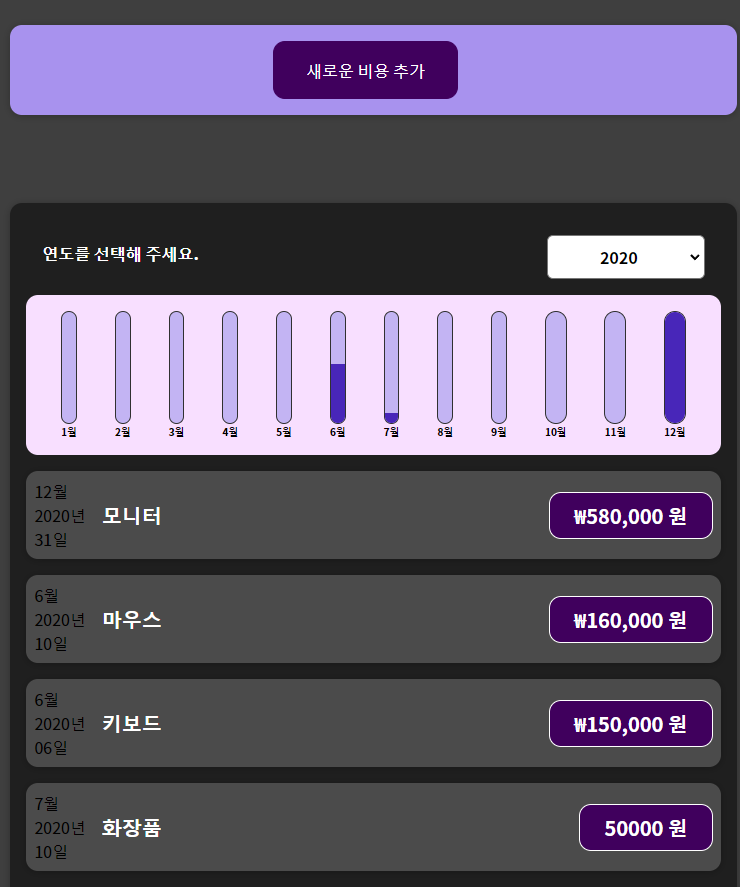
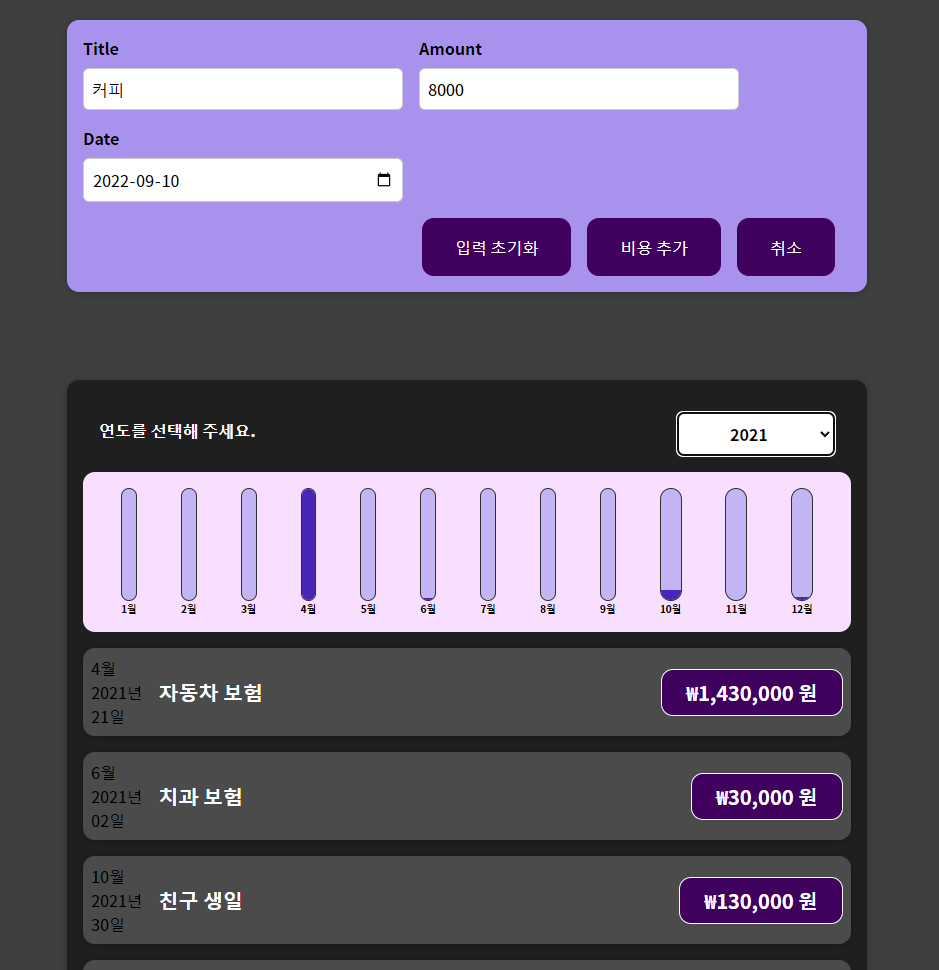

## 비용 추적기 사이드 프로젝트

```js

총 비용 통계 분석 응용 프로그램
1. 총 비용 값 출력
2. 연월 통계 비용 표현
3. 차트로 비용 표현
4. 애니메이션 효과로 표현
5. 새로운 총 비용 등록 가능

React CSS Html

Components
  Expenses 폴더 : 비용 관련
    ExpenseItem : 비용 데이터 출력
    ExpenseDate : 비용 기록 날짜 출력
    Expenses : 비용 목록 및 비용, 날짜 출력
    ExpensesList : 연도별 필터 목록 출력
    ExpensesChart : 차트 출력
  NewExpense 폴더 : 새로운 비용 추가 관련
    ExpenseFilter : 연도 설정 필터
    NewExpense : 새로운 비용 추가
    ExpenseForm : 비용 추가 폼 ( 타이틀, 가격, 연도)
  Chart 폴더 : 비용을 차트로 출력 관련
    Chart : Chart bar 를 담음
    ChartBar : 차트 출력에 필요한 값을 Chart 에 보내주는 용도
  UI 폴더 : 유저 인터페이스 관련
    Card : 래퍼 컴포넌트로 컨텐츠가 담길 틀 역할

Function
  Expenses.js
    filterChangeHandler : ExpensesFilter 에서 연도 변경 시
      이벤트 값을 받아 상태 변환 해주는 함수
    filteredExpenses : 선택된 연도에 따른 데이터 출력 함수
  ExpenseForm.js
    titleChangeHandler : 제목 변경에대한 이벤트 함수
    amountChangeHandler : 가격 변경에대한 이벤트 함수
    dateChangeHandler : 날짜 변경에대한 이벤트 함수
    submitHandler : form 에서 저장된 이벤트 데이터 처리 함수
    onResetText : 입력 초기화 누를 시 입력된 필드 초기화 및 title focus 함수
  ExpensesFilter.js
    dropDownChangeHandler : 선택된 연도 이벤트 처리 함수
  NewExpense.js
    saveExpenseDataHandler : 추가된 비용 데이터 처리 이벤트 함수 및 
      저장되면 비용 추가 폼 닫힘
    startEditingHandler : 비용 추가 누르면 비용추가 폼 보여주기
    stopEditingHandler : 취소 누르면 비용 추가 폼 안보이게함
  App.js
    addExpenseHandler : NewExpense.js 에서 받은 추가된 비용 이벤트 처리 함수
  
```

가계부 첫 화면 



지출 추가 화면



