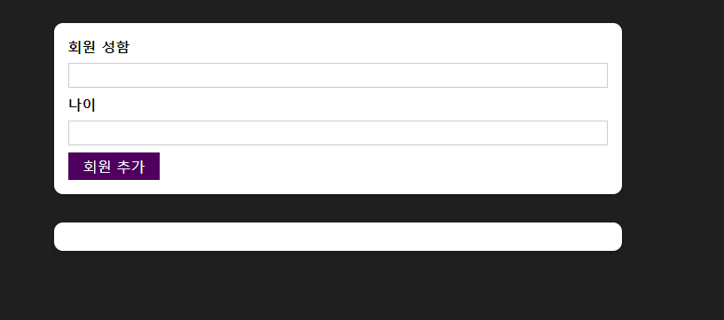
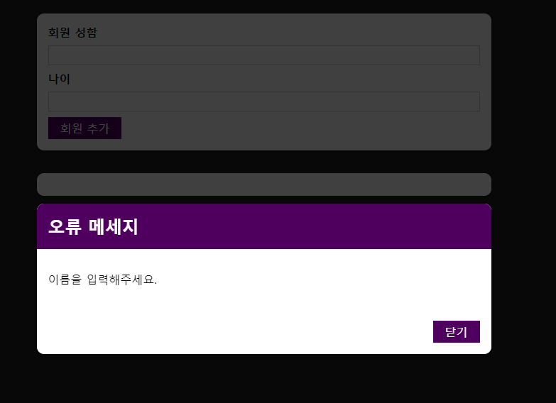
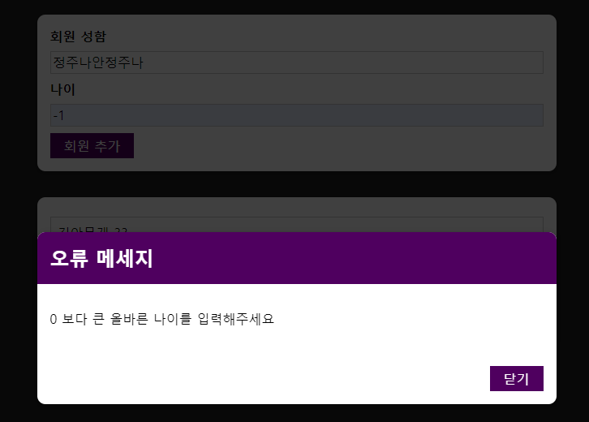
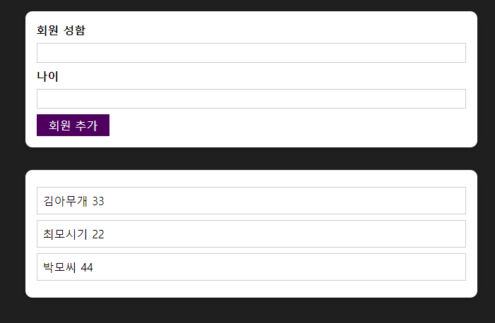

### 신규 회원 정보 추가

```js

react-member-addPJ

신규 회원 정보 입력 및 출력 
1. 신규 회원 정보 입력
2. 신규 회원 정보 출력
3. 신규 회원 정보 인풋 유효성 검사
4. 유효성 위배 경고 모달 팝업 기능 추가

React CSS Html

Components
  Member 폴더 : 회원 정보 관련
    AddMember : 회원 정보 입력
    MemberList : 회원 정보 출력
  UI 폴더 : 회원 정보 입,출력 폼 및 버튼, 모달 관련
    Button : 사용될 버튼 컴포넌트
    Card : 입 출력 화면 form
    ErrorModal : 유효성 위배 경고 모달 팝업
    ModalOverlay : 멤버 정보 폼 오버레이 경고 팝업 
    Backdrop : 모달 밖 버튼 클릭 시 모달창 닫기 기능

Function
  AddMember.js
    AddMemberHandler : 입력된 이름 및 나이 유효성 검사
    onClickCloseBTN : ErrorModal Close
  App.js
    addMemberHandler : 이전 출력 기록 놔둔 채 새로운 신규 멤버 정보 리스트 출력
  
```

첫 화면 



경고 팝업 화면





멤버 추가 리스트 화면




```