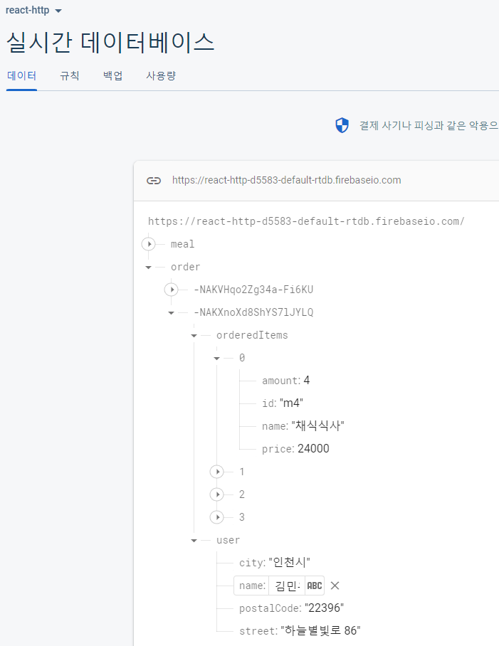

## React Food Order Site Project Content

```js

  비타민777 리엑트 레스토랑
1. 메인 화면
2. 메뉴 목록
3. 레스토랑 설명
4. 장바구니
5. 주문 수량 및 총 가격 출력

React CSS Html

Components
  UI 폴더 : 유저 인터페이스 관련
    Layout 폴더 
      Header : main 상단 헤더 사이트 명 및 내 장바구니
      HeaderCartButton : 내 장바구니 버튼
    Cart 폴더 
      CartIcon : 내 장바구니 아이콘
    Menu 폴더 : 음식 리스트 등 목록 관련
      Menu : 메뉴 아이템, 메뉴 장바구니 담기, 주문가능 목록, 레스토랑 설명
      MenuItem : 메뉴에 필요한 정보
      MenuItemForm : 메뉴 수량 인풋 폼
      AvailableMenu : 주문 가능 메뉴
      MealsSummary : 음식 요약 설명


Function
```

Firebase dummy data


Firebase dummyData fetch


내 장바구니 비어있을 시


내 장바구니


내 장바구니 주문 입력


내 장바구니 주문 입력02


내 장바구니에서 Firebase 에 추가


주문 성공 시


주문 가능 메뉴 불러오기 로딩 메세지


불러오기 실패 에러 메시지 출력

