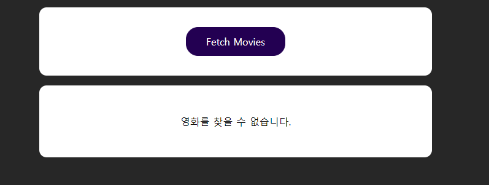
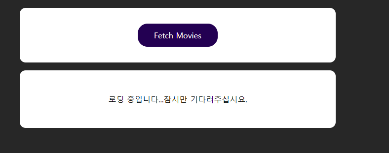
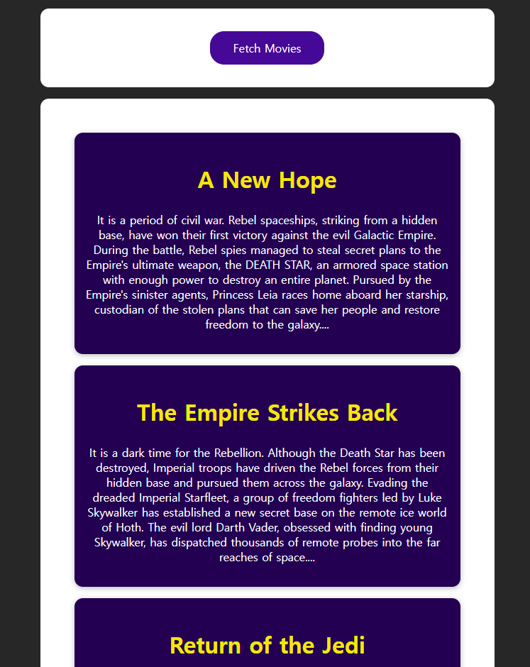
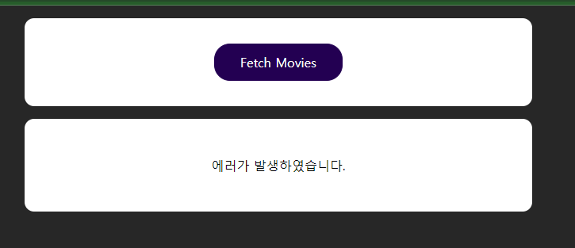

### 스타워즈 API 와 인터렉션을 통한 데이터 요청 및 응답

```js

1. 메인 화면
2. 메인 화면에 영화 정보 출력
3. 영화 정보 출력 에러 메시지 출력
4. 영화 정보 결과 없음 출력
5. 메인 화면에 영화 정보 바로 출력 및 버튼 클릭시 출력 

React CSS Html

components
      Movie : 영화 추가된 또는 영화 리스트 출력 컴포넌트
      MovieList : 영화 리스트 컴포넌트

Function

App.js
-fetchMoviesHandler : 스타워즈 API 에서 영화 정보를 가져오기위한 함수
-transformedMovies : 스타워즈 API 의 json content 를 새로 추가할 함수


```

메인화면


버튼 클릭 시 로딩 화면


버튼 클릭 시 API 에 상호작용에 의한 데이터 출력


버튼 클릭 시 에러 화면

