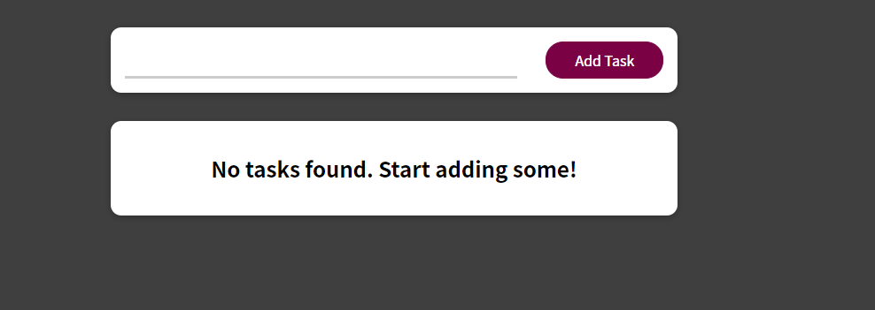
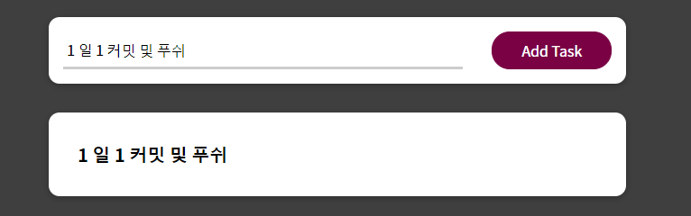
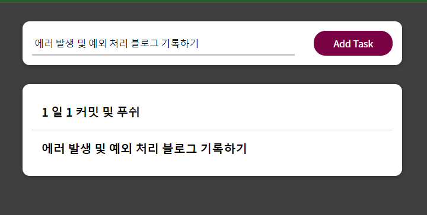
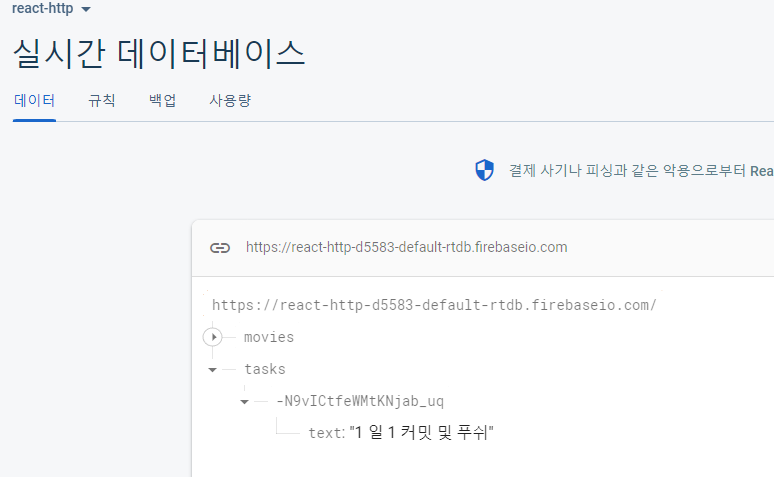
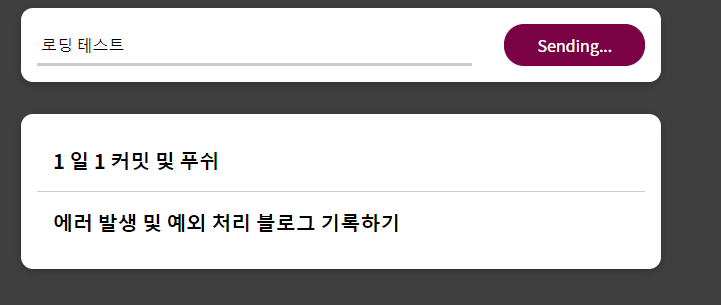
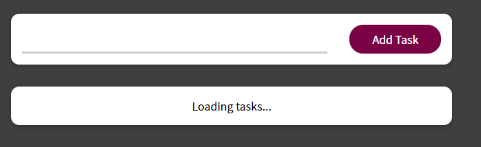

### API 와 인터렉션을 통한 데이터 요청 및 응답

```js

1. 메인 화면
2. 메인 화면에 일정 목록 출력
3. 일정 새로운 일정 추가 및 목록에 추가
4. 로딩 상태 (버튼, 목록 등)
5. Firebase 가상 database 활용, 요청 및 응답 테스트

React CSS Html

components
  hooks : 커스텀 훅 관련 폴더
    use-http.js : 일정 목록 요청 및 응답 로직
  NewTask : 새로운 일정 관련 폴더
    TaskForm.js : 일정 추가 form
    NewTask.js : 일정 추가 http post 로직
  Tasks : 목록 및 일정 아이템 관련 폴더
    TaskItem.js
    Tasks.js : default 목록 및 아이템 및 속성 전달 받으면 반환 로직
  UI : form 들어갈 card 관련 폴더
    Section.js : Card setting


Function
TaskForm.js
-submitHandler : 기본 값 방지 및 입력 예외 처리
NewTask.js
-enterTaskHandler : 일정 추가 http post 로직
use-http.js
-sendRequest : get, post http 로직
App.js
-transFormTasks : 일정에 대한 객체 변환에 따른 새로운 배열 생성
-taskAddHandler : setTasks state 로 새로운 일정 추가


```

메인화면


일정 추가 및 목록


일정 추가 및 목록 02


Firebase 에 추가된 일정 정보


Firebase 에 추가된 일정 정보


일정 추가 시 버튼 로딩 변환


기존 목록 불러오기 로딩
