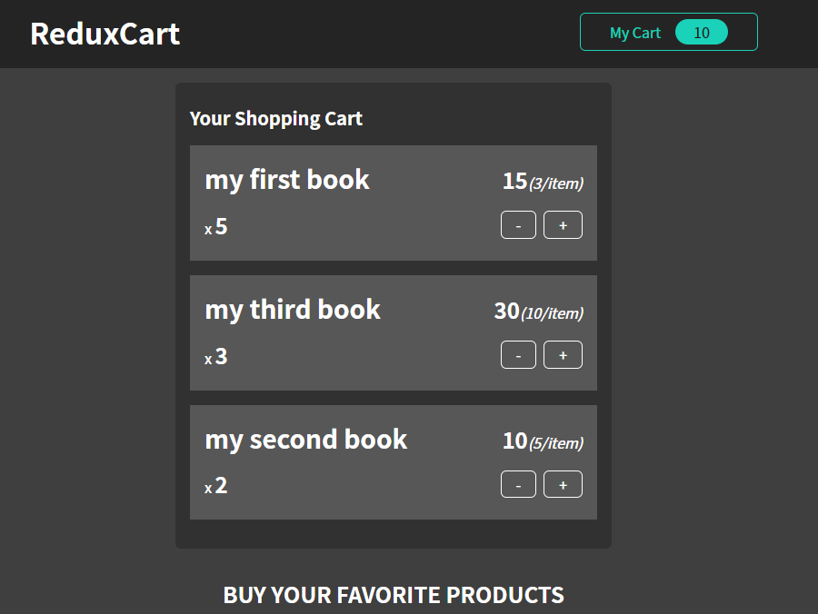
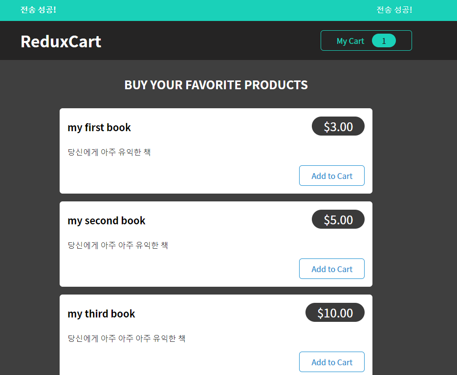
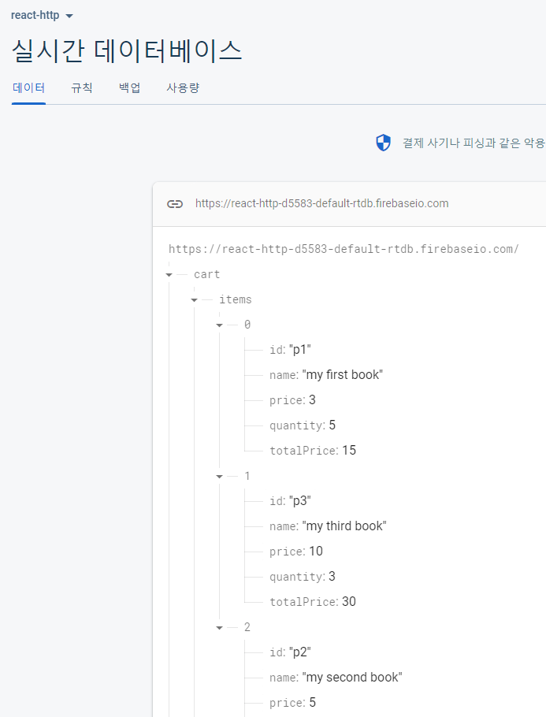
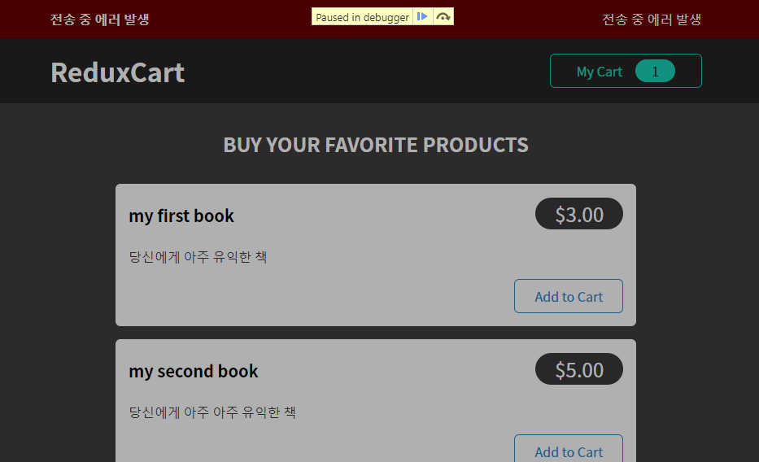
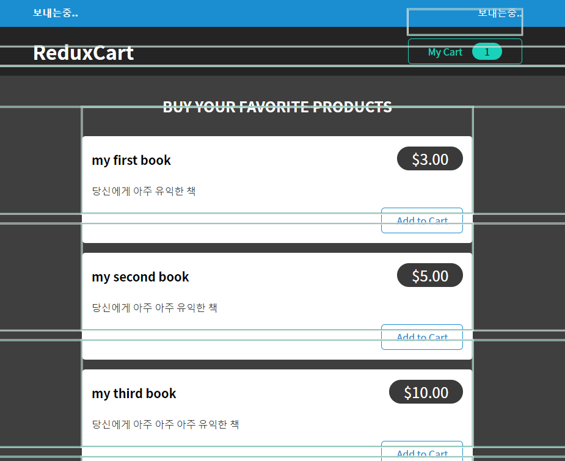

## 코드는 재산이다, 나중에 도움된다, 정리잘하자

```js
project name : ReduxCart
1. 메인 장바구니 목록
2. 내 장바구니
3. 장바구니 상세 보기
4. 장바구니 상세 보기에서 추가 및 제거
5. 장바구니 관련 기능 추가 및 활성화

React CSS Html ReduxToolkit

Components
  UI 폴더 : 유저 인터페이스 관련
    Layout 폴더 
      Header : main 상단 헤더 사이트 명 및 내 장바구니
      HeaderCartButton : 내 장바구니 버튼
    Cart 폴더 
      CartIcon : 내 장바구니 아이콘
    Menu 폴더 : 음식 리스트 등 목록 관련
      Menu : 메뉴 아이템, 메뉴 장바구니 담기, 주문가능 목록, 레스토랑 설명
      MenuItem : 메뉴에 필요한 정보
      MenuItemForm : 메뉴 수량 인풋 폼
      AvailableMenu : 주문 가능 메뉴
      MealsSummary : 음식 요약 설명


Function


```

장바구니 상세 보기


장바구니 전송 성공


장바구니 추가 또는 제거 시 Firebase data update


장바구니 전송 중 에러 메시지 출력


장바구니 전송 중 메시지


