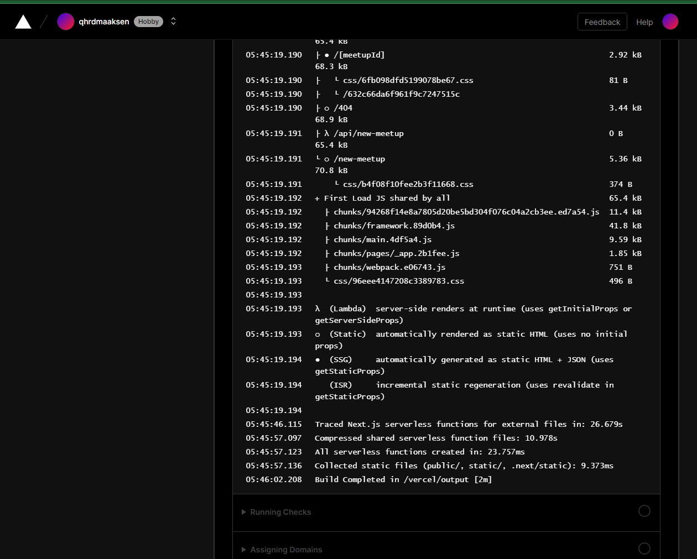
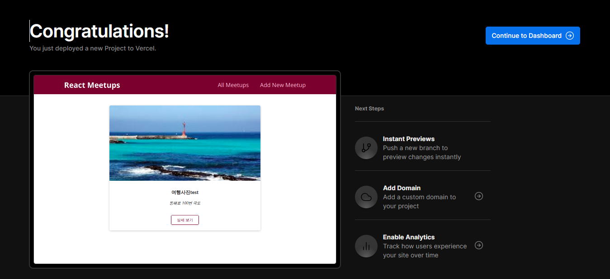
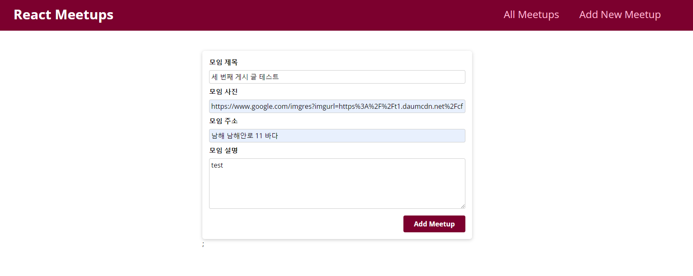
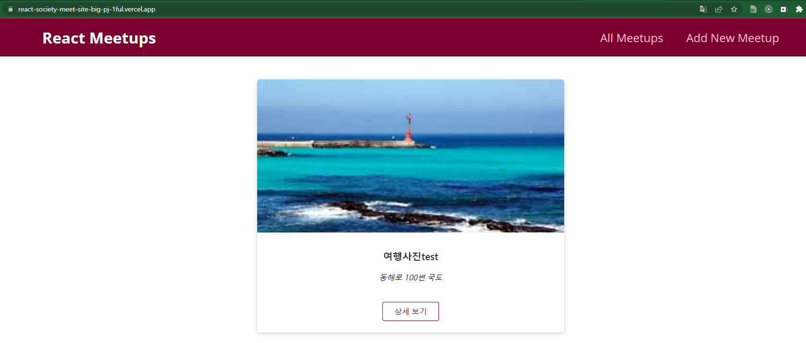
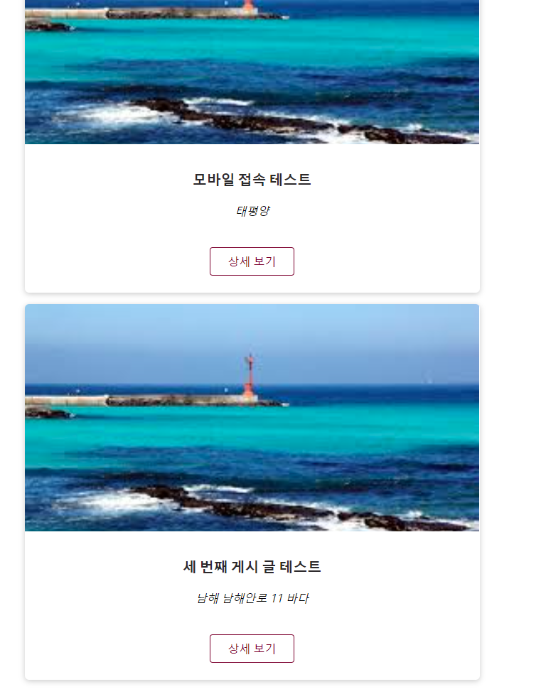

## 코드는 재산이다, 나중에 도움된다, 정리잘하자

```js
project name : reactSocietyMeetSiteBigPJ
site url : https://react-society-meet-site-big-pj-1ful.vercel.app/
1. 네비게이션 출력
2. 게시판의 모든 글 목록 출력
3. 게시글 상세보기 기능
4. 게시글 오름차순 내림차순 정렬 기능
5. 새 게시글 추가 기능
6. 댓글 추가 기능
7. 댓글 목록 출력
8. 요청 응답 Firebase 연동
9. 로딩 스피너
10.파이어 베이스 배포

React CSS Html react-router-dom

Components
  UI 폴더 : 유저 인터페이스 관련
    -Card.js : card 틀
    -LoadingSpinner.js : 로딩 시 빙글빙글 돌아가는 로딩표시
  layout 폴더 
    Layout.js : main 상단 navigation 및 main layout
    MainNavigation.js : 네비게이션
  quotes 폴더 : 게시판 관련
     HighlightedQuote.js : 게시글 상세보기 figure 활용 틀 맞춤
     NoQuotesFound.js : 게시글 찾을 수 없을때 활용
     QuoteForm.js : 게시글 form 관련
     QuoteItem.js : 게시글 레이아웃 관련
     QuoteList.js : 게시글 목록 관련
  comments 폴더 : 댓글 관련
    CommentItem.js : 댓글 출력 관련
    Comments.js : 댓글 데이터, 요청, 상태 관리 관련
    CommentsList.js : 댓글 목록 출력 관련
    NewCommentForm.js : 새 게시글의 요청,에러,상태 관리 관련
  pages 폴더 : 각 페이지 출력
    AllQuotes.js : 모든 게시글 출력, 요청, 상태, 게시글 데이터, 에러 관련
    QuoteDetail.js : 게시글 상세보기 출력 요청,상태,데이터,에러 관련
    NewQuote.js : 새 게시글 관련 요청, 상태관리 관련
    NotFound.js : 페이지 찾을 수 없을때 관련
  hooks 폴더
    use-http.js : 데이터 요청 및 응답 관련
  lib 폴더
    api.js : 모든게시글,게시글,게시글추가,모든댓글 관련 요청 및 응답 관련


```

Vercel deploy


Vercel deploy success


새 게시글 추가


첫 번째 게시글 목록 출력


게시글 등록 후 리스트 확인



