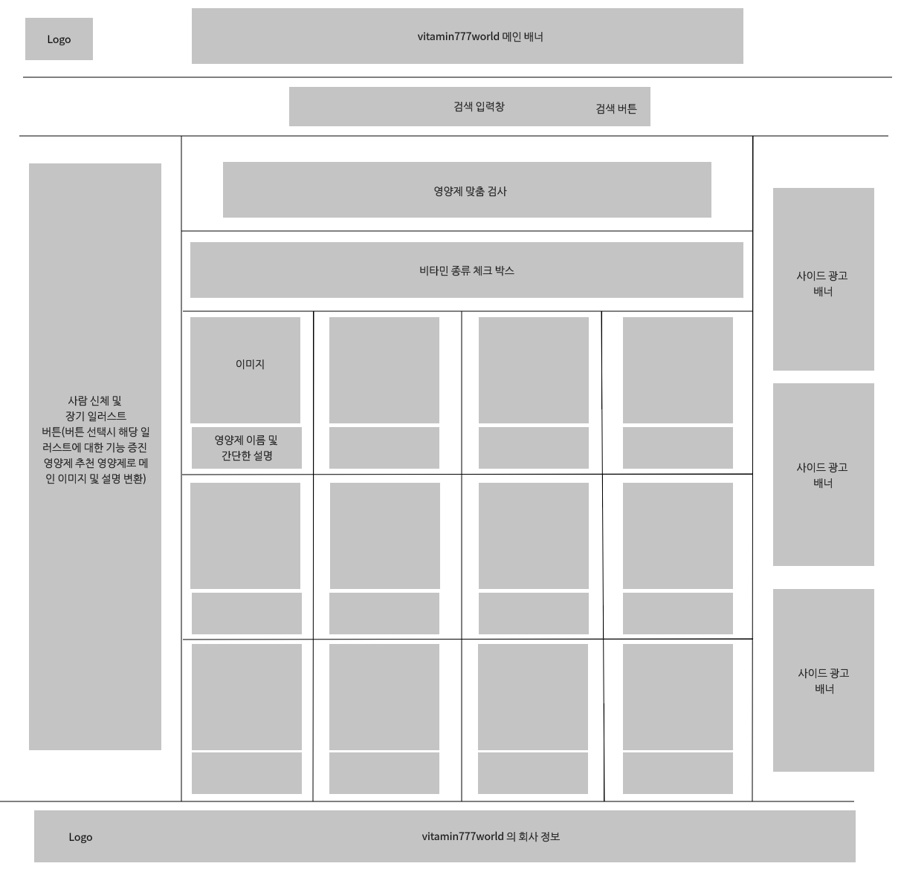
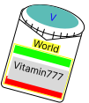

# 영양제 추천 사이트

## 비타민 777 프로젝트


```js

아이디어
- 평소 건강에 관심이 많아 영양제를 찾아보는 중에 많은 시간을 소비하고있는 자신을 발견하며 내게 맞는 영양제를 좀 더 쉽게 찾을 수 있는 방법이 없을까 생각하게되며 시작하게 됨
- 고령화 시대 및 현대인의 큰 관심을 갖고있는 영양제에 대해 정보를 제공
- 영양제를 방문자의 필요하고자 하는 영양소를 직접 선택해 영양제를 추천해주는 기능
- 영양제 추천을 통해 해당 영양제 회사의 홍보 효과 기대 및 건강 관련 광고 수익 창출 기대
- 방문자 타입에 따른 단순 영양제 추천 사이트이기 때문에 방문자의 정보를 수집하지 않음
- 심플한 영양제 추천 사이트이기때문에 판매에 따른 법적 책임은 없음
- 바쁜 현대사회에서 심플하고 빠른 선택을 통해 영양제를 추천해주는 사이트


방문자에 대한 기획 고민
- 어떻게하면 사람들이 다양한 영양제 속에서 자신이 원하는 영양제를 찾을 수 있을까?
- 어떻게하면 웹사이트가 복잡하지 않고 심플하게 보일 수 있을까?
- 어떻게하면 영양제 사이트 답게 보일 수 있을까?
- 어떻게하면 방문자가 자신이 원하는 영양제를 심플하게 찾을 수 있을까?
- 어떻게하면 좀 더 디테일하게 영양제를 추천해줄 수 있을까?


개발 기획 고민
- 어떻게하면 사이트를 보기 좋게 만들 수 있을까?
- 어떤 디자인을 적용해야 사이트가 심플하고 보기 좋을까?
- 어떻게하면 사이트를 빠르게 만들 수 있을까?
- 어떤 라이브러리를 사용해야 라이브러리답게 사용할 수 있을까?
- 어떤 상태관리 라이브러리를 사용해야 상태관리를 효율적으로 할 수 있을까?
- 사용자가 필요로 하는 영양소와 영양제를 어떻게 연결할 수 있을까?
- 첫 메인 페이지가 어떻게 보여야 사이트의 분위기를 잘 전달할 수 있을까?


Pixso 웹 사이트를 통해 프로토타입 메인 페이지의 디자인 구성 설정
- 처음부터 프로토타입 없이 개발을 시작하면 개발 단계에서 디자인을 수정하며 시간을 많이 소비할 것 같아 Pixso 를 사용해 프로토타입을 만들어보기로 결정
- 아마도 프로토타입이다보니 디자인이 미흡하고 불완전한 부분이 많아서 계속해서 수정될것 같지만 큰 틀을 구성하고 안하고의 차이는 크게 날 것 같음 (경험해본바...)

아래는 처음 만들어본 메인 페이지의 디자인 구성

```



```js

Figma 를 활용해 대표 로고 만들기
- 디자인 단계에서는 figma 를 사용해 대표 로고를 만들기로 결정
- 처음 사용해봤으며 나름대로 이것저것 시도해보면서 미리 생각해둔 로고를 천천히 만들어보았음
- 로고 디자인을 구상하고 figma 를 사용해 로고를 만들어보면서 Skewdat 을 사용해 기울기를 줘보니 생각보다 괜찮은 결과물이 나와서 만족함
- Figma 에 대해 아주 기초적인 사용법을 알게되었지만 디자인 요소를 세부적으로 컨트롤하기에 좋은 툴이라고 생각이들었고 커뮤니티에서 Skewdat 및 Zeplin 을 사용해보라는 글을 보았기 때문에 다음에는 Zeplin 을 사용해보고 싶다는 생각이 들었음 디자이너와 협업을 할 때 유용하다고 함

아래는 처음 만들어본 자체 제작 vitamin777world 로고

```



```js

개발 단계 step 01
- react 로 사용해보고 싶었기 때문에 react 사용해보기로 결정
- vite 가 빠르고 react 와 잘 어울리기때문에 vite 를 사용하기로 결정
-- 장점: 빠른 개발 서버, ESM 지원, 최적화된 번들링, JSX 지원
- typescript 를 사용해서 개발 단계에서 타입 에러로 인한 버그를 최소화 하기로 결정

step 01 에 따른 vite + react + typescript 프로젝트 생성


개발 단계 step 02
- react-router-dom 을 사용해서 페이지 이동을 구현하기로 결정

```
